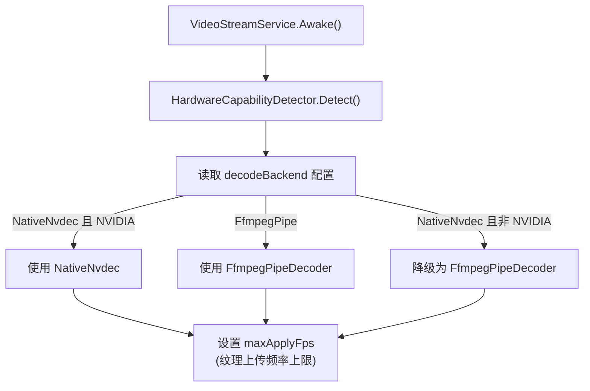
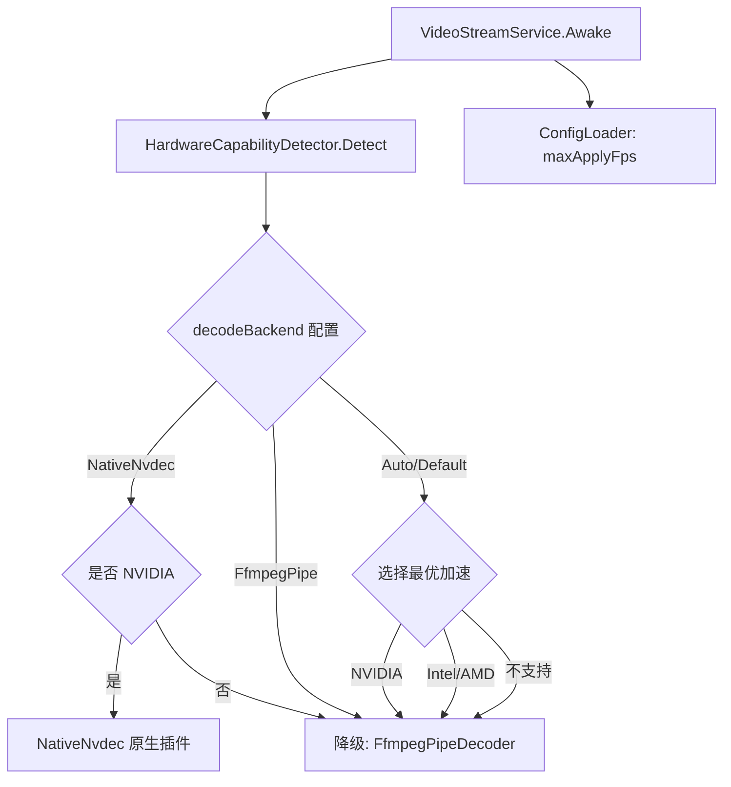
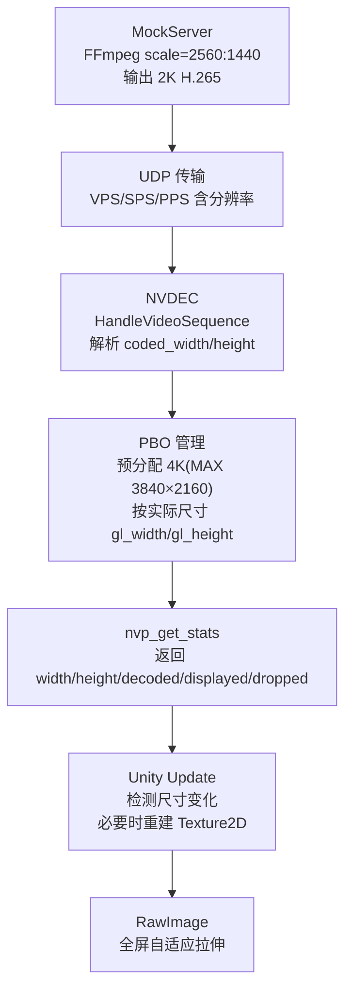
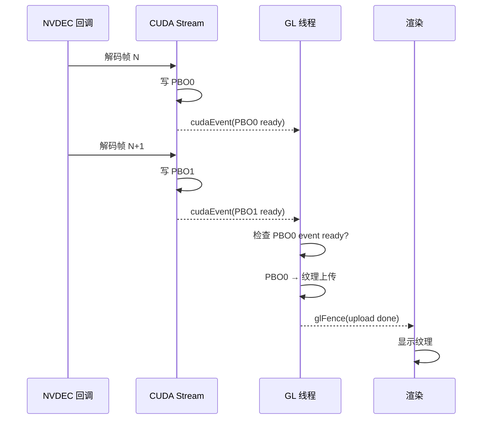
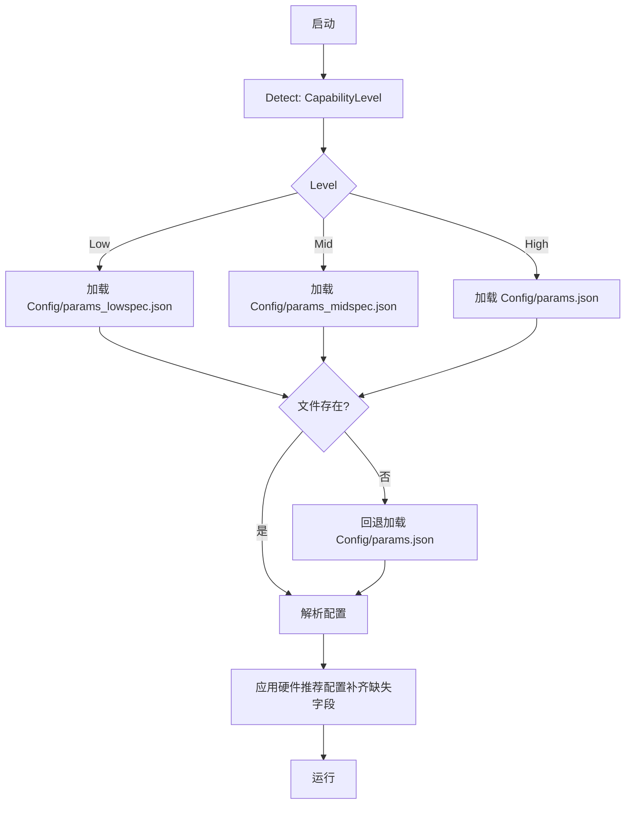

# UDP 图传架构说明

> 最后更新: 2026-04-07
> 当前状态: **生产就绪** - 支持 2K/4K 120fps，三缓冲 PBO 优化，硬件自适应；新增吊射 H.264 复用（v2.2 彩色图传升级）

---

*注：该文件由AI辅助生成*

## 0. 目录

1. [系统概览](#1-系统概览)
2. [硬件自适应系统](#2-硬件自适应系统)  新增
3. [解码后端架构](#3-解码后端架构)  新增
4. [图传尺寸控制链路](#4-图传尺寸控制链路)
5. [三缓冲 PBO 工作流程](#5-三缓冲-pbo-工作流程-opengl-路径)
6. [数据结构定义](#6-数据结构定义-nvdecstubh)
7. [配置分级系统](#7-配置分级系统)  新增
8. [性能指标](#8-性能指标)
9. [关键文件清单](#9-关键文件清单)
10. [启动流程](#10-启动流程)
11. [故障排查](#11-故障排查)
12. [吊射 H.264 图传复用方案](#12-吊射-h264-图传复用方案)  🆕
13. [版本历史](#12-版本历史)

---

## 1. 系统概览



| 后端                     | 适用范围                                                                      | 优点                                                          | 代价/限制                   |
| ------------------------ | ----------------------------------------------------------------------------- | ------------------------------------------------------------- | --------------------------- |
| NativeNvdec (原生插件)   | 仅 NVIDIA                                                                     | 延迟最低；NVDEC 硬解；CUDA→OpenGL/Vulkan；三缓冲 PBO 异步优化 | 平台/硬件限制更强           |
| FfmpegPipeDecoder (管道) | 跨平台                                                                        | 支持 CUDA/VAAPI/DXVA/VideoToolbox；硬件不可用时自动回退软解   | 额外进程/管线开销；延迟略高 |
| 等级                     | 典型判定条件                                                                  |
| ---                      | ---                                                                           |
| High                     | NVIDIA/AMD 独显且 VRAM ≥ 4GB                                                  |
| Mid                      | NVIDIA/AMD 独显但 VRAM < 4GB；或 Intel Iris/Xe + CPU ≥ 8 核；或 Apple Silicon |
| Low                      | Intel 集显 + CPU ≤ 4 核；或系统内存 < 8GB                                     |

### 推荐加速模式 (RecommendedAccel)

| 平台        | GPU         | 推荐加速        |
| ----------- | ----------- | --------------- |
| Linux       | NVIDIA 独显 | NvdecCuda       |
| Linux       | Intel/AMD   | Vaapi           |
| Windows     | NVIDIA 独显 | NvdecCuda       |
| Windows     | Intel/AMD   | Dxva (D3D11VA)  |
| macOS       | Any         | VideoToolbox    |
| 其他/不支持 | -           | Software (软解) |

### 推荐配置输出

| 等级 | 分辨率    | 目标帧率 | 队列大小 | 每帧消费数 |
| ---- | --------- | -------: | -------: | ---------: |
| Low  | 1280×720  |   30 fps |        4 |          1 |
| Mid  | 1920×1080 |   60 fps |        6 |          2 |
| High | 1920×1080 |  120 fps |        8 |          3 |

---

## 3. 解码后端架构

Awake() 阶段逻辑：

1. 调用 `HardwareCapabilityDetector.Detect()` 获取硬件信息
2. 检查配置的 `decodeBackend`
        - 若设置为 `NativeNvdec` 但硬件非 NVIDIA → 自动降级为 `FfmpegPipe`
        - 若设置为 `FfmpegPipe` → 直接使用 ffmpeg 管道
3. 根据 `ConfigLoader` 配置设置 `maxApplyFps`（纹理上传频率上限）



| 后端                          | 适用范围  | 关键特点                                                                                     |
| ----------------------------- | --------- | -------------------------------------------------------------------------------------------- |
| NativeNvdec（原生插件）       | 仅 NVIDIA | NVDEC 硬解；CUDA → OpenGL/Vulkan 路径；可用三缓冲 PBO 优化；最低延迟                         |
| FfmpegPipeDecoder（管道解码） | 跨平台    | 支持 CUDA/VAAPI/D3D11VA(VideoToolbox)/软解回退；启动时自动探测最优加速；硬件不可用时自动回退 |

### FFmpeg 硬件加速命令行示例

```bash
# NVIDIA CUDA/NVDEC (Linux/Windows)
ffmpeg -hwaccel cuda -hwaccel_output_format cuda -extra_hw_frames 8 \
       -f hevc -i - -vf scale_cuda=1920:1080:format=nv12,hwdownload,format=nv12,format=rgb24 \
       -pix_fmt rgb24 -f rawvideo pipe:1

# Intel/AMD VAAPI (Linux)
ffmpeg -hwaccel vaapi -hwaccel_output_format vaapi -vaapi_device /dev/dri/renderD128 \
       -f hevc -i - -vf scale_vaapi=1920:1080:format=nv12,hwdownload,format=nv12,format=rgb24 \
       -pix_fmt rgb24 -f rawvideo pipe:1

# Windows D3D11VA
ffmpeg -hwaccel d3d11va -f hevc -i - \
       -vf scale=1920:1080,format=rgb24 -pix_fmt rgb24 -f rawvideo pipe:1

# macOS VideoToolbox
ffmpeg -hwaccel videotoolbox -f hevc -i - \
       -vf scale=1920:1080,format=rgb24 -pix_fmt rgb24 -f rawvideo pipe:1
```

---

## 4. 图传尺寸控制链路



---

## 5. 三缓冲 PBO 工作流程 (OpenGL 路径)



| 状态/字段               | 含义                               |
| ----------------------- | ---------------------------------- |
| pbo_write_idx           | 当前 CUDA 写入位置（循环 0→1→2→0） |
| pbo_upload_idx          | 当前 GL 上传位置                   |
| pbo_cuda_pending[i]     | PBO[i] 是否存在未完成的 CUDA 写入  |
| pbo_ready_for_upload[i] | PBO[i] 是否已准备好 GL 上传        |

帧丢弃策略（缓冲区满时）示例：

```cpp
if (pbo_ready_for_upload[write_idx] && !cudaEventReady) {
       frames_dropped++;
       return; // 丢弃当前帧，保持低延迟
}
```

---

## 6. 数据结构定义 (NvdecStub.h)

```cpp
struct NvdecContext {
  // 4K 120fps 优化常量
  static constexpr int NUM_PBO_BUFFERS = 3;   // 三缓冲 PBO
  static constexpr int MAX_WIDTH = 3840;      // 4K 宽度预分配
  static constexpr int MAX_HEIGHT = 2160;     // 4K 高度预分配
  static constexpr size_t MAX_PBO_SIZE = MAX_WIDTH * MAX_HEIGHT * 3; // ~25MB

  // CUDA 上下文
  CUcontext cuCtx;
  CUvideoctxlock cuLock;
  CUvideodecoder decoder;
  CUvideoparser parser;
  cudaStream_t stream;

  // 视频尺寸 (从流中自动检测)
  int width, height;

  // OpenGL 三缓冲 PBO
  unsigned int pbo[3];           // GL Buffer IDs
  unsigned int tex;              // GL Texture ID
  CUgraphicsResource cuPbo[3];   // CUDA-GL 互操作资源
  int pbo_write_idx;             // CUDA 写入索引
  int pbo_upload_idx;            // GL 上传索引
  int gl_width, gl_height;       // 当前 GL 对象尺寸

  // 异步同步
  cudaEvent_t cudaWriteEvent[3];       // CUDA 写入完成事件
  bool pbo_cuda_pending[3];            // CUDA 写入进行中
  bool pbo_ready_for_upload[3];        // 准备好 GL 上传
  void* glFence;                       // GLsync fence

  // 统计
  std::atomic<int> frames_decoded;
  std::atomic<int> frames_displayed;
  std::atomic<int> frames_dropped;     // 因缓冲区满丢弃的帧

  // Vulkan 路径 (可选)
  VulkanInteropContext vkCtx;
  bool use_vulkan;
  cudaSurfaceObject_t vkSurface;
};
```

---

## 7. 配置分级系统

启动流程：

1. `HardwareCapabilityDetector.Detect()` → 得到 `CapabilityLevel`
2. 依据等级选择配置文件
3. 若配置文件不存在 → 回退到 `params.json`
4. 应用硬件推荐配置，补齐缺失字段



### 配置文件对比

| 配置项              | params_lowspec.json | params_midspec.json | params.json (高配) |
| ------------------- | ------------------- | ------------------- | ------------------ |
| decoderOutputWidth  | 1280                | 1920                | 1920               |
| decoderOutputHeight | 720                 | 1080                | 1080               |
| targetFrameRate     | 30                  | 60                  | 120                |
| decoderQueueSize    | 4                   | 6                   | 8                  |
| maxDrainPerUpdate   | 1                   | 2                   | 2                  |
| logBufferSize       | 8                   | 8                   | 4                  |
| maxFileQueueSize    | 32                  | 48                  | 64                 |

---

## 8. 性能指标

| 指标              | 720p (低配) | 1080p (中配) | 2K (2560×1440) | 4K (3840×2160) |
| ----------------- | ----------- | ------------ | -------------- | -------------- |
| 目标帧率          | 30 fps      | 60 fps       | 30-60 fps      | 30-120 fps     |
| 单帧 RGB 大小     | ~2.8 MB     | ~6.2 MB      | ~11 MB         | ~25 MB         |
| 三缓冲 PBO 总内存 | ~8 MB       | ~19 MB       | ~33 MB         | ~75 MB         |
| NVDEC 解码表面    | 4-6 个      | 6-8 个       | 8-12 个        | 8-12 个        |
| 总 GPU 内存占用   | ~30 MB      | ~60 MB       | ~100 MB        | ~275 MB        |
| 延迟 (端到端)     | <80ms       | <60ms        | <50ms          | <80ms          |

---

## 9. 关键文件清单

### 核心服务层

| 文件                          | 路径                            | 功能                       |
| ----------------------------- | ------------------------------- | -------------------------- |
| VideoStreamService.cs         | Assets/Scripts/Framework/Video/ | Unity 端视频服务，纹理管理 |
| FfmpegPipeDecoder.cs          | Assets/Scripts/Framework/Video/ | FFmpeg 管道解码器 (跨平台) |
| NativeVideoBridge.cs          | Assets/Scripts/Framework/Video/ | C# ↔ Native 桥接           |
| HardwareCapabilityDetector.cs | Assets/Scripts/Framework/Boot/  | 硬件能力探测与自适应       |
| ConfigLoader.cs               | Assets/Utils/                   | 配置加载与分档选择         |
| RuntimeTuner.cs               | Assets/Scripts/Framework/Boot/  | 运行时性能调优             |

### 原生插件层

| 文件              | 路径                              | 功能                    |
| ----------------- | --------------------------------- | ----------------------- |
| NvdecStub.h/cpp   | Assets/Plugins/NativeVideoPlugin/ | NVDEC 解码器 + PBO 管理 |
| NV12ToRGB.cu      | Assets/Plugins/NativeVideoPlugin/ | CUDA 色彩空间转换内核   |
| VulkanInterop.cpp | Assets/Plugins/NativeVideoPlugin/ | Vulkan 互操作 (可选)    |

### 配置文件

| 文件                | 路径                           | 功能                    |
| ------------------- | ------------------------------ | ----------------------- |
| params.json         | Assets/StreamingAssets/Config/ | 高配参数 (1080p 120fps) |
| params_midspec.json | Assets/StreamingAssets/Config/ | 中配参数 (1080p 60fps)  |
| params_lowspec.json | Assets/StreamingAssets/Config/ | 低配参数 (720p 30fps)   |

### 测试工具

| 文件             | 路径                      | 功能                |
| ---------------- | ------------------------- | ------------------- |
| video_sender.cpp | Assets/MockServerCpp/src/ | MockServer 视频发送 |
| start_mock.sh    | Assets/MockServerCpp/     | MockServer 启动脚本 |
| check_nvidia.sh  | (项目根目录)              | NVIDIA 环境自检脚本 |

---

## 10. 启动流程

```bash
# 1. 环境检查 (可选)
./check_nvidia.sh                  # 检查 NVIDIA 驱动、CUDA、ffmpeg 环境

# 2. 启动 MockServer (视频源)
cd Assets/MockServerCpp
./start_mock.sh                    # 自动选择 Test_4k_120fps.mp4

# 3. 启动 Unity (OpenGL 模式)
./RoboMasterClientWMJ -force-opengl

# 4. 监控日志
tail -f Log/DebugLog.txt | grep -E "NVDEC|VideoStream|Hardware"

# 查看硬件检测结果
grep "HardwareDetection" Log/DebugLog.txt
```

---

## 11. 故障排查

| 问题             | 可能原因             | 解决方案                                |
| ---------------- | -------------------- | --------------------------------------- |
| 黑屏无图像       | MockServer 未启动    | `./start_mock.sh`                       |
| 画面撕裂         | 双缓冲不足           | 已升级为三缓冲                          |
| 帧率低           | GPU 内存不足         | 检查 `nvidia-smi`                       |
| 尺寸错误         | PBO 未重建           | 会自动检测并重建                        |
| CUDA-GL 失败     | GPU 不匹配           | 确保 Unity 使用 NVIDIA GPU              |
| 硬件检测等级错误 | SystemInfo 返回异常  | 检查日志中的 HardwareDetection 输出     |
| ffmpeg 硬解失败  | 缺少硬件加速驱动     | 运行 `./check_nvidia.sh` 诊断           |
| 低配机器卡顿     | 配置档位未正确选择   | 检查是否加载了 params_lowspec.json      |
| VAAPI 不可用     | 缺少 renderD128 设备 | 安装 intel-media-driver/mesa-va-drivers |

---

## 12. 吊射 H.264 图传复用方案 🆕

> 详细方案文档见：[视觉吊射方案.md](视觉吊射方案.md) v2.2

### 12.1 背景

吊射图传从 v1.x 二值化方案（192×144, 1bit, 自定义 RLE/XOR 编码）升级为 v2.2 H.264 彩色方案（400×400, YUV420 彩色, x264 编码）。比赛模式默认 100kbps 彩色，带宽拥塞时自动降级为 80kbps 灰度；仿真模式 200kbps 彩色。客户端解码复用主图传已有的解码基础设施。

> ⚠️ **v2.1 传输层修正**：根据官方规则(R3: 禁止自行架设无线设备)，比赛模式下吊射数据**必须**通过裁判系统 0x0310 CustomByteBlock 图传链路传输（300B×50Hz = 15 KB/s），不允许使用独立 UDP 通道。部署模式下主图传 HEVC 码流被裁判系统切断，但自定义数据流（CustomByteBlock）不受影响。

### 12.2 双传输模式架构

**比赛模式（CustomByteBlock 图传链路）：**

```
发送端 → x264 编码 → 自定义协议分片(H264_STREAM=0x04, ≤247B/片)
  → CustomByteBlock(≤300B) → 裁判系统图传链路(0x0310, 50Hz)
      → 赛事引擎服务器 → gRPC/Protobuf → 自定义客户端(RJ45有线)
          → 自定义协议解析 → H.264 分片重组 → FfmpegPipeDecoder → LobShotHUD v2
```

**仿真模式（裸 UDP 直连）：**

```
主图传管线（已有，不变）:
  UDP 3334 → UdpAnnexBTransport → AnnexBFrameAssembler → FfmpegPipeDecoder → VideoStreamService → Texture2D

吊射图传管线（仿真模式）:
  UDP 8888 → LobShotUdpReceiver → LobShotH264Transport → FfmpegPipeDecoder(新实例) → LobShotHUD v2 → Texture2D
```

两条管线完全独立，互不干扰。吊射管线仅在英雄兵种进入吊射模式时启动。

### 12.3 比赛模式带宽分析

| 指标       | 值                                              |
| ---------- | ----------------------------------------------- |
| 物理上限   | 300B × 50Hz = 15,000 B/s = 15 KB/s              |
| 协议开销   | 每包 9B (7B头+2B尾)                             |
| 可用载荷   | (300-9)B × 50Hz = 14,550 B/s ≈ 116 kbps         |
| H.264 码率 | 100 kbps = 12.5 KB/s (彩色默认)                 |
| 带宽利用率 | ~89% (剩余 ~11% 余量用于心跳/控制)              |
| 自适应降级 | 拥塞时降至 80kbps 灰度(69%), 释放余量           |
| 延迟       | ~160-230ms (裁判系统 ~130-200ms + 编解码 ~30ms) |
| 丢包率     | <1%(正常) / ~3%(拥塞)，靠 IDR 自恢复            |

### 12.4 复用组件对照

| 主图传组件                  | 吊射复用（仿真）              | 吊射复用（比赛）                 | 改动                                            |
| --------------------------- | ----------------------------- | -------------------------------- | ----------------------------------------------- |
| `UdpAnnexBTransport`        | `LobShotH264Transport` (新建) | `CustomByteBlockReceiver` (新建) | 仿真: UDP 8888; 比赛: gRPC 接收 CustomByteBlock |
| `AnnexBFrameAssembler`      | 同                            | 自定义协议解析 + 分片重组        | 比赛模式需解析 0x04 帧类型                      |
| `FfmpegPipeDecoder`         | 新实例                        | 同                               | 输入参数: `-f h264`, 分辨率 400×400             |
| `IVideoDecoder` 接口        | 同                            | 同                               | 零改动复用                                      |
| `NativeVideoBridge` (NVDEC) | 后续阶段                      | 后续阶段                         | 需改 `CodecType` → `H264`; 当前单例需扩展       |

### 12.5 资源开销

| 指标        | 主图传 (1080p 60fps) | 吊射图传 (400×400 60fps)   | 合计       |
| ----------- | -------------------- | -------------------------- | ---------- |
| 码率        | ~4 Mbps              | 100 kbps (0.10 Mbps, 彩色) | ~4.10 Mbps |
| 解码 CPU    | 中 (单核 30-50%)     | **极低 (<1%)**             | 不显著增加 |
| 内存        | ~60 MB (1080p×3缓冲) | **<1 MB** (400×400×RGB24)  | 不显著增加 |
| FFmpeg 进程 | 1 个                 | +1 个                      | 2 个       |

吊射码流仅为主图传的 **2.5%**，开销可忽略。

### 12.6 后续优化路径：NVDEC 支持 H.264

当前 `NativeVideoPlugin` 中 `NvdecStub.cpp` 硬编码了 `cudaVideoCodec_HEVC`。
支持 H.264 需要：

1. 将 `vpp.CodecType` 改为可配置参数（`cudaVideoCodec_H264`）
2. 将全局单例改为多实例架构（或新增一组 `nvp_init_h264` 导出接口）
3. 更新 `NativeVideoBridge.cs` 添加新的 P/Invoke 入口

NVDEC 硬件本身完全支持 H.264 解码，改动量不大，可作为 Phase 4 优化。

---

## 13. 版本历史

- **v1.0**: 初始双缓冲 PBO 实现
- **v1.1**: 添加 Vulkan 路径支持
- **v1.2**: 修复视频尺寸检测
- **v2.0**: 三缓冲 PBO + 异步 CUDA Event + GL Fence 优化
- **v2.1**: 4K 预分配 + 帧丢弃策略
- **v3.0**: 硬件自适应系统 (当前版本)
  - 新增 HardwareCapabilityDetector 硬件能力探测
  - 支持 Low/Mid/High 三级配置自动选择
  - FfmpegPipeDecoder 支持 VAAPI/DXVA/VideoToolbox 跨平台硬解
  - VideoStreamService 自动降级非 NVIDIA 硬件到 ffmpeg 后端
  - 新增低配/中配专用参数文件
- **v3.1**: 新增吊射 H.264 图传复用方案 (2026-04-06)
  - 新增 §12 吊射 H.264 图传复用主图传解码基础设施
  - 复用 FfmpegPipeDecoder / AnnexBFrameAssembler
  - 为后续 NVDEC H.264 支持预留扩展路径
  - **v2.1 修正**：传输层依据官方规则修正为双模式（比赛: CustomByteBlock 图传链路 / 仿真: 裸 UDP）
  - 新增 §12.3 比赛模式带宽分析（15 KB/s 硬性上限, 80kbps 编码占 69%）
- **v3.2**: 吊射图传升级为 YUV420 彩色 (2026-04-07)
  - 比赛模式默认 100kbps 彩色（利用率 89%），拥塞时自适应降级为 80kbps 灰度
  - 仿真模式 200kbps 彩色，画质最佳
  - 更新 §12.3/§12.5 带宽分析和资源开销数据