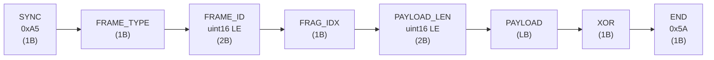

# 自定义数据传输协议

> 版本：v2.0  
> 日期：2026-02-13  
> 帧长度：可变长（最小 9 字节，最大受承载层/物理层限制）

本文件定义 **CustomByteBlock**（Protobuf）中 `bytes data` 的内部字节帧格式。
该协议 **全兵种通用**，可承载吊射视觉、自瞄装甲板检测、雷达态势、文字消息等多种数据。

数据经 MQTT（QoS 1）传输；物理瓶颈为裁判系统串口链路 **300 Byte/包 × 50 Hz**。
为便于稳定落地，推荐在该链路下将 `PAYLOAD_LEN` 控制在 **≤ 249B**（这样总帧长 $7 + 249 + 2 = 258B$，留出序列化/转发余量）。

## 帧类型段位分配

| 段位          | 用途            | 说明                        |
| ------------- | --------------- | --------------------------- |
| `0x01`–`0x0F` | 吊射视觉·I 帧族 | 渐进 I 帧、单包 I 帧        |
| `0x10`–`0x1F` | 吊射视觉·D 帧族 | 差分帧、空差分帧            |
| `0x20`–`0x2F` | 吊射视觉·轨迹帧 | 独立轨迹帧                  |
| `0x30`–`0x3F` | 通用消息·文字   | 预定义/自由文本消息         |
| `0x40`–`0x4F` | 自瞄视觉·目标   | 装甲板外接矩形、目标状态    |
| `0x50`–`0x5F` | 雷达数据        | 敌方位置、雷达标记          |
| `0x60`–`0xEF` | 预留扩展        | 未来功能                    |
| `0xF0`–`0xFF` | 控制/心跳       | 请求 I 帧、参数设置、心跳包 |

---

## 1. 包结构总览

|   字节偏移 | 字段        | 长度 | 常量/编码 | 说明                          |
| ---------: | ----------- | ---: | --------- | ----------------------------- |
|          0 | SYNC        |    1 | `0xA5`    | 帧同步字                      |
|          1 | FRAME_TYPE  |    1 | -         | 帧类型枚举（见 §3）           |
|        2-3 | FRAME_ID    |    2 | uint16 LE | 帧序号，0~65535 循环          |
|          4 | FRAG_IDX    |    1 | -         | 分片索引：0=完整帧，1..N=分片 |
|        5-6 | PAYLOAD_LEN |    2 | uint16 LE | 载荷字节数                    |
| 7..(7+L-1) | PAYLOAD     |    L | -         | 载荷数据（可变）              |
|      (7+L) | XOR         |    1 | -         | 包头+载荷所有字节 XOR 校验    |
|    (7+L+1) | END         |    1 | `0x5A`    | 包结束标记                    |

总长度：$7$（包头）$+\ L$（载荷）$+\ 2$（包尾）。



---

## 2. 字段定义

### 2.1 SYNC

- 固定 `0xA5`，用于帧同步。

### 2.2 FRAME_ID

- `uint16` 小端序，范围 0~65535 循环。

### 2.3 FRAG_IDX

- `0`：表示该包为“完整帧/完整载荷”。
- `1..N`：表示该包属于同一逻辑载荷的分片序列。

> 说明：在 WMJ 吊射视觉链路中，I 帧采用 `I_FRAME_PART1 / I_FRAME_PART2` 表达“渐进两包”，通常不依赖该字段；该字段保留用于将来做通用分片。

### 2.4 PAYLOAD_LEN

- `uint16` 小端序。
- 在接收端应检查：剩余字节是否满足 $PAYLOAD\_LEN + 2$（XOR+END）。

### 2.5 XOR

- 逐字节异或校验，覆盖范围为：`SYNC` 到 `PAYLOAD`（即偏移 `0 .. (7+L-1)` 的所有字节）。
- **不包含** `XOR` 字节自身与 `END`。

参考实现：

```c
uint8_t calc_xor(const uint8_t *buf, size_t len) {
    uint8_t x = 0;
    for (size_t i = 0; i < len; ++i) {
        x ^= buf[i];
    }
    return x;
}

// 校验：buf[7 + payload_len] == calc_xor(buf, 7 + payload_len)
```

### 2.6 END

- 固定 `0x5A`，用于包结束标记。

---

## 3. 帧类型枚举（FRAME_TYPE）

### 吊射视觉（`0x01`–`0x2F`）

| 值     | 名称             | 说明                               | 典型大小  |
| ------ | ---------------- | ---------------------------------- | --------- |
| `0x01` | `I_FRAME_PART1`  | 渐进 I 帧第 1 包（低分辨率完整帧） | 60~100 B  |
| `0x02` | `I_FRAME_PART2`  | 渐进 I 帧第 2 包（高分辨率补丁）   | 120~220 B |
| `0x03` | `I_FRAME_SINGLE` | 单包 I 帧（压缩足够小时使用）      | ≤249 B    |
| `0x10` | `D_FRAME`        | 差分帧（含内嵌弹丸坐标）           | 10~80 B   |
| `0x11` | `D_FRAME_EMPTY`  | 空差分帧（画面无变化）             | 0 B 载荷  |
| `0x20` | `TRAIL_FRAME`    | 独立轨迹帧（完整弹道历史）         | 20~130 B  |

### 通用消息（`0x30`–`0x3F`）

| 值     | 名称       | 说明                                    | 典型大小 |
| ------ | ---------- | --------------------------------------- | -------- |
| `0x30` | `TEXT_MSG` | 文字消息（预定义编号或自由 UTF-8 文本） | 3~120 B  |

### 自瞄视觉（`0x40`–`0x4F`）

| 值     | 名称            | 说明                                   | 典型大小 |
| ------ | --------------- | -------------------------------------- | -------- |
| `0x40` | `ARMOR_TARGETS` | 装甲板外接矩形列表（自瞄检测结果下发） | 5~225 B  |
| `0x41` | `AIM_STATUS`    | 自瞄状态摘要（锁定/丢失/切换目标）     | 3 B      |

### 雷达数据（`0x50`–`0x5F`）

| 值     | 名称            | 说明                             | 典型大小 |
| ------ | --------------- | -------------------------------- | -------- |
| `0x50` | `RADAR_ENEMIES` | 雷达检测到的敌方机器人位置列表   | 2~44 B   |
| `0x51` | `RADAR_MARK`    | 雷达双击标记（请求触发双倍易伤） | 2 B      |

### 控制/心跳（`0xF0`–`0xFF`）

| 值     | 名称            | 说明                  | 典型大小 |
| ------ | --------------- | --------------------- | -------- |
| `0xF0` | `CMD_REQUEST_I` | 控制帧：请求重发 I 帧 | 0 B 载荷 |
| `0xF1` | `CMD_SET_PARAM` | 控制帧：参数设置      | 可变     |
| `0xFE` | `HEARTBEAT`     | 心跳包                | 0 B 载荷 |

---

## 4. 各帧类型载荷格式（PAYLOAD）

### 4.1 渐进 I 帧第 1 包（`I_FRAME_PART1 = 0x01`）

```
偏移  长度  字段            说明
0     1B    width_div4      缩略帧宽度/4 = 24（即96px）
1     1B    height_div4     缩略帧高度/4 = 18（即72px）
2     1B    bg_color        背景色：0x00=黑，0xFF=白
3..   变长  rle_data        96×72 二值帧的 RLE 压缩数据
```

### 4.2 渐进 I 帧第 2 包（`I_FRAME_PART2 = 0x02`）

```
偏移  长度  字段            说明
0     1B    ref_frame_id_lo 关联的第1包 frame_id 低字节
1     1B    ref_frame_id_hi 关联的第1包 frame_id 高字节
2     1B    mixed_count     混合块（有差异块）数量
3..   变长  block_entries   混合块列表，每项格式见下
```

混合块条目格式：

```
偏移  长度  字段      说明
0     1B    bx        块X坐标（8px单位，0~23）
1     1B    by        块Y坐标（8px单位，0~17）
2     1B    rle_len   块内 RLE 数据长度（0=全翻转）
3..   变长  rle_data  8×8 块的内部 RLE 数据
```

### 4.3 单包 I 帧（`I_FRAME_SINGLE = 0x03`）

```
偏移  长度  字段            说明
0     1B    width_div4      帧宽度/4 = 48（即192px）
1     1B    height_div4     帧高度/4 = 36（即144px）
2     1B    bg_color        背景色：0x00=黑，0xFF=白
3     1B    mixed_count     非纯色块数量
4..   变长  block_entries   同“混合块条目格式”
```

### 4.4 差分帧（`D_FRAME = 0x10`）

```
偏移  长度  字段                说明
0     1B    diff_block_count   差异 8×8 块数量（0~24）
1..   变长  diff_blocks        差异块列表（每块10B）
---   分隔  以下为内嵌轨迹段    ---
+0    1B    ball_detected      0=未检测到弹丸，1=检测到
+1    1B    ball_cx            弹丸质心X（像素坐标，0~191）
+2    1B    ball_cy            弹丸质心Y（像素坐标，0~143）
+3    1B    ball_radius        弹丸近似半径（像素）
+4    1B    extra_trail_count  额外轨迹点数（利用剩余空间）
+5..  变长  trail_points       额外轨迹点 {x, y} 列表
```

差异块条目格式：

```
偏移  长度  字段      说明
0     1B    bx        块X坐标（8px单位，0~23）
1     1B    by        块Y坐标（8px单位，0~17）
2     8B    xor_data  该块的 XOR 差分原始数据（与上一帧异或）
```

### 4.5 空差分帧（`D_FRAME_EMPTY = 0x11`）

```
PAYLOAD_LEN = 0
语义：当前帧与上一帧完全相同
```

### 4.6 独立轨迹帧（`TRAIL_FRAME = 0x20`）

```
偏移  长度  字段            说明
0     1B    point_count     轨迹点数量（1~120）
1     1B    oldest_age      最老点距今的帧数（用于时间戳重建）
2..   变长  points          轨迹点数组，每点2B {x, y}
                            按时间从老到新排列
```

### 4.7 控制帧：请求 I 帧（`CMD_REQUEST_I = 0xF0`）

```
PAYLOAD_LEN = 0
语义：接收端请求发送端立即发送一个完整 I 帧
方向：接收端 → 发送端（反向通道）
```

### 4.8 控制帧：参数设置（`CMD_SET_PARAM = 0xF1`）

```
偏移  长度  字段        说明
0     1B    param_id    参数编号
1     1B    param_len   参数值长度
2..   变长  param_val   参数值

param_id 定义：
  0x01 = I帧间隔（单位：帧，默认25）
  0x02 = 轨迹缓存长度（单位：点，默认60）
  0x03 = 二值化阈值（0~255，默认128）
  0x04 = ROI 使能（0=关，1=开）
```

### 4.9 心跳包（`HEARTBEAT = 0xFE`）

```
PAYLOAD_LEN = 0
用途：维持链路活性/便于统计丢包与延迟
```

### 4.10 文字消息（`TEXT_MSG = 0x30`）

```
偏移  长度  字段         说明
0     1B    msg_id       预定义消息编号（0x00 表示自由文本，见附录 C）
1     1B    severity     严重级别：0=INFO, 1=WARN, 2=ERROR
2     1B    text_len     后续 UTF-8 文本字节数（msg_id≠0 时为 0）
3..   变长  text_data    UTF-8 编码文本（仅 msg_id=0x00 时携带）
```

**使用方式：**
- 发送预定义消息时，`msg_id` 填对应编号（如 `0x01` = "你卡弹了"），接收端查表显示，`text_len=0`，无需携带文本；
- 发送自由文本时，`msg_id=0x00`，文本内容放在 `text_data` 中，最大 `249 - 3 = 246` 字节。

### 4.11 装甲板外接矩形（`ARMOR_TARGETS = 0x40`）

```
偏移  长度  字段           说明
0     2B    img_width      源图像宽度（uint16 LE，如 1280）
2     2B    img_height     源图像高度（uint16 LE，如 1024）
4     1B    target_count   本帧检测到的装甲板目标数（0~20）
5..   变长  targets        目标条目数组（每条目 11B）
```

目标条目格式（11 字节/条目）：

```
偏移  长度  字段         说明
0     1B    robot_type   敌方机器人类型（见附录 D）
1     1B    armor_id     该机器人的装甲板编号（0~3）
2     2B    x            外接矩形左上角 X（uint16 LE，像素）
4     2B    y            外接矩形左上角 Y（uint16 LE，像素）
6     2B    w            外接矩形宽度（uint16 LE，像素）
8     2B    h            外接矩形高度（uint16 LE，像素）
10    1B    confidence   置信度（0~100，百分比）
```

> 容量校验：`5 + 11 × 20 = 225B ≤ 249B` ✓  
> 接收端根据 `img_width / img_height` 将像素坐标映射到本地显示分辨率后绘制矩形框。

### 4.12 自瞄状态摘要（`AIM_STATUS = 0x41`）

```
偏移  长度  字段         说明
0     1B    aim_state    自瞄状态枚举：
                           0x00 = IDLE（未启用/无目标）
                           0x01 = SEARCHING（搜索中）
                           0x02 = LOCKED（已锁定）
                           0x03 = TRACKING（跟踪中，未稳定锁定）
                           0x04 = LOST（目标丢失）
1     1B    target_type  当前锁定目标的机器人类型（见附录 D，无目标时为 0）
2     1B    target_armor 锁定的装甲板编号（0~3，无目标时为 0）
```

> 该帧体积极小（3B 载荷，总帧 12B），可高频发送（如 10~25 Hz），
> 用于在客户端 UI 上实时显示自瞄状态指示器。

### 4.13 雷达敌方位置（`RADAR_ENEMIES = 0x50`）

```
偏移  长度  字段           说明
0     1B    enemy_count    检测到的敌方机器人数量（0~6）
1..   变长  enemies        敌方机器人位置数组（每条目 7B）
```

敌方位置条目格式（7 字节/条目）：

```
偏移  长度  字段         说明
0     1B    robot_id     敌方机器人编号（裁判系统 ID，见附录 D）
1     2B    x_cm         场地 X 坐标（uint16 LE，单位 cm，0~2800）
3     2B    y_cm         场地 Y 坐标（uint16 LE，单位 cm，0~1500）
5     1B    confidence   置信度（0~100）
6     1B    flags        标志位（见下）
```

`flags` 位域定义：

| Bit | 名称      | 说明                               |
| --- | --------- | ---------------------------------- |
| 0   | `MOVING`  | `1` = 目标正在移动                 |
| 1   | `VISIBLE` | `1` = 当前帧可见（非历史推测位置） |
| 2-7 | 保留      | 固定 `0`                           |

> 容量校验：`1 + 7 × 6 = 43B ≤ 249B` ✓  
> 坐标系使用 RoboMaster 场地标准坐标：原点位于己方启动区角，X 轴沿长边（0~2800 cm），Y 轴沿短边（0~1500 cm）。

### 4.14 雷达双击标记（`RADAR_MARK = 0x51`）

```
偏移  长度  字段           说明
0     1B    target_id      被标记的敌方机器人 ID（裁判系统编号）
1     1B    mark_action    标记动作：
                             0x01 = MARK（触发双倍易伤）
                             0x02 = CANCEL（取消标记）
```

> 方向：雷达操作手 → 裁判系统/队友客户端  
> 总帧长仅 $7 + 2 + 2 = 11$ 字节，可通过 CustomControl 上行通道发送。

---

## 5. 处理规则（建议）

### 5.1 发送端

1. 填写 `SYNC / FRAME_TYPE / FRAME_ID / FRAG_IDX / PAYLOAD_LEN / PAYLOAD`
2. 计算 `XOR = XOR(buf[0 .. 6+PAYLOAD_LEN])`
3. 写入 `END = 0x5A`
4. 发送整个字节序列（作为 `CustomByteBlock.data` 或上行 `CustomControl.data`）

### 5.2 接收端

1. 扫描并对齐 `SYNC=0xA5`
2. 读取固定包头（7B），解析 `PAYLOAD_LEN`（LE）
3. 检查末尾 `END=0x5A`，并校验 `XOR`
4. 按 `FRAME_TYPE` 分发至对应解包/解码逻辑
5. 若校验失败或长度不一致，丢弃该包并等待后续 I 帧修正

---

## 附录 C：预定义文字消息表（msg_id）

| msg_id | 文本内容     | severity 建议 | 典型使用场景        |
| ------ | ------------ | ------------- | ------------------- |
| `0x00` | （自由文本） | 由发送端指定  | payload 携带 UTF-8  |
| `0x01` | 你卡弹了     | WARN (1)      | 发射机构卡弹        |
| `0x02` | 你漏弹了     | WARN (1)      | 弹丸未命中          |
| `0x03` | 摩擦轮异常   | ERROR (2)     | 摩擦轮卡住/转速不足 |
| `0x04` | 弹仓已空     | ERROR (2)     | 弹丸用尽            |
| `0x05` | 枪管过热     | WARN (1)      | 热量接近上限        |
| `0x06` | 底盘功率超限 | WARN (1)      | 底盘功率超限警告    |
| `0x07` | 注意左侧     | INFO (0)      | 战术方位提示        |
| `0x08` | 注意右侧     | INFO (0)      | 战术方位提示        |
| `0x09` | 注意后方     | INFO (0)      | 战术方位提示        |
| `0x0A` | 请求支援     | WARN (1)      | 战术请求            |
| `0x0B` | 目标已锁定   | INFO (0)      | 自瞄状态通知        |
| `0x0C` | 目标丢失     | WARN (1)      | 自瞄状态通知        |
| `0x0D` | 回血点就绪   | INFO (0)      | 补给状态通知        |
| `0x0E` | 飞坡就绪     | INFO (0)      | 飞坡机构状态        |
| `0x0F` | 小陀螺已开启 | INFO (0)      | 底盘模式通知        |

> `0x10`~`0xFF` 预留，队伍可自行扩展。

## 附录 D：机器人类型编号（robot_type / robot_id）

沿用裁判系统标准编号：

| robot_id | 阵营 | 兵种      |
| -------- | ---- | --------- |
| `0x01`   | 红方 | 英雄      |
| `0x02`   | 红方 | 工程      |
| `0x03`   | 红方 | 步兵 3 号 |
| `0x04`   | 红方 | 步兵 4 号 |
| `0x05`   | 红方 | 步兵 5 号 |
| `0x06`   | 红方 | 飞镖      |
| `0x07`   | 红方 | 哨兵      |
| `0x09`   | 红方 | 雷达      |
| `0x65`   | 蓝方 | 英雄      |
| `0x66`   | 蓝方 | 工程      |
| `0x67`   | 蓝方 | 步兵 3 号 |
| `0x68`   | 蓝方 | 步兵 4 号 |
| `0x69`   | 蓝方 | 步兵 5 号 |
| `0x6A`   | 蓝方 | 飞镖      |
| `0x6B`   | 蓝方 | 哨兵      |
| `0x6D`   | 蓝方 | 雷达      |

> 该编号与裁判系统 `robot_id` 完全一致，便于互操作。