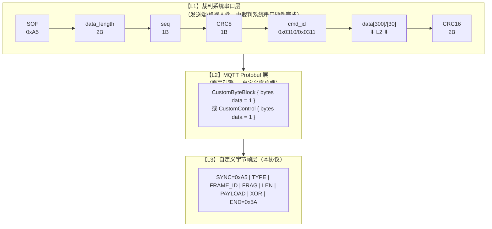
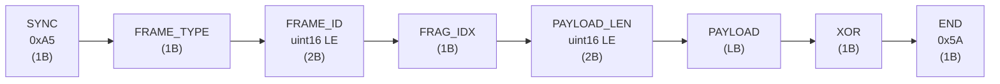
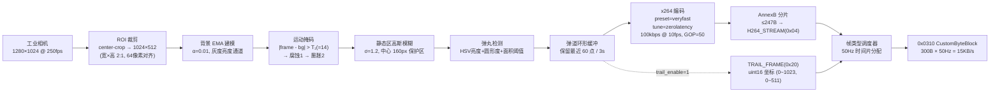

# 自定义数据传输协议

> 版本：v3.3.0  
> 日期：2026-04-19  
> 帧长度：可变长（最小 9 字节，最大受承载层/物理层限制）

| 版本    | 发布日期   | 改动                                                                                                                                                                                                                                                                                                                                                                        |
| ------- | ---------- | --------------------------------------------------------------------------------------------------------------------------------------------------------------------------------------------------------------------------------------------------------------------------------------------------------------------------------------------------------------------------- |
| v 1.0.0 | 2026-02-07 | 第一版首次发布                                                                                                                                                                                                                                                                                                                                                              |
| v 2.0.0 | 2026-02-13 | 第二版首次发布                                                                                                                                                                                                                                                                                                                                                              |
| v 3.0.0 | 2026-04-06 | 新增 `H264_STREAM`(0x04) 帧类型，支持 H.264 编码的吊射图传                                                                                                                                                                                                                                                                                                                  |
| v 3.1.0 | 2026-04-07 | H264_STREAM 升级为 YUV420 彩色（100kbps）；新增自适应降级机制                                                                                                                                                                                                                                                                                                               |
| v 3.2.0 | 2026-04-19 | **H264_STREAM 分辨率升级为原始采集尺寸**；弹道拖影从 D 帧内嵌改为 **独立 TRAIL_FRAME(0x20) 通道**；`CMD_SET_PARAM` 新增 `trail_enable / video_fps / video_bitrate / video_resolution` 参数                                                                                                                                                                                  |
| v 3.2.1 | 2026-04-19 | **采集端固化为 1024×512 横屏 2:1**；新增 §6 **发送端算法** 完整迭代                                                                                                                                                                                                                                                                                                         |
| v 3.3.0 | 2026-04-19 | **严格对齐官方 V1.3.0 通信协议**：明确三层封装（裁判系统串口 0x0310/0x0311 → MQTT Protobuf → 自定义内层帧）；下行 0x0310 容量 300 B / 50 Hz，**上行 0x0311/CustomControl 容量收紧至 30 B / 75 Hz**；上行帧 `PAYLOAD_LEN ≤ 21B`；内层 SYNC 保持 0xA5（与官方串口 SOF 同值但层级不同，发送端需分层处理）；修正 0x0311 频率 50Hz→75Hz；新增 §0 **封装层次与官方协议对齐** 章节 |

v3.3.0 破坏性变更要点：
- **上行通道容量收紧**：原文档假定 `CMD_SET_PARAM` 可使用与下行相同的 ≤249B 载荷，实际官方 0x0311/CustomControl **硬性上限 30 字节**；扣除本协议 9B 头尾后，**上行 PAYLOAD_LEN ≤ 21 B**。所有上行帧（`CMD_REQUEST_I / CMD_SET_PARAM / HEARTBEAT / RADAR_MARK`）必须符合此约束。
- **上行频率上限修正**：0x0311 = **75 Hz**（非 50 Hz）。客户端批量发包不应超过此频率。
- **新增 §0 封装层次**：明确"裁判系统串口层 → MQTT Protobuf 层 → 自定义字节帧层"三层模型，发送端嵌入式代码**不得**把自定义帧错误地拼在 0x0310 外层串口头之前。
- v3.2.1 的帧格式、帧类型、XOR 校验、帧长字段均**保持不变**（向前兼容）。

---

## 0. 封装层次与官方协议对齐（v3.3.0 新增）

本协议**不是独立链路协议**，而是**寄生在官方《RoboMaster 2026 机甲大师高校系列赛通信协议 V1.3.0》的 0x0310 / 0x0311 命令字数据段内**。发送端（机器人嵌入式）与客户端必须按以下三层模型收发：



### 0.1 三层容量关系（官方 V1.3.0 §1.7 表 1-5 / 表 1-41 / 表 1-42）

| 方向 | L1 命令字 | L1 数据段上限 | L2 Protobuf 类型  | L3 本协议有效载荷上限                                   | 频率上限  |
| ---- | --------- | ------------- | ----------------- | ------------------------------------------------------- | --------- |
| 下行 | `0x0310`  | **300 B**     | `CustomByteBlock` | `PAYLOAD_LEN ≤ 291 B`（推荐 ≤ **249 B**，留序列化余量） | **50 Hz** |
| 上行 | `0x0311`  | **30 B**      | `CustomControl`   | `PAYLOAD_LEN ≤ 21 B`（硬性上限，30 - 9 头尾）           | **75 Hz** |

> 推荐值 **249 B** 来自 L1 的 300B 上限扣除 L2 protobuf `bytes data=1` 的 tag(1B) + varint length prefix(≤3B) ≈ 4B、本协议头尾 9B，实际上限 `300 - 4 - 9 = 287`，取 249 保留安全余量。

### 0.2 发送端嵌入式侧的组帧伪码

```c
// Step 1: 组装 L3 自定义字节帧（本协议）
uint8_t inner[300];
size_t inner_len = build_my_frame(inner, FRAME_TYPE_H264_STREAM, /*...*/);
// 其中 build_my_frame 生成：SYNC(0xA5) TYPE FRAME_ID FRAG LEN PAYLOAD XOR END(0x5A)

// Step 2: 塞入 L1 裁判系统串口帧的 data[] 段
referee_frame_t f;
f.SOF       = 0xA5;                    // ⚠ L1 的 SOF，与 L3 的 SYNC 值相同但语义不同
f.data_len  = inner_len;               // ≤ 300
f.seq       = seq++;
f.CRC8      = crc8(&f, offsetof(referee_frame_t, CRC8));
f.cmd_id    = 0x0310;                  // 下行 → 客户端
memcpy(f.data, inner, inner_len);
f.CRC16     = crc16(&f, /*...*/);
uart_send(&f, /*total len*/);

// 裁判系统串口硬件以波特率 921600 @ 图传链路 限速 50Hz 发送。
// 赛事引擎服务器收到后，将 data[inner_len] 原样打包为：
//   CustomByteBlock { data: <inner bytes> }
// 通过 MQTT 推给已登录的自定义客户端。
```

### 0.3 SYNC 冲突说明

| 层级 | 字段 | 值     | 作用域                     |
| ---- | ---- | ------ | -------------------------- |
| L1   | SOF  | `0xA5` | 裁判系统串口物理帧起始字节 |
| L3   | SYNC | `0xA5` | 本协议内层帧同步字         |

**两者数值相同但完全独立**。客户端在 L3 解析时**永远不会看到 L1 的 SOF**（已被赛事引擎剥离），所以对客户端无歧义。发送端嵌入式代码应在 **L1 外层打包后再做串口字节流发送**，切勿在 inner[] 构造阶段混入 L1 字段。

### 0.4 上行通道 0x0311 / CustomControl 的容量约束

```
官方 0x0311 数据段 = 30 B
- 本协议 L3 头（SYNC + TYPE + FRAME_ID + FRAG + LEN）= 7 B
- 本协议 L3 尾（XOR + END）= 2 B
= 上行 PAYLOAD_LEN 上限 21 B
```

**当前协议中所有上行帧类型**（客户端 → 机器人）：

| 帧类型          | 代码 | 载荷实际长度 | 是否满足 ≤ 21B                                            |
| --------------- | ---- | ------------ | --------------------------------------------------------- |
| `CMD_REQUEST_I` | 0xF0 | 0 B          | ✅                                                         |
| `CMD_SET_PARAM` | 0xF1 | 2~6 B        | ✅ （最大 video_resolution=4B param_val + 2B header = 6B） |
| `HEARTBEAT`     | 0xFE | 0 B          | ✅                                                         |
| `RADAR_MARK`    | 0x51 | 2 B          | ✅                                                         |

> 若未来新增上行帧类型，必须在设计阶段验证 `PAYLOAD_LEN ≤ 21`，否则需分片（`FRAG_IDX` 递增）。
> 但考虑到上行场景几乎都是小命令，**强烈建议不要让上行单帧超过 21B**，保持单包原子性。

### 0.5 Protobuf 版本声明

本协议接收/发送的 `CustomByteBlock` 与 `CustomControl` 消息结构与官方 V1.3.0 proto 定义**完全一致**：

```proto
message CustomByteBlock { optional bytes data = 1; }  // 下行 0x0310
message CustomControl   { optional bytes data = 1; }  // 上行 0x0311
```

客户端实现在 `Assets/Proto/` 下生成的 `.cs` 文件必须与官方 proto 版本对齐，否则 MQTT 反序列化会失败。

---


## 帧类型段位分配

| 段位          | 用途            | 说明                        |
| ------------- | --------------- | --------------------------- |
| `0x01`–`0x0F` | 吊射视觉·I 帧族 | 渐进 I 帧、单包 I 帧        |
| `0x10`–`0x1F` | 吊射视觉·D 帧族 | 差分帧、空差分帧            |
| `0x20`–`0x2F` | 吊射视觉·轨迹帧 | 独立轨迹帧                  |
| `0x30`–`0x3F` | 通用消息·文字   | 预定义/自由文本消息         |
| `0x40`–`0x4F` | 自瞄视觉·目标   | 装甲板外接矩形、目标状态    |
| `0x50`–`0x5F` | 雷达数据        | 敌方位置、雷达标记          |
| `0x60`–`0xEF` | 预留扩展        | 未来功能                    |
| `0xF0`–`0xFF` | 控制/心跳       | 请求 I 帧、参数设置、心跳包 |

---

## 1. 包结构总览

|   字节偏移 | 字段        | 长度 | 常量/编码 | 说明                          |
| ---------: | ----------- | ---: | --------- | ----------------------------- |
|          0 | SYNC        |    1 | `0xA5`    | 帧同步字                      |
|          1 | FRAME_TYPE  |    1 | -         | 帧类型枚举（见 §3）           |
|        2-3 | FRAME_ID    |    2 | uint16 LE | 帧序号，0~65535 循环          |
|          4 | FRAG_IDX    |    1 | -         | 分片索引：0=完整帧，1..N=分片 |
|        5-6 | PAYLOAD_LEN |    2 | uint16 LE | 载荷字节数                    |
| 7..(7+L-1) | PAYLOAD     |    L | -         | 载荷数据（可变）              |
|      (7+L) | XOR         |    1 | -         | 包头+载荷所有字节 XOR 校验    |
|    (7+L+1) | END         |    1 | `0x5A`    | 包结束标记                    |

总长度：$7$（包头）$+\ L$（载荷）$+\ 2$（包尾）。



---

## 2. 字段定义

### 2.1 SYNC

- 固定 `0xA5`，用于帧同步。

### 2.2 FRAME_ID

- `uint16` 小端序，范围 0~65535 循环。

### 2.3 FRAG_IDX

- `0`：表示该包为“完整帧/完整载荷”。
- `1..N`：表示该包属于同一逻辑载荷的分片序列。

> 说明：在 WMJ 吊射视觉链路中，I 帧采用 `I_FRAME_PART1 / I_FRAME_PART2` 表达“渐进两包”，通常不依赖该字段；该字段保留用于将来做通用分片。

### 2.4 PAYLOAD_LEN

- `uint16` 小端序。
- 在接收端应检查：剩余字节是否满足 $PAYLOAD\_LEN + 2$（XOR+END）。

### 2.5 XOR

- 逐字节异或校验，覆盖范围为：`SYNC` 到 `PAYLOAD`（即偏移 `0 .. (7+L-1)` 的所有字节）。
- **不包含** `XOR` 字节自身与 `END`。

参考实现：

```c
uint8_t calc_xor(const uint8_t *buf, size_t len) {
    uint8_t x = 0;
    for (size_t i = 0; i < len; ++i) {
        x ^= buf[i];
    }
    return x;
}

// 校验：buf[7 + payload_len] == calc_xor(buf, 7 + payload_len)
```

### 2.6 END

- 固定 `0x5A`，用于包结束标记。

---

## 3. 帧类型枚举（FRAME_TYPE）

### 吊射视觉（`0x01`–`0x2F`）

| 值     | 名称             | 说明                                  | 典型大小  |
| ------ | ---------------- | ------------------------------------- | --------- |
| `0x01` | `I_FRAME_PART1`  | 渐进 I 帧第 1 包（低分辨率完整帧）    | 60~100 B  |
| `0x02` | `I_FRAME_PART2`  | 渐进 I 帧第 2 包（高分辨率补丁）      | 120~220 B |
| `0x03` | `I_FRAME_SINGLE` | 单包 I 帧（压缩足够小时使用）         | ≤249 B    |
| `0x04` | `H264_STREAM`    | **H.264 码流分片（v2.0 吊射图传）** 🆕 | ≤249 B    |
| `0x10` | `D_FRAME`        | 差分帧（含内嵌弹丸坐标）              | 10~80 B   |
| `0x11` | `D_FRAME_EMPTY`  | 空差分帧（画面无变化）                | 0 B 载荷  |
| `0x20` | `TRAIL_FRAME`    | 独立轨迹帧（完整弹道历史）            | 20~130 B  |

### 通用消息（`0x30`–`0x3F`）

| 值     | 名称       | 说明                                    | 典型大小 |
| ------ | ---------- | --------------------------------------- | -------- |
| `0x30` | `TEXT_MSG` | 文字消息（预定义编号或自由 UTF-8 文本） | 3~120 B  |

### 自瞄视觉（`0x40`–`0x4F`）

| 值     | 名称            | 说明                                   | 典型大小 |
| ------ | --------------- | -------------------------------------- | -------- |
| `0x40` | `ARMOR_TARGETS` | 装甲板外接矩形列表（自瞄检测结果下发） | 5~225 B  |
| `0x41` | `AIM_STATUS`    | 自瞄状态摘要（锁定/丢失/切换目标）     | 3 B      |

### 雷达数据（`0x50`–`0x5F`）

| 值     | 名称            | 说明                             | 典型大小 |
| ------ | --------------- | -------------------------------- | -------- |
| `0x50` | `RADAR_ENEMIES` | 雷达检测到的敌方机器人位置列表   | 2~44 B   |
| `0x51` | `RADAR_MARK`    | 雷达双击标记（请求触发双倍易伤） | 2 B      |

### 控制/心跳（`0xF0`–`0xFF`）

| 值     | 名称            | 说明                  | 典型大小 |
| ------ | --------------- | --------------------- | -------- |
| `0xF0` | `CMD_REQUEST_I` | 控制帧：请求重发 I 帧 | 0 B 载荷 |
| `0xF1` | `CMD_SET_PARAM` | 控制帧：参数设置      | 可变     |
| `0xFE` | `HEARTBEAT`     | 心跳包                | 0 B 载荷 |

---

## 4. 各帧类型载荷格式（PAYLOAD）

### 4.1 渐进 I 帧第 1 包（`I_FRAME_PART1 = 0x01`）

```
偏移  长度  字段            说明
0     1B    width_div4      缩略帧宽度/4 = 24（即96px）
1     1B    height_div4     缩略帧高度/4 = 18（即72px）
2     1B    bg_color        背景色：0x00=黑，0xFF=白
3..   变长  rle_data        96×72 二值帧的 RLE 压缩数据
```

### 4.2 渐进 I 帧第 2 包（`I_FRAME_PART2 = 0x02`）

```
偏移  长度  字段            说明
0     1B    ref_frame_id_lo 关联的第1包 frame_id 低字节
1     1B    ref_frame_id_hi 关联的第1包 frame_id 高字节
2     1B    mixed_count     混合块（有差异块）数量
3..   变长  block_entries   混合块列表，每项格式见下
```

混合块条目格式：

```
偏移  长度  字段      说明
0     1B    bx        块X坐标（8px单位，0~23）
1     1B    by        块Y坐标（8px单位，0~17）
2     1B    rle_len   块内 RLE 数据长度（0=全翻转）
3..   变长  rle_data  8×8 块的内部 RLE 数据
```

### 4.3 单包 I 帧（`I_FRAME_SINGLE = 0x03`）

```
偏移  长度  字段            说明
0     1B    width_div4      帧宽度/4 = 48（即192px）
1     1B    height_div4     帧高度/4 = 36（即144px）
2     1B    bg_color        背景色：0x00=黑，0xFF=白
3     1B    mixed_count     非纯色块数量
4..   变长  block_entries   同“混合块条目格式”
```

### 4.4 H.264 码流分片（`H264_STREAM = 0x04`）🆕

> v3.0.0 新增。用于 v2.0 吊射图传方案，通过 CustomByteBlock 链路传输 H.264 码流。
> **比赛模式下**：这是唯一合法的吊射数据传输通道（官方规则 R3 禁止自行架设无线设备）。
> **仿真模式下**：可选用裸 UDP 传输（低延迟，无封装开销）进行日常开发测试。

```
偏移  长度  字段            说明
0     1B    stream_id       码流标识（0=吊射图传，预留 1~15 给其他视频流）
1     1B    flags           标志位：
                              bit 0: is_keyframe (1=该分片属于 IDR 帧)
                              bit 1: is_first    (1=该帧的第一个分片)
                              bit 2: is_last     (1=该帧的最后一个分片)
                              bit 3-7: 保留
2..   变长  h264_data       H.264 Annex-B 字节流片段
```

**使用说明：**

- 发送端将 x264 编码器输出的 Annex-B 字节流按 ≤247B 分片（`249 - 2B 头 = 247B`）
- `FRAME_ID` 用于标识视频帧序号，`FRAG_IDX` 用于标识帧内分片序号
- 接收端按 `FRAME_ID` + `FRAG_IDX` 顺序重组完整 Annex-B 流，喂给 H.264 解码器
- `is_keyframe` 标志帮助接收端在丢包后快速定位下一个 IDR 帧开始解码
- 编码器应设置 `repeat-headers=1`，确保每个 IDR 帧前都携带 SPS/PPS

**带宽分析（比赛模式，0x0310 图传链路，v3.3.0 分辨率 1024×512）：**

```
物理上限:     300 B/包 × 50 Hz             = 15,000 B/s (裁判系统协议 V1.3.0 表1-41)
协议开销:     每包 CustomByteBlock 头(7B) + 尾(2B)        = 9 B
可用载荷:     (300 - 9) B × 50 Hz          = 14,550 B/s ≈ 116 kbps
分辨率提升:   360×540 → 1024×512（像素数 194k → 524k，2.7×）
但由于大面积为静态区且经高斯模糊预处理，色度与残差几乎同旧版：
  - 100 kbps @ 10 fps @ GOP=50 @ veryfast/zerolatency 在实测中：
    平均 P 帧 ~600 B，IDR ~3.2 kB（两包填满 5~7 个 CustomByteBlock 帧）
消耗:         100 kbps ≈ 12.5 KB/s → 83% 带宽（余量 ~2.5 KB/s 用于 TRAIL + 心跳）
降级档位:     
  L0 彩色 100 kbps / 10 fps（默认，趋势优先）
  L1 彩色 80 kbps  / 8 fps （轻度拥塞）
  L2 灰度 60 kbps  / 6 fps （严重拥塞，仅保留亮度通道）
```

> ⚠️ 0x0310 无重传机制。丢包率正常 <1%，拥塞时 ~3%。靠 H.264 IDR 帧自恢复（建议 5s 间隔 = GOP 50 @ 10fps）。
> 裁判系统延迟 ~130ms（正常）/ ~200ms（拥塞），加上编解码约 30ms，总延迟约 160-230ms。

### 4.5 差分帧（`D_FRAME = 0x10`）

> v3.2.0 变更：弹丸坐标内嵌字段已廃弃，发送端应将 `extra_trail_count=0` 且不携带轨迹数据。
> 弹道拖影请使用独立 `TRAIL_FRAME`(0x20)，收发双端可依 `CMD_SET_PARAM/trail_enable`（0xF1 param 0x05）远程开关。

```
偏移  长度  字段                说明
0     1B    diff_block_count   差异 8×8 块数量（0~24）
1..   变长  diff_blocks        差异块列表（每坨10B）
---   分隔  以下为序列兼容区域，v3.2.0 起应填 0/不携带  ---
+0    1B    ball_detected      ☠ 廃弃：固定 0
+1    1B    ball_cx            ☠ 廃弃：固定 0
+2    1B    ball_cy            ☠ 廃弃：固定 0
+3    1B    ball_radius        ☠ 廃弃：固定 0
+4    1B    extra_trail_count  ☠ 廃弃：固定 0
```

差异块条目格式：

```
偏移  长度  字段      说明
0     1B    bx        块X坐标（8px单位，0~23）
1     1B    by        块Y坐标（8px单位，0~17）
2     8B    xor_data  该块的 XOR 差分原始数据（与上一帧异或）
```

### 4.6 空差分帧（`D_FRAME_EMPTY = 0x11`）

```
PAYLOAD_LEN = 0
语义：当前帧与上一帧完全相同
```

### 4.7 独立轨迹帧（`TRAIL_FRAME = 0x20`）

> v3.2.1 升级：坐标字段为 2B（uint16 LE），适配 **1024×512** 原始采集分辨率。
> 该帧发送行为**完全由发送端的 `trail_enable` 参数控制**；客户端可通过
> `CMD_SET_PARAM`（0xF1）的 `param_id=0x05` 远程开关。禁用后发送端不再打包 TRAIL 帧，
> 直接释放带宽给 H.264 码流；客户端同时隐藏本地轨迹叠加层。

```
偏移  长度  字段            说明
0     1B    point_count     轨迹点数量（1~60）
1     1B    oldest_age      最老点距 now 的帧数（用于时间戳重建）
2     1B    flags           标志位：
                              bit 0: coord_u16 (1=坐标为 uint16 LE，v3.2.1 固定为 1)
                              bit 1: has_radius (1=每个点额外携带 1B 半径)
                              bit 2-7: 保留
3..   变长  points          轨迹点数组（按时间从老到新排列）

point 格式（coord_u16=1 时，4~5B/点）：
  偏移  长度  说明
  0    2B    x 坐标（uint16 LE，原始采集像素 0~1023）
  2    2B    y 坐标（uint16 LE，原始采集像素 0~511）
  4    1B    半径（has_radius=1 时存在，px，典型 3~8）
```

**容量校验**（最大包长）：`3 + 60×5 = 303B` 超出 249B 上限。
实际发送端应取 `point_count ≤ 48`（`3 + 48×5 = 243B`），或不用 has_radius 时可放宽至 61。
若轨迹过长，推荐分成多包传输（`FRAME_ID` 相同，`FRAG_IDX` 递增）。

### 4.8 控制帧：请求 I 帧（`CMD_REQUEST_I = 0xF0`）

```
PAYLOAD_LEN = 0
语义：接收端请求发送端立即发送一个完整 I 帧
方向：接收端 → 发送端（反向通道）
```

### 4.9 控制帧：参数设置（`CMD_SET_PARAM = 0xF1`）

```
偏移  长度  字段        说明
0     1B    param_id    参数编号
1     1B    param_len   参数值长度
2..   变长  param_val   参数值

param_id 定义（v3.2.0 扩展）：
  0x01 = I帧间隔                1B    单位：帧，默认 25
  0x02 = 轨迹缓存长度            1B    单位：点，默认 60，上限 60
  0x03 = 二值化阈值（v1兼容）  1B    0~255，默认 128
  0x04 = ROI 使能               1B    0=关，1=开
  0x05 = 弹道拖影开关           1B    0=禁用发送 TRAIL_FRAME，1=启用（默认）
  0x06 = H.264 目标帧率         1B    单位：fps（建议 6~12，1024×512 默认 10）
  0x07 = H.264 目标码率         2B LE 单位：kbps（建议 80~110，默认 100）
  0x08 = 视频分辨率             4B    uint16 LE width + uint16 LE height
                                      （v3.2.1 默认 1024×512；发送端仅在支持时生效；不支持将回应 NAK）
  0x09 = IDR 强制请求           0B    等价于 CMD_REQUEST_I(0xF0)，为对称性保留
  0x0A = 轨迹渲染色彩建议       3B    RGB24，客户端下发给发送端（仅提示性）
```

> ⚠️ **上行封包约束（v3.3.0）**：`CMD_SET_PARAM` 如果通过 **上行 0x0311 / CustomControl** 发送，
> 由于官方 data 段 ≤ 30 B，本协议头尾 9 B，因此 `param_len` 载荷 ≤ **19 B**（`2B param header + 19B val = 21B`）。
> 上表所有 param_id 已符合此约束（最大 0x08 视频分辨率 = 4B val + 2B header = 6B）。
> 若发送端通过 **下行 0x0310 / CustomByteBlock** 回 echo 参数，则沿用 ≤ 249 B 规则。

**弹道拖影开关协同逻辑（v3.3.0 明确上行封装）：**

1. 客户端用户按热键/设置面板 → 调用 `LobShotHUD.TrailEnabled = false/true`
2. 客户端立即隐藏/显示本地轨迹叠加层（UI 即时生效，无需等待发送端 ack）
3. 构造 **上行内层帧**（`SYNC + TYPE=0xF1 + FRAME_ID + FRAG + LEN=3 + [0x05, 0x01, enable] + XOR + END`）= 12 B，符合 `≤ 30B` 约束
4. 将内层帧写入 `CustomControl.data`，由客户端通过 MQTT 发布到 topic `CustomControl`，赛事引擎转发为图传链路 0x0311 命令字
5. 发送端（机器人嵌入式）从裁判系统串口处解出 0x0311 的 data[30]，内层解析后更新 `trail_enable`，立即给下一帧生效
6. 发送端停止 / 恢复打包 `TRAIL_FRAME`，释放 / 回收带宽；可选地通过 0x0310 回传 `HEARTBEAT` 或 `CMD_SET_PARAM` echo

### 4.10 心跳包（`HEARTBEAT = 0xFE`）

```
PAYLOAD_LEN = 0
用途：维持链路活性/便于统计丢包与延迟
```

### 4.11 文字消息（`TEXT_MSG = 0x30`）

```
偏移  长度  字段         说明
0     1B    msg_id       预定义消息编号（0x00 表示自由文本，见附录 C）
1     1B    severity     严重级别：0=INFO, 1=WARN, 2=ERROR
2     1B    text_len     后续 UTF-8 文本字节数（msg_id≠0 时为 0）
3..   变长  text_data    UTF-8 编码文本（仅 msg_id=0x00 时携带）
```

**使用方式：**
- 发送预定义消息时，`msg_id` 填对应编号（如 `0x01` = "你卡弹了"），接收端查表显示，`text_len=0`，无需携带文本；
- 发送自由文本时，`msg_id=0x00`，文本内容放在 `text_data` 中；下行（0x0310）最大 `249 - 3 = 246` 字节；上行（0x0311）最大 `21 - 3 = 18` 字节（UTF-8 下仅约 6 个汉字）。

### 4.12 装甲板外接矩形（`ARMOR_TARGETS = 0x40`）

```
偏移  长度  字段           说明
0     2B    img_width      源图像宽度（uint16 LE，如 1280）
2     2B    img_height     源图像高度（uint16 LE，如 1024）
4     1B    target_count   本帧检测到的装甲板目标数（0~20）
5..   变长  targets        目标条目数组（每条目 11B）
```

目标条目格式（11 字节/条目）：

```
偏移  长度  字段         说明
0     1B    robot_type   敌方机器人类型（见附录 D）
1     1B    armor_id     该机器人的装甲板编号（0~3）
2     2B    x            外接矩形左上角 X（uint16 LE，像素）
4     2B    y            外接矩形左上角 Y（uint16 LE，像素）
6     2B    w            外接矩形宽度（uint16 LE，像素）
8     2B    h            外接矩形高度（uint16 LE，像素）
10    1B    confidence   置信度（0~100，百分比）
```

> 容量校验：`5 + 11 × 20 = 225B ≤ 249B` ✓  
> 接收端根据 `img_width / img_height` 将像素坐标映射到本地显示分辨率后绘制矩形框。

### 4.13 自瞄状态摘要（`AIM_STATUS = 0x41`）

```
偏移  长度  字段         说明
0     1B    aim_state    自瞄状态枚举：
                           0x00 = IDLE（未启用/无目标）
                           0x01 = SEARCHING（搜索中）
                           0x02 = LOCKED（已锁定）
                           0x03 = TRACKING（跟踪中，未稳定锁定）
                           0x04 = LOST（目标丢失）
1     1B    target_type  当前锁定目标的机器人类型（见附录 D，无目标时为 0）
2     1B    target_armor 锁定的装甲板编号（0~3，无目标时为 0）
```

> 该帧体积极小（3B 载荷，总帧 12B），可高频发送（如 10~25 Hz），
> 用于在客户端 UI 上实时显示自瞄状态指示器。

### 4.14 雷达敌方位置（`RADAR_ENEMIES = 0x50`）

```
偏移  长度  字段           说明
0     1B    enemy_count    检测到的敌方机器人数量（0~6）
1..   变长  enemies        敌方机器人位置数组（每条目 7B）
```

敌方位置条目格式（7 字节/条目）：

```
偏移  长度  字段         说明
0     1B    robot_id     敌方机器人编号（裁判系统 ID，见附录 D）
1     2B    x_cm         场地 X 坐标（uint16 LE，单位 cm，0~2800）
3     2B    y_cm         场地 Y 坐标（uint16 LE，单位 cm，0~1500）
5     1B    confidence   置信度（0~100）
6     1B    flags        标志位（见下）
```

`flags` 位域定义：

| Bit | 名称      | 说明                               |
| --- | --------- | ---------------------------------- |
| 0   | `MOVING`  | `1` = 目标正在移动                 |
| 1   | `VISIBLE` | `1` = 当前帧可见（非历史推测位置） |
| 2-7 | 保留      | 固定 `0`                           |

> 容量校验：`1 + 7 × 6 = 43B ≤ 249B` ✓  
> 坐标系使用 RoboMaster 场地标准坐标：原点位于己方启动区角，X 轴沿长边（0~2800 cm），Y 轴沿短边（0~1500 cm）。

### 4.15 雷达双击标记（`RADAR_MARK = 0x51`）

```
偏移  长度  字段           说明
0     1B    target_id      被标记的敌方机器人 ID（裁判系统编号）
1     1B    mark_action    标记动作：
                             0x01 = MARK（触发双倍易伤）
                             0x02 = CANCEL（取消标记）
```

> 方向：雷达操作手 → 通过上行 0x0311 / CustomControl 传到本方机器人，再转发给队友客户端（不直接入裁判系统）  
> 总帧长仅 $7 + 2 + 2 = 11$ 字节，符合上行 30B 约束 ✓

---

## 5. 处理规则（建议）

### 5.1 发送端

1. 填写 `SYNC / FRAME_TYPE / FRAME_ID / FRAG_IDX / PAYLOAD_LEN / PAYLOAD`
2. 计算 `XOR = XOR(buf[0 .. 6+PAYLOAD_LEN])`
3. 写入 `END = 0x5A`
4. 发送整个字节序列（作为 `CustomByteBlock.data` 或上行 `CustomControl.data`）

### 5.2 接收端

1. 扫描并对齐 `SYNC=0xA5`
2. 读取固定包头（7B），解析 `PAYLOAD_LEN`（LE）
3. 检查末尾 `END=0x5A`，并校验 `XOR`
4. 按 `FRAME_TYPE` 分发至对应解包/解码逻辑
5. 若校验失败或长度不一致，丢弃该包并等待后续 I 帧修正

---

## 6. 发送端算法（v3.3.0 吊射图传完整流水线）

> 本章节描述 **发送端（机器人嵌入式 Jetson / OrinNano）** 在 1024×512 原生分辨率下的
> 完整图传生成流水线。所有步骤均在 **内层（L3）** 完成后，由嵌入式调用
> 裁判系统串口 API（L1）打包为 0x0310/0x0311 打出（详见 §0.2）。接收端无需感知细节，
> 仅按 §4.4 解析 `H264_STREAM(0x04)` 即可。

### 6.1 流水线总览



### 6.2 步骤 1：ROI 裁剪（采集源 → 1024×512）

```cpp
// 假设传感器输出 1280×1024 灰度 / BGR
constexpr int SRC_W = 1280, SRC_H = 1024;
constexpr int ROI_W = 1024, ROI_H = 512;
constexpr int ROI_X = (SRC_W - ROI_W) / 2;   // 128
constexpr int ROI_Y = (SRC_H - ROI_H) / 2;   // 256

cv::Mat roi = full(cv::Rect(ROI_X, ROI_Y, ROI_W, ROI_H)).clone();
```

**要点：**
- **无 resize**：直接从传感器中心区域裁出 1024×512，避免二次下采样带来的模糊与锯齿。
- 宽 1024 = 64 × 16、高 512 = 32 × 16，完全满足 H.264 16 像素宏块对齐，x264 不会隐式填充。
- 纵向视野从原来的 540 px 缩减到 512 px（-5%），但横向视野从 360 px 扩大到 1024 px（+184%），
  符合吊射观察靶板横向分布的实际需求。

### 6.3 步骤 2：静态信息消除（背景建模 + 运动掩码 + 模糊）

**目的：** 在极低码率下仍保留弹丸/靶板/动态物体清晰度，把大片静态背景的高频信息"削平"以腾出码率给运动区。

```cpp
// 增量背景建模（亮度通道 Y）
cv::accumulateWeighted(roiGray, bgModel, 0.01);  // α=0.01，100 帧时间常数
cv::absdiff(roiGray, bgModel, diff);
cv::threshold(diff, motionMask, 14, 255, cv::THRESH_BINARY);
cv::erode (motionMask, motionMask, kern3, {-1,-1}, 1);  // 去噪
cv::dilate(motionMask, motionMask, kern3, {-1,-1}, 2);  // 扩边，防止边缘被模糊

// 中心保护区（准心附近永不模糊，避免漏检弹丸）
cv::Rect centerSafe(ROI_W/2 - 80, ROI_H/2 - 80, 160, 160);
cv::rectangle(motionMask, centerSafe, 255, cv::FILLED);

// 模糊静态区
cv::Mat blurred;
cv::GaussianBlur(roi, blurred, cv::Size(0, 0), 1.2);
roi.copyTo(blurred, motionMask);  // 运动区覆盖回原始
```

**效果：** x264 对模糊区估计出极小残差 → 码率节省 ≈ 35~45%，留给 IDR 帧与运动区。

### 6.4 步骤 3：弹丸检测与弹道环形缓冲

```cpp
struct TrailPoint { uint16_t x, y; uint8_t radius; uint8_t age; };
std::deque<TrailPoint> trail;   // 上限 60 点（对应 3s @ 20Hz 检测）

// 每帧运行：HSV 亮度阈值 → 连通域 → 圆形度 > 0.7 → 半径 2~10 px
auto det = DetectBall(roi);
if (det.found) {
    trail.push_back({(uint16_t)det.cx, (uint16_t)det.cy,
                     (uint8_t)det.r, 0});
    if (trail.size() > 60) trail.pop_front();
}
for (auto& p : trail) p.age++;       // 时间递增
// 超过 MAX_AGE=60 (3s @ 20Hz) 自动丢弃
while (!trail.empty() && trail.front().age > 60) trail.pop_front();
```

### 6.5 步骤 4：x264 编码配置（v3.2.1 推荐参数）

```cpp
x264_param_t p;
x264_param_default_preset(&p, "veryfast", "zerolatency");

p.i_width  = 1024;
p.i_height = 512;
p.i_fps_num = 10;  p.i_fps_den = 1;
p.i_keyint_max     = 50;       // 5s IDR 间隔（@ 10fps）
p.i_keyint_min     = 50;
p.b_intra_refresh  = 0;        // 走完整 IDR 以便 FRAG_IDX 重组时同步
p.i_bframe         = 0;        // 禁用 B 帧降低延迟
p.rc.i_rc_method   = X264_RC_ABR;
p.rc.i_bitrate     = 100;      // kbps（v3.2.1 默认；拥塞时由 CMD_SET_PARAM 下调）
p.rc.i_vbv_max_bitrate = 110;
p.rc.i_vbv_buffer_size = 100;  // 1s 缓冲
p.b_repeat_headers = 1;        // 每个 IDR 前都插入 SPS/PPS，便于丢包恢复
p.b_annexb         = 1;        // AnnexB 起始码，便于按 NAL 分片
p.i_csp            = X264_CSP_I420;  // YUV420 彩色
x264_param_apply_profile(&p, "baseline");  // 无 CABAC，解码更轻
```

### 6.6 步骤 5：AnnexB 分片 → H264_STREAM(0x04) → 串口 L1 封装

```cpp
// ① 每个 NALU 扫描 0x000001 或 0x00000001 起始码，取其后的 NAL payload
// ② 若单个 NAL ≤ 245 B（245 = 247 - 2B H264_STREAM 头），单包发送
//    否则按 245 B 切片，FRAG_IDX 递增；首片置 is_first=1，末片 is_last=1
// ③ 同一 IDR 帧的所有分片共享 FRAME_ID，flags.is_keyframe=1
// ④ 构造好的内层帧（SYNC..END，≤ 258B）**仍在 L3**，
//    接下来必须调用裁判系统串口 API 将其写入 0x0310 的 data[x] 段
//    完成 L1 封装（见 §0.2：SOF/data_length/seq/CRC8/cmd_id/data/CRC16）
```

**分片策略关键：**
- `FRAME_ID` 采样 **H.264 帧序号**（非协议包序号），所有属于同一视频帧的分片共享。
- `FRAG_IDX` 从 1 开始累增（0 保留给"不分片"帧）。
- 发送速率按 `min(实际编码输出, 50Hz×247B)` 节流，避免突发超裁判系统带宽上限。
- **L1 封装开销 13 B**（SOF+data_length+seq+CRC8+cmd_id+CRC16）由赛事提供的裁判系统库自动追加，
  本协议不需关心 CRC 计算，但需确保 data 段不超 300B。

### 6.7 步骤 6：帧类型调度器（下行 0x0310 的 50Hz 时间片分配）

在下行 15 KB/s（300B×50Hz）总带宽下，发送端 **每 20ms（50Hz）时隙** 优先级：

| 优先级 | 帧类型              | 典型占用 | 触发条件                             |
| ------ | ------------------- | -------- | ------------------------------------ |
| P0     | `H264_STREAM(0x04)` | 90%      | x264 有输出时                        |
| P1     | `TRAIL_FRAME(0x20)` | 5~8%     | `trail_enable=1 && trail.size() > 0` |
| P2     | `HEARTBEAT(0xFE)`   | < 0.1%   | 每 2s 一次                           |
| P3     | `TEXT_MSG / 其他`   | 剩余带宽 | 按需发送                             |

当 P0 队列积压（编码器输出 > 带宽）时，调度器**丢弃非 IDR 帧的 P 帧**（不丢 IDR 首片），
并通过 `param_id=0x07` 自动下调码率一档（100 → 80 → 60 kbps）。

### 6.8 远程参数响应（从上行 0x0311 / CustomControl 接收 CMD_SET_PARAM）

发送端作为被控方，通过裁判系统串口收到 0x0311 data（≤ 30B），内层解出 `CMD_SET_PARAM` 后必须响应：

| param_id | 动作                                                                             |
| -------- | -------------------------------------------------------------------------------- |
| `0x05`   | 设置 `trail_enable`。设为 0 时立即停止打包 TRAIL_FRAME                           |
| `0x06`   | 调用 `x264_encoder_reconfig()` 更新 `i_fps_num`                                  |
| `0x07`   | 调用 `x264_encoder_reconfig()` 更新 `rc.i_bitrate`；同步 `vbv_max_bitrate`       |
| `0x08`   | 分辨率切换（需重建编码器）；v3.2.1 接收端可拒绝非 1024×512 请求并回 NAK          |
| `0x09`   | 强制下一帧为 IDR：`x264_encoder_intra_refresh()` 或 `pic.i_type = X264_TYPE_IDR` |
| `0x0A`   | 仅记录轨迹渲染色彩建议（发送端不改变编码器行为）                                 |

### 6.9 性能预算（参考，Jetson OrinNano 8GB）

| 步骤               | 耗时/帧     | 说明                                           |
| ------------------ | ----------- | ---------------------------------------------- |
| ROI 裁剪           | 0.2 ms      | 纯内存拷贝                                     |
| 背景 EMA + 掩码    | 1.8 ms      | OpenCV NEON 加速                               |
| 静态模糊           | 2.5 ms      | σ=1.2 的 `GaussianBlur`                        |
| 弹丸检测           | 0.8 ms      | 1024×512 灰度连通域                            |
| x264 编码          | 12 ms       | veryfast preset @ 1024×512 YUV420              |
| 分片 + L1 封装 DMA | 1.5 ms      | 每帧平均 7 个 CustomByteBlock，含 SOF/CRC 开销 |
| **合计**           | **18.8 ms** | 10 fps 时隙 100 ms，CPU 占用 ~19%              |

---

## 附录 C：预定义文字消息表（msg_id）

| msg_id | 文本内容     | severity 建议 | 典型使用场景        |
| ------ | ------------ | ------------- | ------------------- |
| `0x00` | （自由文本） | 由发送端指定  | payload 携带 UTF-8  |
| `0x01` | 你卡弹了     | WARN (1)      | 发射机构卡弹        |
| `0x02` | 你漏弹了     | WARN (1)      | 弹丸未命中          |
| `0x03` | 摩擦轮异常   | ERROR (2)     | 摩擦轮卡住/转速不足 |
| `0x04` | 弹仓已空     | ERROR (2)     | 弹丸用尽            |
| `0x05` | 枪管过热     | WARN (1)      | 热量接近上限        |
| `0x06` | 底盘功率超限 | WARN (1)      | 底盘功率超限警告    |
| `0x07` | 注意左侧     | INFO (0)      | 战术方位提示        |
| `0x08` | 注意右侧     | INFO (0)      | 战术方位提示        |
| `0x09` | 注意后方     | INFO (0)      | 战术方位提示        |
| `0x0A` | 请求支援     | WARN (1)      | 战术请求            |
| `0x0B` | 目标已锁定   | INFO (0)      | 自瞄状态通知        |
| `0x0C` | 目标丢失     | WARN (1)      | 自瞄状态通知        |
| `0x0D` | 回血点就绪   | INFO (0)      | 补给状态通知        |
| `0x0E` | 飞坡就绪     | INFO (0)      | 飞坡机构状态        |
| `0x0F` | 小陀螺已开启 | INFO (0)      | 底盘模式通知        |

> `0x10`~`0xFF` 预留，队伍可自行扩展。

## 附录 D：机器人类型编号（robot_type / robot_id）

沿用裁判系统标准编号：

| robot_id | 阵营 | 兵种      |
| -------- | ---- | --------- |
| `0x01`   | 红方 | 英雄      |
| `0x02`   | 红方 | 工程      |
| `0x03`   | 红方 | 步兵 3 号 |
| `0x04`   | 红方 | 步兵 4 号 |
| `0x05`   | 红方 | 步兵 5 号 |
| `0x06`   | 红方 | 飞镖      |
| `0x07`   | 红方 | 哨兵      |
| `0x09`   | 红方 | 雷达      |
| `0x65`   | 蓝方 | 英雄      |
| `0x66`   | 蓝方 | 工程      |
| `0x67`   | 蓝方 | 步兵 3 号 |
| `0x68`   | 蓝方 | 步兵 4 号 |
| `0x69`   | 蓝方 | 步兵 5 号 |
| `0x6A`   | 蓝方 | 飞镖      |
| `0x6B`   | 蓝方 | 哨兵      |
| `0x6D`   | 蓝方 | 雷达      |

> 该编号与裁判系统 `robot_id` 完全一致，便于互操作。