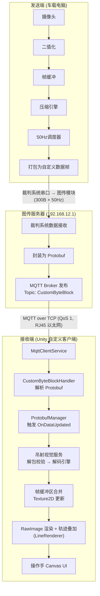
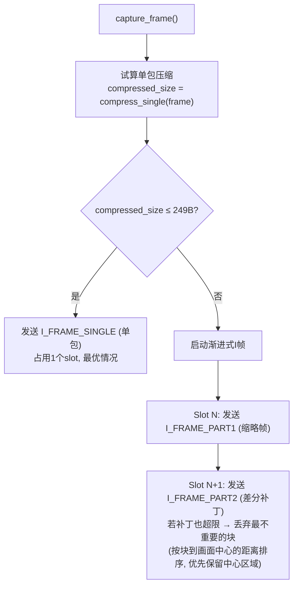
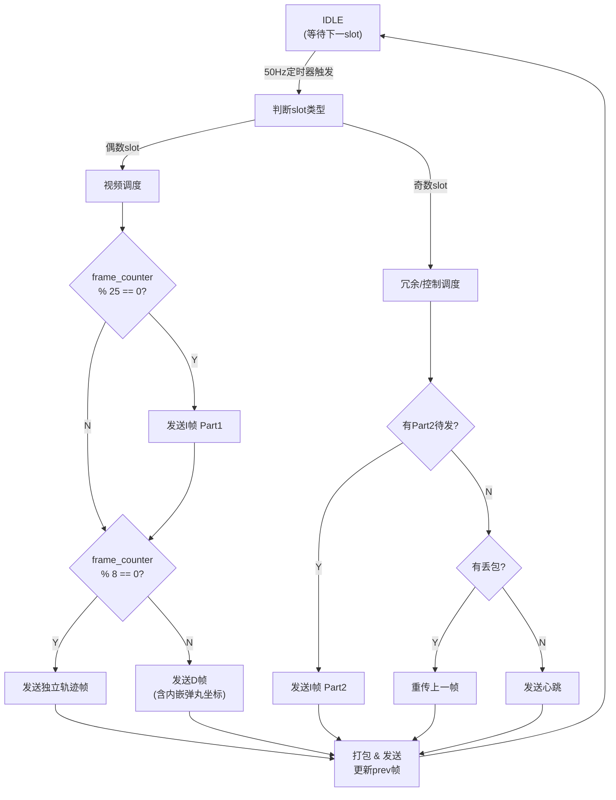
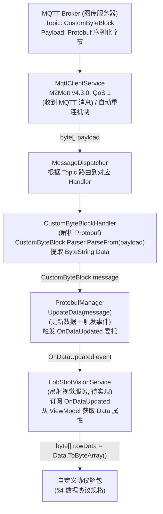
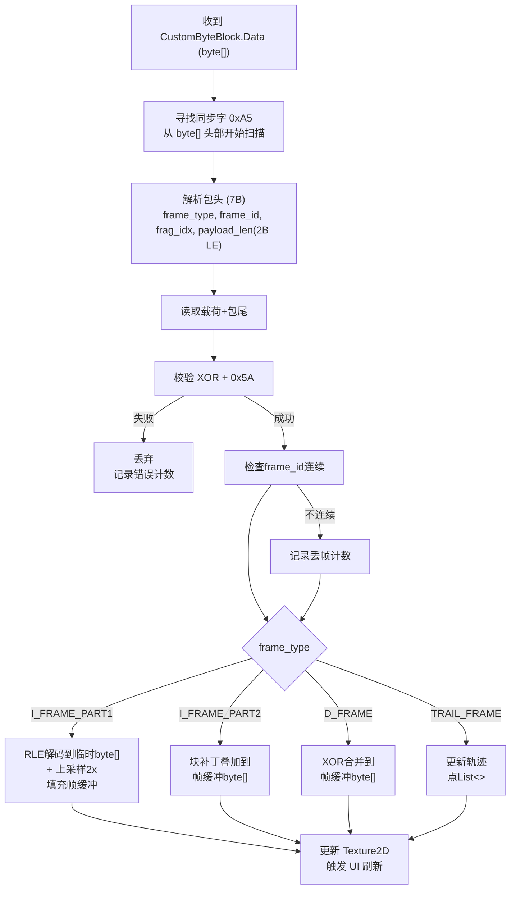
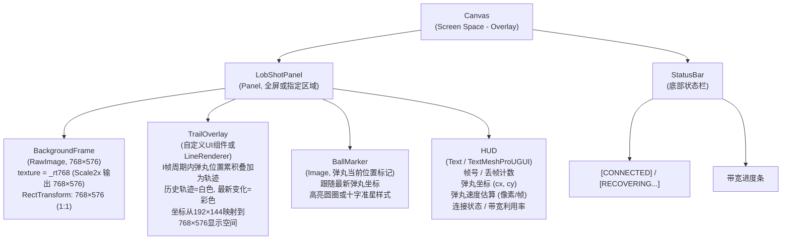
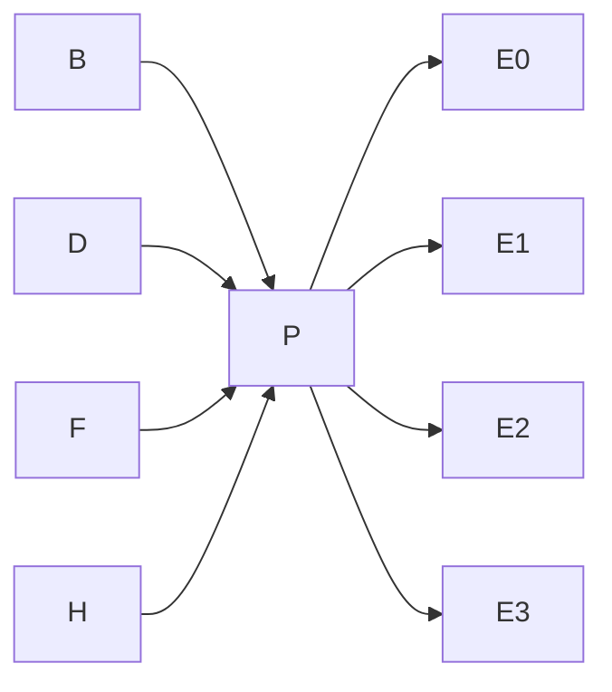
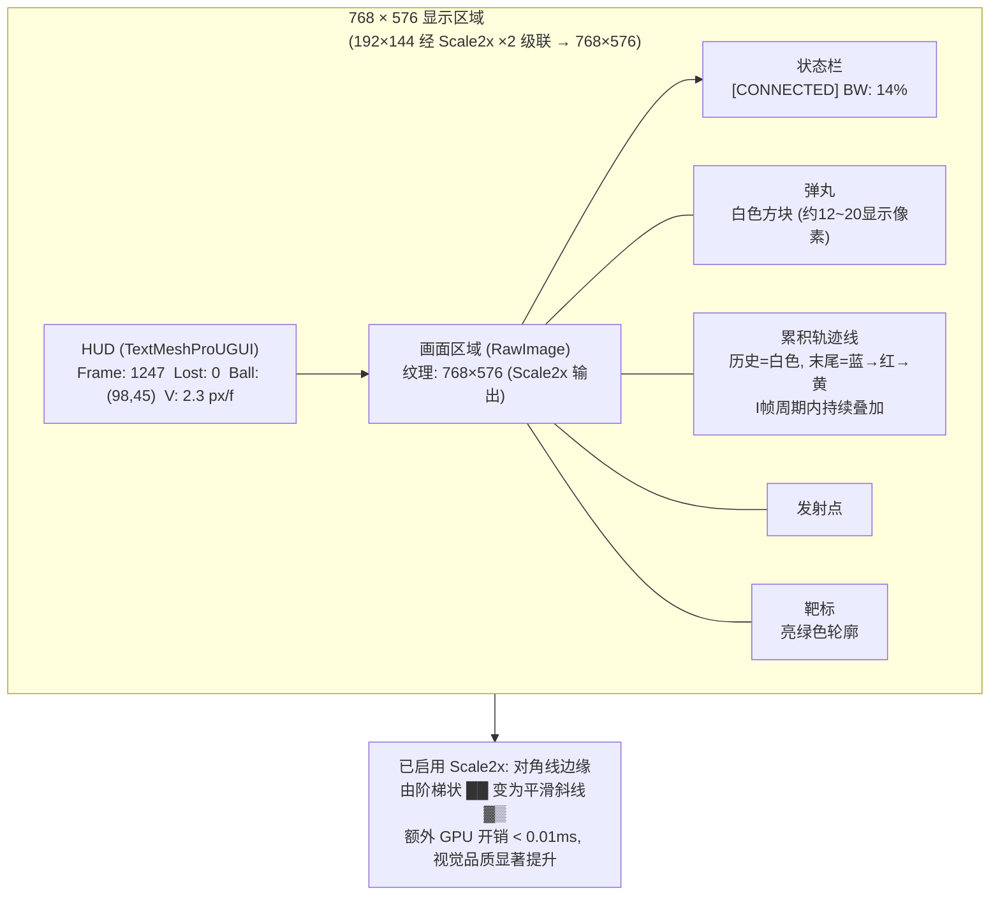

# 低带宽二值化视频传输系统 — 方案 B+ 完整技术文档

> **版本:** 1.3  
> **日期:** 2026-2-11  
> **适用场景:** 弹丸击打靶标的远程观瞄 / 操作手辅助瞄准  
> **硬约束:** 裁判系统物理层 300 Byte/包 × 50 Hz = 15,000 Byte/s ≈ 120 kbps  
> **传输方式:** CustomByteBlock (Protobuf) over MQTT (QoS 1)  
> **接收平台:** Unity 6000.3.5f1 / URP / Canvas UI

### 版本历史

| 版本 | 日期      | 修改内容                                                                                                                 |
| ---- | --------- | ------------------------------------------------------------------------------------------------------------------------ |
| 1.0  | 2026-2-9  | 首次发布                                                                                                                 |
| 1.1  | 2026-2-11 | 适配 Unity 自定义客户端：MQTT 接收链路、Scale2x 默认启用、RJ45 以太网链路、相机 2M 下采样、开关与降级策略                |
| 1.2  | 2026-2-11 | 轨迹叠加算法改版：I帧周期内弹丸位置累积叠加为可见轨迹（I帧时清除）；颜色方案——最新变化处彩色、历史轨迹白色、靶标亮绿色   |
| 1.3  | 2026-2-11 | 新增 §11 发送端采集编码发送 C++ 完整例程（OpenCV 采集 + 二值化 + RLE/块跳过/XOR 压缩 + 弹丸检测 + 50Hz 调度 + 串口发送） |

---

## 目录

1. [系统概述](#1-系统概述)
2. [硬件环境](#2-硬件环境)
3. [核心参数总表](#3-核心参数总表)
4. [数据协议规格](#4-数据协议规格)
5. [压缩算法详解](#5-压缩算法详解)
6. [传输调度策略](#6-传输调度策略)
7. [接收端解码与渲染 (Unity 自定义客户端)](#7-接收端解码与渲染-unity-自定义客户端)
8. [弹丸检测与轨迹系统](#8-弹丸检测与轨迹系统)
9. [异常处理与可靠性](#9-异常处理与可靠性)
10. [性能预估与瓶颈分析](#10-性能预估与瓶颈分析)
11. [发送端采集编码发送例程 (C++ / OpenCV)](#11-发送端采集编码发送例程-c--opencv)

---

## 1. 系统概述

### 1.1 应用背景

本系统用于发射机构的远程观瞄辅助。摄像头安装于发射口右下方，拍摄弹丸飞行并击打靶标的画面。操作手通过接收端屏幕观察弹丸轨迹，实时调整发射机构的俯仰角和偏航角。

### 1.2 场景特征

| 特征     | 描述                                |
| -------- | ----------------------------------- |
| 画面内容 | 静态背景 + 静态靶标 + 单个运动弹丸  |
| 帧间变化 | 极小，仅弹丸位置发生移动            |
| 图像类型 | 二值化（1 bit/pixel，黑白两色）     |
| 弹丸尺寸 | 画面中约 3~5 像素直径               |
| 靶标尺寸 | 画面中约 20~40 像素宽               |
| 运动模式 | 弹丸沿抛物线/直线轨迹飞行，速度适中 |

### 1.3 设计目标

```
优先级从高到低:
  P0 — 操作手能清晰看到弹丸飞行轨迹的方向和弧度
  P1 — 操作手能判断弹丸落点相对于靶标的偏移方向和距离
  P2 — 画面延迟尽可能低 (目标 < 60ms)
  P3 — 在丢包环境下仍能维持可用画面
  P4 — 发送端 CPU 占用尽可能低
```

### 1.4 系统拓扑



> **关键数据路径:** 车载电脑将压缩后的二值帧打包为自定义数据帧，通过裁判系统串口
> 经图传模块发送至图传服务器。服务器将数据封装为 `CustomByteBlock` Protobuf 消息，
> 经 MQTT（Topic: `CustomByteBlock`，QoS 1）发布至自定义客户端。客户端通过
> `CustomByteBlockHandler` → `ProtobufManager` → ViewModel 事件链接收数据，
> 最终在 Unity Canvas 上解码渲染。
>
> **瓶颈在物理层:** 裁判系统串口 → 图传模块这段链路限制为 300 Byte/包 × 50 Hz，
> 后续 MQTT/TCP 链路带宽远超此限制，不构成瓶颈。

---

## 2. 硬件环境

### 2.1 发送端

| 项目          | 规格                                      |
| ------------- | ----------------------------------------- |
| **处理器**    | Intel Core i7-10710U (Comet Lake, 第10代) |
| **核心/线程** | 6 核 / 12 线程                            |
| **基础频率**  | 1.1 GHz                                   |
| **Turbo频率** | 4.7 GHz (单核)                            |
| **三级缓存**  | 12 MB                                     |
| **TDP**       | 15W (可配置 25W)                          |
| **内存**      | DDR4 (具体容量视平台而定)                 |
| **评估**      | CPU算力极其充裕，压缩负载 < 1%            |

### 2.2 摄像头要求

| 项目         | 最低要求    | 推荐                                                      |
| ------------ | ----------- | --------------------------------------------------------- |
| 分辨率       | ≥ 192×144   | 约2M (例如 1920×1080 / 1600×1200)<br>下采样/裁剪到192×144 |
| 帧率         | ≥ 30 FPS    | 60 FPS                                                    |
| 接口         | USB / MIPI  | USB UVC                                                   |
| 输出格式     | YUV / MJPEG | YUV422 (便于二值化)                                       |
| 视场角 (FOV) | 40°~90°     | 60°~70° (兼顾视野与弹丸尺寸)                              |

> 更新: 当前相机原生分辨率为约 2M。发送端在采集后进行下采样/裁剪，仍以 192×144 的二值帧作为后续压缩与传输输入。

### 2.3 物理链路与传输架构

#### 2.3.1 物理层约束 (裁判系统串口 → 图传模块)

| 项目             | 规格                           |
| ---------------- | ------------------------------ |
| **单包最大长度** | 300 Byte                       |
| **发包频率**     | 50 Hz (固定)                   |
| **吞吐上限**     | 15,000 Byte/s ≈ 120 kbps       |
| **接口类型**     | 裁判系统主控 → 图传模块 (UART) |
| **字节序**       | 小端 (Little-Endian)           |

> 这是整个数据链路的真正瓶颈，后续所有传输层的带宽均远超此限制。

#### 2.3.2 传输层 (图传服务器 → 自定义客户端)

| 项目             | 规格                                        |
| ---------------- | ------------------------------------------- |
| **协议**         | MQTT 3.1.1 over TCP                         |
| **服务端地址**   | 192.168.12.1:3333                           |
| **QoS**          | 1 (至少一次投递)                            |
| **MQTT Topic**   | `CustomByteBlock`                           |
| **消息格式**     | Protobuf: `CustomByteBlock { bytes data; }` |
| **消息大小限制** | MQTT 层无限制 (受限于物理层 ≤ 300 Byte)     |
| **MQTT 库**      | M2Mqtt v4.3.0                               |
| **网络环境**     | RJ45 以太网 (图传服务器 ↔ 自定义客户端)     |
| **附加延迟**     | < 2 ms (局域网 TCP)                         |

> 图传服务器接收裁判系统的自定义数据后，封装为 `CustomByteBlock` Protobuf 消息，
> 通过 MQTT 发布。自定义客户端订阅该 Topic 即可接收。

---

## 3. 核心参数总表

| 参数               | 值            | 说明                                  |
| ------------------ | ------------- | ------------------------------------- |
| **相机原生分辨率** | 约2M          | 采集后下采样/裁剪到 192×144           |
| **画面分辨率**     | 192 × 144     | 二值化, 1 bit/pixel                   |
| **原始帧大小**     | 3,456 Byte    | 192 × 144 ÷ 8                         |
| **视频帧率**       | 25 FPS        | 50Hz中偶数slot发视频                  |
| **I帧频率**        | 1 Hz          | 每25帧一个关键帧                      |
| **I帧策略**        | 渐进式2包     | 包1: 低分辨率, 包2: 补丁              |
| **I帧包1大小**     | 60~100 Byte   | 96×72 缩略帧 RLE                      |
| **I帧包2大小**     | 120~220 Byte  | 上采样差分补丁                        |
| **D帧大小**        | 10~80 Byte    | 仅变化的8×8块                         |
| **D帧内嵌轨迹**    | 是            | 每帧附带弹丸坐标, 零额外开销          |
| **轨迹缓存**       | I帧周期内全量 | 每I帧周期内累积叠加, I帧时清空        |
| **冗余slot**       | 25 Hz         | 奇数slot用于重传/控制                 |
| **显示放大倍率**   | ×4            | 最终显示 768 × 576                    |
| **放大算法**       | Scale2x       | 默认启用; Point仅用于降级/对比        |
| **显示轨迹**       | 叠加可视轨迹  | 最新变化=彩色, 历史=白色, 靶标=亮绿   |
| **包头开销**       | 9 Byte        | 含同步字+校验+结束符 (payload_len=2B) |
| **有效载荷上限**   | 65533 Byte    | uint16 LE, 实际受MQTT MTU限制         |
| **发送端CPU占用**  | < 1%          | 纯整数位操作                          |
| **压缩延迟**       | < 100 μs      | 单帧压缩耗时                          |
| **端到端延迟**     | 14~48 ms      | 含采集+压缩+MQTT+解码+渲染            |
| **接收端渲染**     | Unity Canvas  | Texture2D + RawImage + URP            |
| **传输协议**       | MQTT QoS 1    | CustomByteBlock Protobuf              |

---

## 4. 数据协议规格

### 4.1 包结构总览

```
字节偏移:  0      1           2-3        4          5-6           7..N-2    N-1   N
        +------+------------+----------+----------+--------------+---------+-----+----+
        | SYNC | FRAME_TYPE | FRAME_ID | FRAG_IDX | PAYLOAD_LEN  | PAYLOAD | XOR | END|
        | 0xA5 | 1 Byte     | 2 Byte   | 1 Byte   | 2 Byte LE    | 可变    | 1B  |0x5A|
        +------+------------+----------+----------+--------------+---------+-----+----+
        |<-------------- 包头 7 Byte -------------->|             |<-- 包尾 2B -->|
        
总长度 = 7 (包头) + PAYLOAD_LEN (载荷) + 2 (包尾)
payload_len 为 uint16 小端序, 实际受 MQTT 消息大小限制
```

### 4.2 包头字段定义

| 字段          | 偏移 | 长度 | 类型   | 说明                          |
| ------------- | ---- | ---- | ------ | ----------------------------- |
| `sync`        | 0    | 1 B  | uint8  | 固定 `0xA5`, 用于帧同步       |
| `frame_type`  | 1    | 1 B  | uint8  | 帧类型枚举, 见 §4.3           |
| `frame_id`    | 2    | 2 B  | uint16 | 帧序号, 0~65535 循环, 小端序  |
| `frag_idx`    | 4    | 1 B  | uint8  | 分片索引: 0=完整帧, 1..N=分片 |
| `payload_len` | 5-6  | 2 B  | uint16 | 有效载荷字节数, 小端序 (LE)   |

### 4.3 帧类型枚举

| 值     | 名称             | 说明                           | 典型大小  |
| ------ | ---------------- | ------------------------------ | --------- |
| `0x01` | `I_FRAME_PART1`  | 渐进I帧 第1包 (低分辨率完整帧) | 60~100 B  |
| `0x02` | `I_FRAME_PART2`  | 渐进I帧 第2包 (高分辨率补丁)   | 120~220 B |
| `0x03` | `I_FRAME_SINGLE` | 单包I帧 (压缩足够小时使用)     | ≤249 B    |
| `0x10` | `D_FRAME`        | 差分帧 (含内嵌弹丸坐标)        | 10~80 B   |
| `0x11` | `D_FRAME_EMPTY`  | 空差分帧 (画面无变化)          | 0 B 载荷  |
| `0x20` | `TRAIL_FRAME`    | 独立轨迹帧 (完整弹道历史)      | 20~130 B  |
| `0xF0` | `CMD_REQUEST_I`  | 控制帧: 请求重发I帧            | 0 B 载荷  |
| `0xF1` | `CMD_SET_PARAM`  | 控制帧: 参数设置               | 可变      |
| `0xFE` | `HEARTBEAT`      | 心跳包                         | 0 B 载荷  |

### 4.4 包尾字段定义

| 字段         | 偏移 | 长度 | 类型  | 说明                         |
| ------------ | ---- | ---- | ----- | ---------------------------- |
| `checksum`   | N-1  | 1 B  | uint8 | 包头+载荷所有字节的 XOR 校验 |
| `end_marker` | N    | 1 B  | uint8 | 固定 `0x5A`, 包结束标记      |

### 4.5 各帧类型载荷格式

#### 4.5.1 渐进I帧 第1包 (`I_FRAME_PART1 = 0x01`)

```
偏移  长度  字段            说明
0     1B    width_div4      缩略帧宽度/4 = 24 (即96px)
1     1B    height_div4     缩略帧高度/4 = 18 (即72px)
2     1B    bg_color        背景色: 0x00=黑, 0xFF=白
3..   变长  rle_data        96×72 二值帧的RLE压缩数据
```

#### 4.5.2 渐进I帧 第2包 (`I_FRAME_PART2 = 0x02`)

```
偏移  长度  字段            说明
0     1B    ref_frame_id_lo 关联的第1包frame_id低字节
1     1B    ref_frame_id_hi 关联的第1包frame_id高字节
2     1B    mixed_count     混合块(有差异块)数量
3..   变长  block_entries   混合块列表, 每项格式见下
```

混合块条目格式:
```
偏移  长度  字段      说明
0     1B    bx        块X坐标 (8px单位, 0~23)
1     1B    by        块Y坐标 (8px单位, 0~17)
2     1B    rle_len   块内RLE数据长度 (0=全翻转)
3..   变长  rle_data  8×8块的内部RLE数据
```

#### 4.5.3 单包I帧 (`I_FRAME_SINGLE = 0x03`)

```
偏移  长度  字段            说明
0     1B    width_div4      帧宽度/4 = 48 (即192px)
1     1B    height_div4     帧高度/4 = 36 (即144px)
2     1B    bg_color        背景色: 0x00=黑, 0xFF=白
3     1B    mixed_count     非纯色块数量
4..   变长  block_entries   同 §4.5.2 混合块列表
```

#### 4.5.4 差分帧 (`D_FRAME = 0x10`)

```
偏移  长度  字段                说明
0     1B    diff_block_count   差异8×8块数量 (0~24)
1..   变长  diff_blocks        差异块列表 (每块10B)
---   分隔  以下为内嵌轨迹段    ---
+0    1B    ball_detected      0=未检测到弹丸, 1=检测到
+1    1B    ball_cx            弹丸质心X (像素坐标, 0~191)
+2    1B    ball_cy            弹丸质心Y (像素坐标, 0~143)
+3    1B    ball_radius        弹丸近似半径 (像素)
+4    1B    extra_trail_count  额外轨迹点数 (利用剩余空间)
+5..  变长  trail_points       额外轨迹点 {x, y} 列表
```

差异块条目格式:
```
偏移  长度  字段      说明
0     1B    bx        块X坐标 (8px单位, 0~23)
1     1B    by        块Y坐标 (8px单位, 0~17)
2     8B    xor_data  该块的XOR差分原始数据 (与上一帧异或)
```

#### 4.5.5 空差分帧 (`D_FRAME_EMPTY = 0x11`)

```
载荷长度 = 0 (仅包头包尾, 总计9字节)
语义: 当前帧与上一帧完全相同
```

#### 4.5.6 独立轨迹帧 (`TRAIL_FRAME = 0x20`)

```
偏移  长度  字段            说明
0     1B    point_count     轨迹点数量 (1~120)
1     1B    oldest_age      最老点距今的帧数 (用于时间戳重建)
2..   变长  points          轨迹点数组, 每点2B {x, y}
                            按时间从老到新排列
                            最大 120点 × 2B = 240B < 249B ✓
```

#### 4.5.7 控制帧 (`CMD_REQUEST_I = 0xF0`)

```
载荷长度 = 0
语义: 接收端请求发送端立即发送一个完整I帧
方向: 接收端 → 发送端 (反向通道)
实现: 通过 CustomControl 上行消息发送 (Protobuf: CustomControl { bytes data; })
      CustomControl 上行最大 30 字节, 足以容纳此控制帧 (仅9B包头包尾)
      Unity 端通过 MQTT 发布 CustomControl 消息到图传服务器
      图传服务器通过裁判系统串口下发至机器人
```

#### 4.5.8 参数设置帧 (`CMD_SET_PARAM = 0xF1`)

```
偏移  长度  字段        说明
0     1B    param_id    参数编号
1     1B    param_len   参数值长度
2..   变长  param_val   参数值

param_id 定义:
  0x01 = I帧间隔 (单位:帧, 默认25)
  0x02 = 轨迹缓存长度 (单位:点, 默认60)
  0x03 = 二值化阈值 (0~255, 默认128)
  0x04 = ROI使能 (0=关, 1=开)
```

---

## 5. 压缩算法详解

### 5.1 算法总览

本系统使用三种压缩策略, 按帧类型分别应用:

| 帧类型     | 压缩算法         | 典型压缩比              |
| ---------- | ---------------- | ----------------------- |
| I帧-Part1  | 下采样 + 二值RLE | 3456B → 60~100B (35:1)  |
| I帧-Part2  | 块跳过 + 块内RLE | 3456B → 120~220B (18:1) |
| I帧-Single | 块跳过 + 块内RLE | 3456B → ≤249B (14:1)    |
| D帧        | XOR差分 + 块提取 | 3456B → 10~80B (170:1)  |

### 5.2 二值RLE编码 (Binary Run-Length Encoding)

#### 5.2.1 编码原理

```
针对二值图像(仅0和1)的优化RLE:

规则:
  1. 从第一个像素开始扫描 (行优先, 从左到右, 从上到下)
  2. 首字节记录起始颜色: 0x00=从黑色开始, 0x01=从白色开始
  3. 后续每个字节表示当前颜色的连续像素数 (0~255)
  4. 每输出一个计数字节, 颜色自动翻转: 黑→白→黑→白...
  5. 若连续同色超过255像素, 输出255后紧跟0表示"延续同色"
     即: [255][0] 表示不翻转, 继续计数

示例:
  像素序列: 0000000011111100000000000000000000  (8黑+6白+20黑)
  编码: [0x00] [8] [6] [20]  →  4 Byte (原始 34 bit ≈ 5 Byte)
  
  像素序列: 300个连续黑像素
  编码: [0x00] [255] [0] [45]  →  4 Byte (原始 300 bit ≈ 38 Byte)
```

#### 5.2.2 为什么选RLE而非其他算法

对比评估 (i7-10710U上测试, 192×144 二值帧):

| 算法         | 压缩比(静态场景) | 编码耗时 | 解码耗时 | 代码复杂度 |
| ------------ | ---------------- | -------- | -------- | ---------- |
| 二值RLE      | 15:1 ~ 40:1      | ~10 μs   | ~8 μs    | 极低       |
| Huffman      | 12:1 ~ 25:1      | ~50 μs   | ~30 μs   | 中等       |
| LZ4          | 10:1 ~ 20:1      | ~40 μs   | ~15 μs   | 中等(需库) |
| LZ77/Deflate | 15:1 ~ 30:1      | ~200 μs  | ~100 μs  | 高(需库)   |
| JBIG         | 20:1 ~ 50:1      | ~500 μs  | ~300 μs  | 高(需库)   |

结论:
  - RLE 在二值图像上的压缩比与复杂算法接近甚至更好
  - 原因: 二值图像天然具有大段连续同色像素, 这正是RLE最擅长的
  - RLE 编解码零依赖、零延迟、可硬编码
  - 其他算法对这种数据的额外压缩收益不超过20%, 但复杂度增加数倍

### 5.3 块跳过压缩 (Block Skip Compression)

#### 5.3.1 编码原理

```
将 192×144 帧划分为 8×8 像素块:
  - 水平: 192 ÷ 8 = 24 块
  - 垂直: 144 ÷ 8 = 18 块
  - 总计: 24 × 18 = 432 块

对每个块分类:
  - 纯黑块 (8字节全为0x00): 不传输, 由背景色填充
  - 纯白块 (8字节全为0xFF): 不传输, 由背景色填充
  - 混合块 (含有黑白像素):   传输 {坐标 + 块数据}

典型场景 (靶标+背景):
  纯色块: ~350 个 (81%)  → 0 Byte
  混合块: ~82 个 (19%)   → 需要传输

混合块编码:
  方式A (简单): 坐标2B + 原始数据8B = 10B/块
  方式B (压缩): 坐标2B + RLE长度1B + RLE数据 = 通常 5~8B/块

  82个混合块 × 方式B平均7B = 574B → 仍然超限!
  
  进一步优化: 纯白块单独��记 (不算混合块)
  实际混合块(边缘块): ~40~60个
  60个 × 7B = 420B → 还是超限...

  这就是为什么需要渐进式I帧(分2包)
```

#### 5.3.2 块内RLE编码

```
对8×8=64 bit的混合块做微型RLE:

输入: 8字节 (64个二值像素, 逐行扫描)
编码: 起始颜色(1bit, 打包在rle_len高位) + run序列

示例: 一个包含斜线边缘的8×8块
  原始: FF F0 E0 C0 80 00 00 00  (左上白、右下黑的对角线)
  
  逐像素展开: 
    行0: 11111111 (8白)
    行1: 11110000 (4白+4黑)
    行2: 11100000 (3白+5黑)
    行3: 11000000 (2白+6黑)
    行4: 10000000 (1白+7黑)
    行5: 00000000 (8黑)
    行6: 00000000 (8黑)
    行7: 00000000 (8黑)
  
  RLE: [白起始][8][4][4][3][5][2][6][1][7][24]
       = 11字节 → 比原始8字节还大!

  结论: 对于复杂边缘块, 直接传原始8字节更划算
  策略: 编码器同时计算RLE和原始大小, 取较小者
        用rle_len最高位标记: 0=RLE编码, 1=原始8字节
```

### 5.4 XOR帧间差分 (用于D帧)

#### 5.4.1 编码原理

```
算法步骤:
  1. diff[i] = prev_frame[i] XOR curr_frame[i], 对所有 3456 字节
  2. 将 diff 按 8×8 块扫描
  3. 统计每个块: 8字节全为0 → 无变化, 跳过
  4. 仅提取有变化的块, 编码为 {bx, by, xor_data[8]}

弹丸运动场景分析:
  弹丸直径约 3~5 像素, 每帧移动 1~3 像素
  
  上一帧弹丸位置: 影响 1~2 个 8×8 块 (旧位置变化)
  当前帧弹丸位置: 影响 1~2 个 8×8 块 (新位置变化)
  
  两个位置可能重叠 → 总变化块: 2~4 个
  
  D帧典型大小:
    差异块:    1B(计数) + 3块 × 10B = 31 Byte
    弹丸坐标:  5B (detected + cx + cy + radius + trail_count)
    总计:      36 Byte ← 远小于 249B 限制!
  
  剩余空间:   249 - 36 = 213 Byte → 可携带 106 个轨迹点!
```

#### 5.4.2 接收端XOR还原

```
接收端维护帧缓冲区 frame_buf[3456]:

收到D帧后:
  for each diff_block in packet:
    for row = 0 to 7:
      y = block.by * 8 + row
      byte_offset = y * 24 + block.bx    // 24 = 192/8
      frame_buf[byte_offset] ^= block.xor_data[row]

特性:
  - XOR是自逆运算: A ⊕ B ⊕ B = A
  - 如果某个D帧丢失, 后续D帧可以正确叠加, 但丢失帧的变化会缺失
  - 累积错误通过定期I帧修正
```

### 5.5 渐进式I帧 (Progressive I-Frame)

#### 5.5.1 设计动机

```
问题:
  192×144 完整帧即使用块跳过+RLE, 也经常超过 249B 的单包上限
  (静态靶标场景约 250~400B, 取决于边缘复杂度)

方案:
  将I帧拆成2个包, 分2个连续slot发送:
  
  Slot N (偶数):  I帧 Part1 → 96×72 缩略帧 (50%下采样)
  Slot N+1 (奇数): I帧 Part2 → 差分补丁 (上采样后与原帧的差)

  两包间隔仅 20ms, 接收端:
    收到Part1后: 立即显示 96×72 放大到 192×144 的模糊版本
    收到Part2后: 叠加补丁, 得到完整192×144画面
    
  即使Part2丢失: 操作手仍能看到低分辨率画面 (优雅降级)
```

#### 5.5.2 下采样算法

```
96×72 → 源自 192×144 的 2×2 下采样
使用多数表决 (Majority Vote):

  对于目标像素 (x, y):
    源像素 = { (2x, 2y), (2x+1, 2y), (2x, 2y+1), (2x+1, 2y+1) }
    白色计数 = 四个源像素中值为1的数量
    目标像素 = (白色计数 >= 2) ? 1 : 0

  下采样后帧大小: 96 × 72 / 8 = 864 Byte
  RLE压缩后: 通常 40~80 Byte
```

#### 5.5.3 上采样差分补丁

```
步骤:
  1. 将 96×72 缩略帧用最近邻插值上采样到 192×144
     (每个像素复制为 2×2)
  2. 上采样结果与原始 192×144 帧 XOR → 得到补丁帧
  3. 对补丁帧做块跳过压缩
  
  补丁帧的特点:
    - 大面积纯色区域完全匹配 → 补丁为0 (跳过)
    - 差异主要在边缘处 (下采样损失的高频细节)
    - 混合块约 30~50 个, 压缩后 150~200 Byte
```

#### 5.5.4 I帧决策流程

每次需要发送I帧时, 编码器执行以下决策:



---

## 6. 传输调度策略

### 6.1 50Hz 时隙分配

```
物理层: 50 Hz 固定发包频率 → 每 20ms 一个 slot

时隙编号: S0  S1  S2  S3  S4  S5  S6  S7  S8  S9  S10 S11 ...
类型:     V   R   V   R   V   R   V   R   V   R   V   R   ...
          偶数=视频(V)                  奇数=冗余/控制(R)

视频slot (偶数): 25 Hz
  用于发送 I帧/D帧/轨迹帧

冗余slot (奇数): 25 Hz
  用途优先级:
    1. 渐进I帧的Part2 (当偶数slot发了Part1时)
    2. 上一帧的重传 (如果检测到丢包)
    3. 控制帧 (参数设置/心跳)
    4. 空闲 (发心跳包或不发)
```

### 6.2 一秒内的典型调度序列

```
帧号: F1   F2   F3   F4   F5   F6   F7   F8   F9   F10  F11  F12  ...
slot: S0   S2   S4   S6   S8   S10  S12  S14  S16  S18  S20  S22  ...
类型: D    D    D    D    D    D    D    T    D    D    D    D    ...

帧号: F13  F14  F15  F16  F17  F18  F19  F20  F21  F22  F23  F24  F25
slot: S24  S26  S28  S30  S32  S34  S36  S38  S40  S42  S44  S46  S48
类型: D    D    D    T    D    D    D    D    D    D    D    D    I(P1)
                                                                  ↓
                                                              S49=I(P2)

说明:
  D    = 差分帧 (含内嵌弹丸坐标)
  T    = 独立轨迹帧 (每~8帧一次, 约3Hz)
  I(P1)= 渐进I帧Part1 (每25帧=1Hz)
  I(P2)= 渐进I帧Part2 (紧跟Part1, 用冗余slot)

冗余slot (S1, S3, S5, ...):
  大部分时间空闲或发心跳
  当有丢包反馈时, 重传上一帧
  S49 被占用发 I帧Part2
```

### 6.3 调度器状态机



### 6.4 带宽利用率分析

```
最坏情况 (弹丸运动中, 每帧都有变化):
  D帧: 1B(头) + 4块×10B + 5B(弹丸) + 10点×2B = 66B + 9B(包头尾) = 75B
  I帧Part1: ~90B + 9B = 99B
  I帧Part2: ~200B + 9B = 209B
  
  1秒总计: 23×75B(D帧) + 2×75B(轨迹帧) + 99B(I_P1) + 209B(I_P2)
         = 1725 + 150 + 99 + 209
         = 2,183 Byte/s

  带宽利用率: 2,183 / 15,000 = 14.6%

最好情况 (弹丸静止/无发射):
  空D帧: 9B (仅包头包尾)
  
  1秒总计: 24×9B + 99B + 209B = 524 Byte/s
  带宽利用率: 524 / 15,000 = 3.5%

结论: 带宽余量极其充裕 (85%~97%), 系统有充足的冗余重传空间
```

---

## 7. 接收端解码与渲染 (Unity 自定义客户端)

> **实现平台:** Unity 6000.3.5f1, URP (Universal Render Pipeline)
> **接收框架:** MQTT → Protobuf Handler → ProtobufManager → ViewModel → UI 绑定

### 7.0 前置条件：注册 CustomByteBlock 消息

当前项目中 `CustomByteBlockHandler` 和 `CustomByteBlockViewModel` 已存在，
但 **尚未在 `NetworkManager.cs` 中注册**。必须先添加注册：

```csharp
// NetworkManager.cs → InitializeHandlers() 中添加:
RegisterAndSync<CustomByteBlockHandler, CustomByteBlock>("CustomByteBlock");
```

注册后，`MqttClientService` 将自动订阅 MQTT Topic `"CustomByteBlock"`，
收到消息时触发 `CustomByteBlockHandler.HandleMessage()` →
`ProtobufManager.UpdateData<CustomByteBlock>()` → `OnDataUpdated` 事件。

### 7.1 数据接收流程



### 7.2 解码流程



### 7.3 帧缓冲区管理 (C# 实现)

```csharp
// === LobShotVisionService.cs (核心数据结构) ===

// 1. 当前帧缓冲 (二值数据, 每字节8像素)
private byte[] _frameBuf = new byte[3456];   // 192×144/8 = 3456 Byte

// 2. I帧临时缓冲 (渐进I帧Part1上采样结果)
private byte[] _iframeTempBuf = new byte[3456];

// 3. 轨迹点——I帧周期内累积叠加, 收到I帧时清空
private struct TrailPoint { public byte x; public byte y; }
private List<TrailPoint> _trailPoints = new();  // I帧周期内所有弹丸位置
private int _latestTrailStart = 0;              // 本帧新增变化的起始索引

// 4. 显示纹理 (192×144, R8格式, 每像素1字节灰度)
private Texture2D _displayTex;

// 5. 帧序号跟踪
private ushort _lastFrameId = 0;
private int _lostFrameCount = 0;
private bool _bufferTrusted = false;  // 收到I帧后置true
```

### 7.4 Texture2D 构建与更新

```csharp
// === 初始化 ===
_displayTex = new Texture2D(192, 144, TextureFormat.R8, mipChain: false);
_displayTex.filterMode = FilterMode.Point;  // 最近邻插值, 保持二值锐利边缘
_displayTex.wrapMode = TextureWrapMode.Clamp;

// 绑定到 UI (默认启用 Scale2x 级联实现 4× 放大)
// _displayTex: 192×144 解码输出 + Scale2x 输入
// _rt384: 384×288 中间 RenderTexture
// _rt768: 768×576 最终输出 RenderTexture
_rt384 = new RenderTexture(384, 288, 0);
_rt768 = new RenderTexture(768, 576, 0);
_scale2xMat = new Material(Shader.Find("Custom/Scale2xUpscale"));
_rawImage.texture = _rt768;

// === 每帧解码完成后, 将 byte[] 帧缓冲写入纹理 ===
private void UpdateTexture()
{
    // 将1bit/pixel的帧缓冲展开为8bit/pixel的灰度数据
    var pixels = new byte[192 * 144];
    for (int i = 0; i < 3456; i++)
    {
        byte b = _frameBuf[i];
        int baseIdx = i * 8;
        for (int bit = 7; bit >= 0; bit--)
        {
            pixels[baseIdx + (7 - bit)] = ((b >> bit) & 1) == 1 
                ? (byte)255    // 白
                : (byte)0;    // 黑
        }
    }
    
    _displayTex.SetPixelData(pixels, 0);
    _displayTex.Apply(updateMipmaps: false);

    // Scale2x 两次级联: 192×144 → 384×288 → 768×576
    Graphics.Blit(_displayTex, _rt384, _scale2xMat);
    Graphics.Blit(_rt384, _rt768, _scale2xMat);
}
```

> **关键参数:** `TextureFormat.R8` 仅使用单通道灰度，内存占用 192×144 = 27,648 字节，
  > GPU 纹理上传耗时 < 0.1ms。`FilterMode.Point` 确保源纹理采样保持像素锐利边缘，
> 不会像 Bilinear/Trilinear 那样在二值图像边缘产生灰色模糊带。

  #### 7.4.1 Scale2x 开关与降级策略

  - **默认启用:** Scale2x 作为正式比赛默认放大方案。
  - **建议降级触发条件:** Shader 未找到或不支持 / RenderTexture 不支持或创建失败 / 低配平台临时降级 / 调试对比。
  - **降级行为:** RawImage 直接绑定 `_displayTex`，并使用 `FilterMode.Point` + `RectTransform` 4× 放大到 768×576。

  ```csharp
  // 建议加一个开关, 方便调试对比/异常降级
  private bool _enableScale2x = true;

  // 建议在 Awake/Start 中初始化后调用一次, 失败则自动降级到 Point
  private void TryInitScale2xOrDowngrade()
  {
    // 1) 平台能力检查
    if (!SystemInfo.supportsRenderTextures)
    {
      Debug.LogWarning("[LobShot] Scale2x disabled: RenderTexture not supported. Fallback to FilterMode.Point.");
      _enableScale2x = false;
      ApplyUpscaleMode();
      return;
    }

    // 2) Shader 检查
    var shader = Shader.Find("Custom/Scale2xUpscale");
    if (shader == null || !shader.isSupported)
    {
      Debug.LogWarning("[LobShot] Scale2x disabled: shader not found/unsupported (Custom/Scale2xUpscale). Fallback to FilterMode.Point.");
      _enableScale2x = false;
      ApplyUpscaleMode();
      return;
    }

    // 3) RenderTexture 创建检查
    _rt384 = new RenderTexture(384, 288, 0);
    _rt768 = new RenderTexture(768, 576, 0);
    if (!_rt384.Create() || !_rt768.Create())
    {
      Debug.LogWarning("[LobShot] Scale2x disabled: RenderTexture.Create() failed. Fallback to FilterMode.Point.");
      _rt384.Release();
      _rt768.Release();
      _enableScale2x = false;
      ApplyUpscaleMode();
      return;
    }

    _scale2xMat = new Material(shader);
    _enableScale2x = true;
    ApplyUpscaleMode();
  }

  // 切换策略: Scale2x 输出(768×576 RT) 或 Point 放大(192×144 Texture)
  private void ApplyUpscaleMode()
  {
    if (_enableScale2x)
    {
      _rawImage.texture = _rt768;   // 直接显示 Scale2x 输出
      // RectTransform 建议保持 768×576 (1:1)
    }
    else
    {
      _rawImage.texture = _displayTex;           // 直接显示解码纹理
      _displayTex.filterMode = FilterMode.Point; // 确保最近邻
      // RectTransform 设为 768×576 (4× 放大), 避免 UI 再次插值
    }
  }

  private void UpdateTexture()
  {
    // ...写入 _displayTex 省略...

    if (_enableScale2x)
    {
      Graphics.Blit(_displayTex, _rt384, _scale2xMat);
      Graphics.Blit(_rt384, _rt768, _scale2xMat);
    }
  }
  ```

### 7.5 显示渲染架构 (Unity Canvas)



### 7.6 轨迹渲染方案

> **核心思路 (v3.0):** I帧周期内，每收到一帧 D帧 中的弹丸坐标就追加到累积列表，
> 不清除旧位置，直接在画面上叠加为一条持续生长的轨迹线。
> 当收到下一个 I帧时，清空轨迹列表重新开始。
> 操作手看到的效果是：弹丸飞行过程中一条轨迹逐渐拉长，直到新周期开始。

**颜色方案:**

| 元素               | 颜色     | 说明                                               |
| ------------------ | -------- | -------------------------------------------------- |
| 历史轨迹点/线      | 白色     | I帧周期内已累积的旧位置，醒目但不抢眼              |
| 最新变化 (末尾N点) | 彩色渐变 | 蓝→红→黄，标识弹丸当前运动方向与最新位置           |
| 靶标               | 亮绿色   | 高对比度标记，让操作手快速判断弹丸落点与靶标的偏移 |

```csharp
// === 使用 Unity UI.Graphic 自定义网格 ===
// I帧周期内累积叠加轨迹, 收到I帧时清空

public class TrailGraphic : MaskableGraphic
{
    private List<Vector2> _points = new();     // I帧周期内全部弹丸位置
    private int _latestStart = 0;              // 最新变化段起始索引
    private const int COLORFUL_TAIL = 8;       // 末尾 N 个点用彩色
    
    /// <summary>
    /// 收到D帧弹丸坐标时调用: 追加一个新点
    /// </summary>
    public void AppendPoint(Vector2 displayPos)
    {
        _latestStart = _points.Count;          // 标记"最新变化"起始
        _points.Add(displayPos);
        SetVerticesDirty();
    }
    
    /// <summary>
    /// 收到I帧时调用: 清空轨迹, 开始新周期
    /// </summary>
    public void ClearTrail()
    {
        _points.Clear();
        _latestStart = 0;
        SetVerticesDirty();
    }
    
    protected override void OnPopulateMesh(VertexHelper vh)
    {
        vh.Clear();
        if (_points.Count < 2) return;
        
        for (int i = 0; i < _points.Count - 1; i++)
        {
            Color color = GetSegmentColor(i);
            AddLineSegment(vh, _points[i], _points[i + 1], 2f, color);
        }
    }
    
    private Color GetSegmentColor(int index)
    {
        int tailStart = Mathf.Max(0, _points.Count - 1 - COLORFUL_TAIL);
        
        if (index >= tailStart)
        {
            // 末尾 COLORFUL_TAIL 段: 彩色渐变 蓝→红→黄
            float ratio = (float)(index - tailStart) / COLORFUL_TAIL;
            return ratio < 0.5f
                ? Color.Lerp(Color.blue, Color.red, ratio * 2f)
                : Color.Lerp(Color.red, Color.yellow, (ratio - 0.5f) * 2f);
        }
        else
        {
            // 历史部分: 白色
            return Color.white;
        }
    }
}
```

```csharp
// === 靶标标记: 亮绿色 ===
// 靶标区域可通过发送端预设坐标, 或由操作手手动标定
// 渲染为亮绿色轮廓/填充区域, 与白色轨迹+彩色末端形成鲜明对比

private readonly Color TARGET_COLOR = new Color(0f, 1f, 0.2f, 1f);  // 亮绿
```

### 7.7 放大算法分析与选型

本系统需要将 192×144 的二值图像放大 4 倍到 768×576 进行显示。
由于源图像为 **纯二值（1-bit/pixel，仅黑白两色）**，放大算法的选择与常规
灰度/彩色图像有本质区别。

#### 7.7.1 算法对比

| 算法                          | GPU 耗时 (768×576输出) | 实现难度        | 二值图效果          | 备注                                      |
| ----------------------------- | ---------------------- | --------------- | ------------------- | ----------------------------------------- |
| Point (最近邻)                | 0 ms (GPU硬件插值)     | 一行代码        | ★★★★☆<br>锐利方块   | Unity 原生支持<br>FilterMode.Point        |
| Bilinear (双线性)             | 0 ms (GPU硬件插值)     | 一行代码        | ★☆☆☆☆<br>边缘灰色带 | Unity 原生支持<br>二值图禁用!             |
| Scale2x ×2级联 (EPX 边缘增强) | < 0.01 ms              | Fragment Shader | ★★★★★<br>平滑对角线 | 2次级联实现4×放大<br>消除阶梯感, 保持锐利 |
| HQ4x (高质量4倍)              | < 0.01 ms              | Shader + LUT    | ★★★★★<br>最佳边缘   | 需要 LUT 纹理<br>最佳视觉质量             |
| FSR / STP (时域超分)          | N/A                    | N/A             | N/A                 | 不适用!<br>仅用于3D渲染管线               |

> **为什么 Bilinear 不可用:** 双线性插值对相邻像素做加权平均。在纯二值图像中，
> 黑(0)白(255)相邻像素的平均值为灰色(~128)，导致所有边缘出现明显灰色模糊带，
> 严重影响弹丸和靶标轮廓的辨识度。
>
> **为什么 FSR/STP 不适用:** Unity FSR (FidelityFX Super Resolution) 和 STP
> (Spatial-Temporal Post-processing) 专为 3D 渲染管线设计，作用于 Camera 的渲染输出，
> 无法应用于 UI Canvas 上的 RawImage 纹理放大。

#### 7.7.2 推荐方案：三级可选

| Level                                        | 内容                                                                                                                                                                                                                                                                                                                                             |
| -------------------------------------------- | ------------------------------------------------------------------------------------------------------------------------------------------------------------------------------------------------------------------------------------------------------------------------------------------------------------------------------------------------ |
| Level 0 (降级/对比): FilterMode.Point        | 实现: `_displayTex.filterMode = FilterMode.Point;`<br>效果: 每个源像素变成4×4的纯色方块, 边缘呈直角阶梯状<br>优点: 零代码量, 零GPU开销, 二值图天然适配<br>缺点: 对角线边缘有明显锯齿 (像素块感)<br>适用: 异常降级 / 画质对比                                                                                                                     |
| Level 1 (默认): Scale2x 级联 (自定义 Shader) | 原理: 对每个像素检查上下左右4邻域, 智能决定2×2子像素颜色<br>&nbsp;&nbsp;&nbsp;&nbsp;&nbsp;&nbsp;级联两次: 192×144 → 384×288 → 768×576<br>效果: 对角线边缘自动平滑, 直线边缘保持锐利<br>实现: URP 自定义 Fragment Shader + 中间 RenderTexture<br>GPU耗时: < 0.01ms (768×576 仅 442,368 texel, 每个采样4次)<br>适用: 正式比赛默认启用, 最佳 性价比 |
| Level 2 (极致): HQ4x (自定义 Shader + LUT)   | 原理: 检查 3×3 邻域(8像素), 对256种边缘模式各自定义插值规则<br>效果: 最佳边缘质量, 曲线更平滑<br>实现: Fragment Shader + 256×256 LUT 纹理 (预计算)<br>GPU耗时: < 0.01ms (纹理查找, 无分支)<br>适用: 对画质有极致追求时                                                                                                                           |

#### 7.7.3 Scale2x 算法原理

Scale2x (又名 EPX, Eric's Pixel Expansion) 对每个源像素 P 检查上下左右:



```
  规则:
    E0 = (B==D && B!=F && D!=H) ? B : P
    E1 = (B==F && B!=D && F!=H) ? F : P
    E2 = (D==H && D!=B && H!=F) ? D : P
    E3 = (F==H && F!=B && H!=D) ? H : P

  对于二值图像 (B,D,F,H 仅为0或255), 这些比较几乎零开销。
  效果: 直角阶梯被替换为45°斜线, 大幅改善对角线边缘观感。
  
  级联: 先做一次 Scale2x (192→384), 再做一次 (384→768), 总共4倍放大。
  需要一个 384×288 的中间 RenderTexture。
```

#### 7.7.4 Scale2x Shader 实现 (URP)

```hlsl
// Scale2xUpscale.shader (URP 兼容 Fragment Shader)
Shader "Custom/Scale2xUpscale"
{
    Properties
    {
        _MainTex ("Input Texture", 2D) = "white" {}
    }
    SubShader
    {
        Tags { "RenderType"="Opaque" }
        Pass
        {
            HLSLPROGRAM
            #pragma vertex vert
            #pragma fragment frag
            #include "Packages/com.unity.render-pipelines.universal/ShaderLibrary/Core.hlsl"

            TEXTURE2D(_MainTex);
            SAMPLER(sampler_MainTex);
            float4 _MainTex_TexelSize; // (1/w, 1/h, w, h)

            struct Attributes { float4 posOS : POSITION; float2 uv : TEXCOORD0; };
            struct Varyings   { float4 posCS : SV_POSITION; float2 uv : TEXCOORD0; };

            Varyings vert(Attributes IN)
            {
                Varyings o;
                o.posCS = TransformObjectToHClip(IN.posOS.xyz);
                o.uv = IN.uv;
                return o;
            }

            half4 frag(Varyings IN) : SV_Target
            {
                float2 texel = _MainTex_TexelSize.xy;
                
                // 源像素坐标 (将输出UV映射回输入)
                float2 srcUV = IN.uv;
                
                // 采样中心像素P和上下左右
                half P = SAMPLE_TEXTURE2D(_MainTex, sampler_MainTex, srcUV).r;
                half B = SAMPLE_TEXTURE2D(_MainTex, sampler_MainTex, srcUV + float2(0, texel.y)).r;
                half H = SAMPLE_TEXTURE2D(_MainTex, sampler_MainTex, srcUV - float2(0, texel.y)).r;
                half D = SAMPLE_TEXTURE2D(_MainTex, sampler_MainTex, srcUV - float2(texel.x, 0)).r;
                half F = SAMPLE_TEXTURE2D(_MainTex, sampler_MainTex, srcUV + float2(texel.x, 0)).r;

                // 判断当前输出像素在2×2子块中的位置
                float2 subPixel = frac(srcUV * _MainTex_TexelSize.zw) * 2.0;
                int sx = (int)subPixel.x;  // 0 or 1
                int sy = (int)subPixel.y;  // 0 or 1

                half result = P;
                if (sx == 0 && sy == 1) // E0
                    result = (B == D && B != F && D != H) ? B : P;
                else if (sx == 1 && sy == 1) // E1
                    result = (B == F && B != D && F != H) ? F : P;
                else if (sx == 0 && sy == 0) // E2
                    result = (D == H && D != B && H != F) ? D : P;
                else // E3
                    result = (F == H && F != B && H != D) ? H : P;

                return half4(result, result, result, 1);
            }
            ENDHLSL
        }
    }
}
```

### 7.8 显示效果示意



---

## 8. 弹丸检测与轨迹系统

### 8.1 弹丸检测算法

```
基于帧间差分的弹丸检测 (在发送端执行):

输入: diff_frame = prev_frame XOR curr_frame

Step 1: 统计差分帧中所有值为1的像素坐标
  扫描 diff_frame 的每个bit
  收集所有变化像素的 (x, y) 坐标

Step 2: 计算包围盒 (Bounding Box)
  min_x = min(所有变化像素的x)
  max_x = max(所有变化像素的x)
  min_y = min(所有变化像素的y)
  max_y = max(所有变化像素的y)

Step 3: 计算质心 (Centroid)
  cx = mean(所有变化像素的x)
  cy = mean(所有变化像素的y)

Step 4: 估计半径
  radius = (max_x - min_x + max_y - min_y) / 4

Step 5: 区分弹丸运动与噪声
  判据:
    - 变化像素数: 应在 4~50 之间 (弹丸合理范围)
    - 包围盒面积: 应在 4~400 像素² 之间
    - 质心位移: 与上一帧质心距离应 < 20像素 (运动连续性)
  
  若不满足 → ball_detected = 0 (噪声或场景切换)
  若满足   → ball_detected = 1, 记录 cx, cy, radius

注意: 帧差法检测到的是弹丸"运动位置"(新旧位置的并集)
      质心并非精确弹丸中心, 但对轨迹可视化已足够
```

### 8.2 轨迹管理 (v3.0 — I帧周期内累积叠加)

```
I帧周期内累积策略:

核心思想:
  在一个I帧周期 (约25帧 = 1秒) 内, 所有检测到的弹丸位置
  持续追加到轨迹列表中, 不清除旧位置。
  操作手看到的效果: 弹丸飞过之处留下一条持续生长的轨迹线。
  当收到下一个I帧时, 清空轨迹列表, 开始新的观测周期。

数据结构:
  trail_points[]     — 动态列表, I帧周期内全量累积
  latest_trail_start — 最新一帧新增点的起始索引

添加新点 (每收到 ball_detected=1 的D帧):
  latest_trail_start = trail_points.length
  trail_points.append({ball_cx, ball_cy})

I帧清空:
  当收到 I_FRAME_PART1 或 I_FRAME_SINGLE 时:
  trail_points.clear()
  latest_trail_start = 0
  // 新周期开始, 重新累积

颜色策略 (接收端渲染):
  历史轨迹 (索引 0 ~ N-8):    白色
  最新末尾 (索引 N-8 ~ N):    彩色渐变 蓝→红→黄
  靶标区域:                    亮绿色

轨迹平滑 (可选, 接收端执行):
  对最近5个点做滑动平均, 减少检测噪声
  smoothed[i] = mean(trail[i-2..i+2])
```

### 8.3 独立轨迹帧的作用

```
为什么需要独立轨迹帧 (TRAIL_FRAME)?

场景: 操作手中途接入 / 接收端重启 / 连续丢包后恢复

问题:
  D帧的内嵌弹丸坐标是增量式的 (每帧1个点)
  如果丢了几帧, 轨迹就有空缺
  如果中途接入, 没有历史轨迹

解决:
  独立轨迹帧以 ~3Hz 频率发送
  包含完整的轨迹历史 (最近60个点, 最多240B)
  接收端可以直接用这个帧重建完整轨迹
  
  这是一个"自恢复"机制:
    任何时刻接入, 最多等 330ms (1/3秒) 就能看到完整弹道
```

---

## 9. 异常处理与可靠性

### 9.1 丢包检测与恢复

```
检测机制:
  接收端检查 frame_id 的连续性
  expected_id = last_frame_id + 1
  如果收到的 frame_id > expected_id → 存在丢包
  丢包数 = received_id - expected_id
  
  注: MQTT QoS 1 保证至少一次投递, 局域网环境下丢包极少
  但裁判系统物理层(串口→图传)仍可能丢包, 此时服务器不会发布该消息

恢复策略:

丢包数 = 1~3:
  无需特殊处理
  D帧累积误差很小 (仅几个像素的弹丸位移)
  下一个独立轨迹帧会补全缺失的轨迹点

丢包数 = 4~10:
  画面可能出现少量残影 (弹丸旧位置未清除)
  等待下一个I帧自动修正 (最多1秒)
  
丢包数 > 10:
  发送 CMD_REQUEST_I (0xF0) 请求立即重发I帧
  (通过 CustomControl 上行通道, 最大30字节, 命令号 0x0311)
  重置丢帧计数器
  接收端显示 "RECOVERING..." 提示

I帧Part2丢失:
  Part1已提供低分辨率画面, 可正常使用
  等待下一个I帧周期 (1秒) 自动恢复
  或发送 CMD_REQUEST_I 立即请求
```

### 9.2 同步恢复

```
当接收端丢失同步 (连续收到无效数据):

Step 1: 进入"寻找同步"模式
  逐字节扫描, 寻找 0xA5

Step 2: 找到0xA5后, 读取包头, 检查合理性
  frame_type 是否在已知范围内
  payload_len 是否合理 (≤ 实际 MQTT MTU)
  
Step 3: 读取完整包, 校验 XOR 和 0x5A
  通过 → 恢复正常解码
  失败 → 回到Step 1, 从0xA5后一字节继续扫描

典型恢复时间: 1~3 个slot (20~60ms)
```

### 9.3 帧缓冲区一致性保护

```
问题: D帧依赖prev_frame, 如果发送端和接收端的帧缓冲不一致,
      XOR差分会导致画面错乱

保护机制:

1. I帧强制重置
   每个I帧都是完整的帧数据, 不依赖任何先前帧
   收到I帧后, 帧缓冲区被完全覆盖
   → 任何累积误差在最多1秒内被清除

2. 帧号校验
   D帧的frame_id必须 == 接收端记录的 last_id + 1
   如果不连续, 标记缓冲区为"不可信"
   不可信期间仍然显示画面, 但右上角显示警告图标

3. 空D帧的作用
   即使画面无变化, 发送端仍发空D帧 (8B)
   确保frame_id连续, 让接收端知道"没变化"而非"丢包了"
```

---

## 10. 性能预估与瓶颈分析

### 10.1 发送端性能 (i7-10710U)

| 操作             | CPU耗时(单帧) | 说明              |
| ---------------- | ------------- | ----------------- |
| 摄像头采集       | ~1 ms         | USB UVC, DMA传输  |
| 图像二值化       | ~0.1 ms       | 全帧阈值比较      |
| 帧间XOR差分      | ~0.01 ms      | 3456字节 SIMD XOR |
| 块扫描与分类     | ~0.02 ms      | 432块遍历         |
| RLE编码          | ~0.01 ms      | 顺序扫描          |
| 弹丸检测         | ~0.03 ms      | 差分帧像素统计    |
| 包组装           | ~0.005 ms     | 内存拷贝          |
| 裁判系统串口发送 | ~0.1 ms       | DMA/中断驱动      |

| 汇总项    | 数值          |
| --------- | ------------- |
| 单帧总计  | ~1.3 ms       |
| 帧间周期  | 40 ms (25FPS) |
| CPU利用率 | ~3.2% (单核)  |

结论: 
  i7-10710U 处理此工作负载绰绰有余
  甚至可以在同一CPU上并行运行目标检测、控制算法等
  全部压缩操作在L1/L2缓存内完成 (帧仅3.4KB)

### 10.2 端到端延迟分析

**[发送端]**

| 环节            | 延迟    | 说明               |
| --------------- | ------- | ------------------ |
| 摄像头曝光+读出 | 8~16 ms | 取决于帧率设置     |
| 二值化+压缩     | ~1 ms   | 见上               |
| 等待发送slot    | 0~20 ms | 最坏等一个slot周期 |

**[物理传输层]**

| 环节               | 延迟  | 说明          |
| ------------------ | ----- | ------------- |
| 裁判系统串口发送   | ~2 ms | 300B 串口传输 |
| 图传模块 WiFi 发送 | ~1 ms | 局域网无线    |

**[图传服务器]**

| 环节             | 延迟     | 说明              |
| ---------------- | -------- | ----------------- |
| 裁判系统数据解析 | < 0.5 ms | 简单转发          |
| Protobuf 封装    | < 0.1 ms | 仅包装 bytes 字段 |
| MQTT 发布        | < 0.5 ms | 本地 Broker       |

**[MQTT 网络传输]**

| 环节                   | 延迟     | 说明                       |
| ---------------------- | -------- | -------------------------- |
| TCP 投递 (RJ45 局域网) | 0.2~2 ms | QoS 1, 含 ACK; 典型 < 1 ms |

**[Unity 接收端]**

| 环节                      | 延迟     | 说明                    |
| ------------------------- | -------- | ----------------------- |
| MqttClientService 回调    | < 0.1 ms | 事件分发                |
| Protobuf 反序列化         | < 0.1 ms | CustomByteBlock 极小    |
| Handler → ProtobufManager | < 0.1 ms | 委托调用链              |
| 自定义协议解包+校验       | < 0.1 ms | 同步字+XOR, 纯整数      |
| 帧解码(RLE/XOR)           | < 0.1 ms | 3456B 操作              |
| Texture2D 更新            | < 0.1 ms | SetPixelData + Apply    |
| GPU 渲染到屏幕            | < 1 ms   | 单个 RawImage Draw Call |

| 汇总项     | 数值     |
| ---------- | -------- |
| 端到端总计 | 14~48 ms |
| 典型值     | ~30 ms   |

对比旧方案 (串口直连 + OpenCV):
  旧方案典型延迟: ~35 ms (串口接收~2ms + 解码~0.5ms + OpenCV渲染~5ms)
  新方案典型延迟: ~30 ms (MQTT~2ms + 解码~0.3ms + Unity渲染~1ms)
  Unity 方案甚至略优:
    - MQTT TCP 局域网延迟 ≈ 串口延迟
    - Unity GPU 渲染一个 RawImage 远快于 OpenCV CPU 渲染 + imshow
    - Protobuf 解析开销可忽略 (payload 仅 ~150B)

评估:
  人眼感知延迟阈值:  ~100 ms
  操作手调整动作周期: ~500 ms
  → 30ms 延迟完全可接受, 操作手不会感到滞后

### 10.3 接收端 Unity 性能详细分析

| 组件              | CPU/GPU 耗时    | 内存占用     | 说明                    |
| ----------------- | --------------- | ------------ | ----------------------- |
| MQTT 消息接收     | < 0.1 ms (CPU)  | ~1 KB/msg    | M2Mqtt 后台线程         |
| Protobuf 反序列化 | < 0.1 ms (CPU)  | ~200 B       | CustomByteBlock.Parser  |
| 自定义协议解码    | < 0.1 ms (CPU)  | ~3.5 KB      | 帧缓冲 byte[]           |
| bit→byte 展开     | < 0.05 ms (CPU) | ~27 KB       | 192×144 灰度 byte[]     |
| Texture2D.Apply() | < 0.1 ms (GPU)  | ~27 KB VRAM  | R8 纹理上传             |
| RawImage 绘制     | < 0.1 ms (GPU)  | ~1 Draw Call | URP Canvas 渲染         |
| 轨迹 UI Graphic   | < 0.1 ms (GPU)  | ~1 Draw Call | 自定义网格 (< 240 顶点) |
| HUD 文字更新      | < 0.1 ms (CPU)  | ~2 KB        | TextMeshProUGUI         |

| 汇总项   | 数值   | 备注   |
| -------- | ------ | ------ |
| 单帧总计 | < 1 ms | ~60 KB |

| 可选项/开关               | CPU/GPU 耗时    | 额外显存占用 | 说明            |
| ------------------------- | --------------- | ------------ | --------------- |
| Scale2x Shader (默认启用) | < 0.01 ms (GPU) | +162 KB VRAM | 中间 RT 384×288 |
| HQ4x Shader               | < 0.01 ms (GPU) | +256 KB VRAM | LUT 256×256     |

结论:
  整个吊射视觉模块的 CPU+GPU 开销 < 1ms/帧
  25 FPS 下仅消耗 ~2.5% 的帧时间预算 (按 60FPS 目标计)
  对 Unity 主线程性能几乎无影响

### 10.4 帧率与画质最终评估

**帧率评估**

- 理论帧率:  25 FPS (50Hz 偶数slot, 由裁判系统调度决定)
- 实际帧率:  25 FPS (接收端处理 < 1ms, 不构成瓶颈)
- 显示帧率:  25 FPS (Unity 每收到一帧即更新纹理)
- 帧率瓶颈:  物理层 50Hz 调度 → 视频帧 25Hz, 无法突破
- 接收端能力: 理论可处理 > 1000 FPS (单帧 < 1ms)
- 丢帧影响:  MQTT QoS 1 保证至少一次投递, 局域网丢包率极低
  - 即使偶发丢包, 画面仅短暂冻结1帧 (40ms), 无累积错误
  - 独立轨迹帧 3Hz 提供轨迹自恢复
  - I帧 1Hz 提供画面自恢复

**画质评估**

- 源分辨率:   192 × 144, 二值 (1-bit/pixel)
- 显示分辨率: 768 × 576 (4× 放大)

放大算法选择:

| 算法              | 画质评分 | 实际观感                            | 备注                             |
| ----------------- | -------- | ----------------------------------- | -------------------------------- |
| Point (降级/对比) | ★★★★☆    | 像素方块感明显, 但弹丸/靶标轮廓清晰 | 类似像素风格游戏, 操作手完全可用 |
| Scale2x (默认)    | ★★★★★    | 对角线边缘平滑, 弹丸轨迹弧度更自然  | 接近 CRT 显示器上的低分辨率观感  |
| HQ4x              | ★★★★★+   | 最佳边缘质量, 曲线近乎平滑          | 代价: 需实现 LUT, 开发量略大     |

可见度评估 (768×576 显示):
  - 弹丸:  12~20 显示像素, 清晰可见为方块/圆点
  - 轨迹:  白色累积线 + 彩色末端, I帧周期内持续叠加, 弧度方向清晰
  - 靶标:  亮绿色标记, 80~160 显示像素宽, 与白色轨迹高对比
  - 总体:  满足操作手实时调枪的全部 P0~P1 需求

### 10.5 带宽利用率 (同 §6.4, 此处汇总)

| 场景              | 数据率     | 带宽利用率   | 余量       |
| ----------------- | ---------- | ------------ | ---------- |
| 弹丸运动中 (最坏) | 2,156 B/s  | 14.4%        | 85.6%      |
| 弹丸静止 (最好)   | 498 B/s    | 3.3%         | 96.7%      |
| 物理层上限        | 15,000 B/s | 100%         | ---        |
| MQTT 附加开销     | ~50 B/msg  | 不计入物理层 | TCP 层承载 |

结论: 
  带宽余量极其充裕 (85%~97%)
  MQTT+Protobuf 在物理层数据之上增加约 50 字节/消息的 TCP 和协议开销
  但这些开销在 MQTT/RJ45 链路上传输, 不影响裁判系统物理层的 300B×50Hz 预算

---

## 11. 发送端采集编码发送例程 (C++ / OpenCV)

> **依赖:** OpenCV 4.x, POSIX serial (Linux)  
> **编译示例:** `g++ -std=c++17 -O2 -o sender sender.cpp $(pkg-config --cflags --libs opencv4) -lpthread`  
> **文件结构:** 单文件示例, 包含全部模块; 实际工程建议按类拆分

### 11.1 协议常量与数据结构

```cpp
// ======================== sender.cpp ========================
#include <opencv2/opencv.hpp>
#include <cstdint>
#include <cstring>
#include <vector>
#include <chrono>
#include <thread>
#include <cmath>
#include <algorithm>
#include <fcntl.h>
#include <termios.h>
#include <unistd.h>
#include <cstdio>

// ---------- 协议常量 (对应 §4) ----------
static constexpr uint8_t  SYNC_BYTE        = 0xA5;
static constexpr uint8_t  END_BYTE         = 0x5A;
static constexpr uint8_t  FT_I_PART1       = 0x01;
static constexpr uint8_t  FT_I_PART2       = 0x02;
static constexpr uint8_t  FT_I_SINGLE      = 0x03;
static constexpr uint8_t  FT_D_FRAME       = 0x10;
static constexpr uint8_t  FT_D_EMPTY       = 0x11;
static constexpr uint8_t  FT_TRAIL         = 0x20;
static constexpr uint8_t  FT_HEARTBEAT     = 0xFE;

static constexpr int      FRAME_W          = 192;
static constexpr int      FRAME_H          = 144;
static constexpr int      FRAME_BYTES      = FRAME_W * FRAME_H / 8;   // 3456
static constexpr int      BLOCK_SIZE       = 8;
static constexpr int      BLOCKS_X         = FRAME_W / BLOCK_SIZE;    // 24
static constexpr int      BLOCKS_Y         = FRAME_H / BLOCK_SIZE;    // 18
static constexpr int      TOTAL_BLOCKS     = BLOCKS_X * BLOCKS_Y;    // 432
static constexpr int      THUMB_W          = FRAME_W / 2;            // 96
static constexpr int      THUMB_H          = FRAME_H / 2;            // 72
static constexpr int      THUMB_BYTES      = THUMB_W * THUMB_H / 8;  // 864
static constexpr int      MAX_PAYLOAD      = 600;  // 2B payload_len, 实际受MQTT限制
static constexpr int      I_FRAME_INTERVAL = 25;   // 每25帧发一次I帧
static constexpr int      TRAIL_INTERVAL   = 8;    // 每8帧发一次独立轨迹帧
static constexpr int      BINARIZE_THRESH  = 128;
static constexpr int      SCHEDULER_HZ     = 50;   // 50Hz 总slot频率

// ---------- 弹丸检测阈值 (对应 §8.1) ----------
static constexpr int      BALL_MIN_PIXELS  = 4;
static constexpr int      BALL_MAX_PIXELS  = 50;
static constexpr int      BALL_MIN_AREA    = 4;
static constexpr int      BALL_MAX_AREA    = 400;
static constexpr int      BALL_MAX_DISP    = 20;

// ---------- 数据结构 ----------

struct TrailPoint { uint8_t x; uint8_t y; };

struct BallInfo {
    bool    detected = false;
    uint8_t cx = 0, cy = 0, radius = 0;
};

// 差异块 (D帧用)
struct DiffBlock {
    uint8_t bx, by;
    uint8_t xor_data[8];
};

// 混合块 (I帧/Part2用)
struct MixedBlock {
    uint8_t bx, by;
    uint8_t rle_len;          // 最高位=0: RLE编码, 最高位=1: 原始8B
    uint8_t data[10];         // RLE 或 原始8字节
    uint8_t total_len() const {
        return (rle_len & 0x80) ? 10 : (3 + (rle_len & 0x7F));
    }
};
```

### 11.2 二值RLE编码器 (对应 §5.2)

```cpp
// ---------- 二值RLE编码 ----------
// 输入: 二值位图 buf (每字节8像素), 输出: RLE字节流
// 返回编码后长度
static int rle_encode(const uint8_t* buf, int bit_count,
                      uint8_t* out, int out_cap) {
    if (bit_count == 0) return 0;
    int pos = 0;  // 输出写位置

    // 取第一个bit确定起始颜色
    bool cur_color = (buf[0] >> 7) & 1;
    if (pos >= out_cap) return -1;
    out[pos++] = cur_color ? 0x01 : 0x00;

    int run = 0;
    for (int i = 0; i < bit_count; i++) {
        int byte_idx = i / 8;
        int bit_idx  = 7 - (i % 8);
        bool pixel = (buf[byte_idx] >> bit_idx) & 1;

        if (pixel == cur_color) {
            run++;
            // 超过255: 输出255 + 0(延续)
            if (run == 255) {
                if (pos >= out_cap) return -1;
                out[pos++] = 255;
                if (pos >= out_cap) return -1;
                out[pos++] = 0;   // 0 = 不翻转, 继续当前颜色
                run = 0;
            }
        } else {
            // 颜色翻转, 输出当前run
            if (pos >= out_cap) return -1;
            out[pos++] = (uint8_t)run;
            cur_color = pixel;
            run = 1;
        }
    }
    // 输出最后一段run
    if (run > 0) {
        if (pos >= out_cap) return -1;
        out[pos++] = (uint8_t)run;
    }
    return pos;
}
```

### 11.3 块级压缩 (对应 §5.3 — 块跳过 / 块内RLE)

```cpp
// ---------- 8×8块提取 ----------
// 从帧缓冲中提取指定块的8字节
static void extract_block(const uint8_t* frame, int bx, int by,
                          uint8_t block_out[8]) {
    for (int row = 0; row < 8; row++) {
        int y = by * 8 + row;
        int byte_offset = y * (FRAME_W / 8) + bx;  // 每行24字节
        block_out[row] = frame[byte_offset];
    }
}

// 判断块类型: 0=纯黑, 1=纯白, 2=混合
static int classify_block(const uint8_t block[8]) {
    bool all_zero = true, all_ff = true;
    for (int i = 0; i < 8; i++) {
        if (block[i] != 0x00) all_zero = false;
        if (block[i] != 0xFF) all_ff = false;
    }
    if (all_zero) return 0;
    if (all_ff)   return 1;
    return 2;
}

// 对混合块编码: 尝试RLE, 若RLE更大则用原始8B
static MixedBlock encode_mixed_block(uint8_t bx, uint8_t by,
                                     const uint8_t block[8]) {
    MixedBlock mb;
    mb.bx = bx;
    mb.by = by;

    uint8_t rle_buf[20];
    int rle_len = rle_encode(block, 64, rle_buf, sizeof(rle_buf));

    if (rle_len > 0 && rle_len < 8) {
        // RLE更短 → 使用RLE
        mb.rle_len = (uint8_t)rle_len;  // 最高位=0
        std::memcpy(mb.data, rle_buf, rle_len);
    } else {
        // 原始8字节更短或相等 → 标记最高位=1
        mb.rle_len = 0x80 | 8;
        std::memcpy(mb.data, block, 8);
    }
    return mb;
}
```

### 11.4 XOR帧间差分 (对应 §5.4)

```cpp
// ---------- XOR差分 ----------
// 计算帧间XOR差分, 提取变化块
static int xor_diff_extract(const uint8_t* prev, const uint8_t* curr,
                            uint8_t* diff_frame,
                            DiffBlock* out_blocks, int max_blocks) {
    // Step 1: 全帧XOR
    for (int i = 0; i < FRAME_BYTES; i++)
        diff_frame[i] = prev[i] ^ curr[i];

    // Step 2: 逐块扫描, 提取非零块
    int count = 0;
    for (int by = 0; by < BLOCKS_Y && count < max_blocks; by++) {
        for (int bx = 0; bx < BLOCKS_X && count < max_blocks; bx++) {
            uint8_t block[8];
            extract_block(diff_frame, bx, by, block);

            // 检查是否全零
            bool all_zero = true;
            for (int i = 0; i < 8; i++) {
                if (block[i] != 0) { all_zero = false; break; }
            }
            if (!all_zero) {
                out_blocks[count].bx = (uint8_t)bx;
                out_blocks[count].by = (uint8_t)by;
                std::memcpy(out_blocks[count].xor_data, block, 8);
                count++;
            }
        }
    }
    return count;
}
```

### 11.5 渐进式I帧编码器 (对应 §5.5)

```cpp
// ---------- 渐进式I帧 ----------

// 2×2 多数表决下采样: 192×144 → 96×72
static void downsample_majority(const uint8_t* src, uint8_t* dst) {
    // src: 192×144/8 = 3456B, dst: 96×72/8 = 864B
    std::memset(dst, 0, THUMB_BYTES);
    for (int ty = 0; ty < THUMB_H; ty++) {
        for (int tx = 0; tx < THUMB_W; tx++) {
            // 取源帧的2×2像素
            int count = 0;
            for (int dy = 0; dy < 2; dy++) {
                for (int dx = 0; dx < 2; dx++) {
                    int sx = tx * 2 + dx;
                    int sy = ty * 2 + dy;
                    int sbyte = sy * (FRAME_W / 8) + sx / 8;
                    int sbit  = 7 - (sx % 8);
                    if ((src[sbyte] >> sbit) & 1) count++;
                }
            }
            // 多数表决: ≥2 白 → 白
            if (count >= 2) {
                int dbyte = ty * (THUMB_W / 8) + tx / 8;
                int dbit  = 7 - (tx % 8);
                dst[dbyte] |= (1 << dbit);
            }
        }
    }
}

// 最近邻上采样: 96×72 → 192×144 (每像素复制为2×2)
static void upsample_nn(const uint8_t* thumb, uint8_t* full) {
    std::memset(full, 0, FRAME_BYTES);
    for (int ty = 0; ty < THUMB_H; ty++) {
        for (int tx = 0; tx < THUMB_W; tx++) {
            int tbyte = ty * (THUMB_W / 8) + tx / 8;
            int tbit  = 7 - (tx % 8);
            bool pixel = (thumb[tbyte] >> tbit) & 1;
            if (pixel) {
                // 填充2×2
                for (int dy = 0; dy < 2; dy++) {
                    for (int dx = 0; dx < 2; dx++) {
                        int fx = tx * 2 + dx;
                        int fy = ty * 2 + dy;
                        int fbyte = fy * (FRAME_W / 8) + fx / 8;
                        int fbit  = 7 - (fx % 8);
                        full[fbyte] |= (1 << fbit);
                    }
                }
            }
        }
    }
}

// 编码I帧Part1: 缩略帧RLE
// 返回载荷长度, 写入 payload
static int encode_i_part1(const uint8_t* frame, uint8_t* thumb_buf,
                          uint8_t* payload) {
    downsample_majority(frame, thumb_buf);

    // 统计背景色 (黑像素多 → bg=0, 白像素多 → bg=0xFF)
    int white_count = 0;
    for (int i = 0; i < THUMB_BYTES; i++)
        white_count += __builtin_popcount(thumb_buf[i]);
    uint8_t bg = (white_count > THUMB_W * THUMB_H / 2) ? 0xFF : 0x00;

    payload[0] = THUMB_W / 4;   // width_div4 = 24
    payload[1] = THUMB_H / 4;   // height_div4 = 18
    payload[2] = bg;

    int rle_len = rle_encode(thumb_buf, THUMB_W * THUMB_H,
                             payload + 3, MAX_PAYLOAD - 3);
    if (rle_len < 0) rle_len = 0;
    return 3 + rle_len;
}

// 编码I帧Part2: 上采样差分补丁 (块跳过)
// 返回载荷长度
static int encode_i_part2(const uint8_t* frame, const uint8_t* thumb_buf,
                          uint16_t ref_frame_id, uint8_t* payload) {
    // 上采样缩略帧到192×144
    uint8_t upsampled[FRAME_BYTES];
    upsample_nn(thumb_buf, upsampled);

    // XOR得到补丁
    uint8_t patch[FRAME_BYTES];
    for (int i = 0; i < FRAME_BYTES; i++)
        patch[i] = upsampled[i] ^ frame[i];

    // 块跳过: 提取混合块
    std::vector<MixedBlock> mixed;
    for (int by = 0; by < BLOCKS_Y; by++) {
        for (int bx = 0; bx < BLOCKS_X; bx++) {
            uint8_t block[8];
            extract_block(patch, bx, by, block);
            int cls = classify_block(block);
            if (cls == 2) {  // 混合块
                mixed.push_back(encode_mixed_block(bx, by, block));
            }
        }
    }

    // 组装载荷
    payload[0] = (uint8_t)(ref_frame_id & 0xFF);
    payload[1] = (uint8_t)((ref_frame_id >> 8) & 0xFF);
    payload[2] = (uint8_t)mixed.size();

    int pos = 3;
    for (auto& mb : mixed) {
        if (pos + mb.total_len() > MAX_PAYLOAD) break;  // 超限截断
        payload[pos++] = mb.bx;
        payload[pos++] = mb.by;
        int data_len = (mb.rle_len & 0x80) ? 8 : (mb.rle_len & 0x7F);
        payload[pos++] = mb.rle_len;
        std::memcpy(payload + pos, mb.data, data_len);
        pos += data_len;
    }
    return pos;
}

// 尝试单包I帧编码 (块跳过)
// 返回载荷长度, >MAX_PAYLOAD 表示需要渐进式
static int encode_i_single(const uint8_t* frame, uint8_t* payload) {
    // 统计背景色
    int white_count = 0;
    for (int i = 0; i < FRAME_BYTES; i++)
        white_count += __builtin_popcount(frame[i]);
    uint8_t bg = (white_count > FRAME_W * FRAME_H / 2) ? 0xFF : 0x00;

    // 提取混合块
    std::vector<MixedBlock> mixed;
    for (int by = 0; by < BLOCKS_Y; by++) {
        for (int bx = 0; bx < BLOCKS_X; bx++) {
            uint8_t block[8];
            extract_block(frame, bx, by, block);
            int cls = classify_block(block);
            bool is_bg = (bg == 0x00) ? (cls == 0) : (cls == 1);
            if (!is_bg && cls != 2) is_bg = false;
            if (cls == 2 || !is_bg) {
                if (cls != 2) {
                    // 纯色但非背景色 → 全翻转块
                    MixedBlock mb;
                    mb.bx = bx; mb.by = by;
                    mb.rle_len = 0;  // rle_len=0 表示全翻转
                    mixed.push_back(mb);
                } else {
                    mixed.push_back(encode_mixed_block(bx, by, block));
                }
            }
        }
    }

    // 组装载荷
    payload[0] = FRAME_W / 4;   // width_div4 = 48
    payload[1] = FRAME_H / 4;   // height_div4 = 36
    payload[2] = bg;
    payload[3] = (uint8_t)mixed.size();

    int pos = 4;
    for (auto& mb : mixed) {
        int entry_len = mb.total_len();
        if (pos + entry_len > MAX_PAYLOAD) return pos + entry_len; // 超限
        payload[pos++] = mb.bx;
        payload[pos++] = mb.by;
        int data_len = (mb.rle_len & 0x80) ? 8 : (mb.rle_len & 0x7F);
        payload[pos++] = mb.rle_len;
        if (data_len > 0) {
            std::memcpy(payload + pos, mb.data, data_len);
            pos += data_len;
        }
    }
    return pos;
}
```

### 11.6 弹丸检测 (对应 §8.1)

```cpp
// ---------- 弹丸检测 (基于帧间差分) ----------
static BallInfo detect_ball(const uint8_t* diff_frame,
                            const BallInfo& prev_ball) {
    BallInfo ball;
    // Step 1: 收集所有变化像素坐标
    std::vector<int> xs, ys;
    for (int y = 0; y < FRAME_H; y++) {
        for (int x = 0; x < FRAME_W; x++) {
            int byte_idx = y * (FRAME_W / 8) + x / 8;
            int bit_idx  = 7 - (x % 8);
            if ((diff_frame[byte_idx] >> bit_idx) & 1) {
                xs.push_back(x);
                ys.push_back(y);
            }
        }
    }

    int n = (int)xs.size();
    // Step 5: 像素数门限
    if (n < BALL_MIN_PIXELS || n > BALL_MAX_PIXELS) return ball;

    // Step 2: 包围盒
    int min_x = *std::min_element(xs.begin(), xs.end());
    int max_x = *std::max_element(xs.begin(), xs.end());
    int min_y = *std::min_element(ys.begin(), ys.end());
    int max_y = *std::max_element(ys.begin(), ys.end());
    int area = (max_x - min_x + 1) * (max_y - min_y + 1);
    if (area < BALL_MIN_AREA || area > BALL_MAX_AREA) return ball;

    // Step 3: 质心
    float sum_x = 0, sum_y = 0;
    for (int i = 0; i < n; i++) { sum_x += xs[i]; sum_y += ys[i]; }
    int cx = (int)(sum_x / n);
    int cy = (int)(sum_y / n);

    // Step 5: 运动连续性 (与上一帧质心距离)
    if (prev_ball.detected) {
        int dx = cx - prev_ball.cx;
        int dy = cy - prev_ball.cy;
        if (dx * dx + dy * dy > BALL_MAX_DISP * BALL_MAX_DISP)
            return ball;
    }

    // Step 4: 估计半径
    int radius = (max_x - min_x + max_y - min_y) / 4;
    if (radius < 1) radius = 1;

    ball.detected = true;
    ball.cx = (uint8_t)std::clamp(cx, 0, 191);
    ball.cy = (uint8_t)std::clamp(cy, 0, 143);
    ball.radius = (uint8_t)std::clamp(radius, 1, 255);
    return ball;
}
```

### 11.7 数据包组装与串口发送 (对应 §4.1)

```cpp
// ---------- 数据包组装 ----------
struct Packet {
    uint8_t buf[1024]; // SYNC(1) + 包头(6) + payload + XOR(1) + END(1)
    int     len = 0;
};

static Packet build_packet(uint8_t frame_type, uint16_t frame_id,
                           uint8_t frag_idx,
                           const uint8_t* payload, uint16_t payload_len) {
    Packet pkt;
    int p = 0;

    // 包头 (7 Byte)
    pkt.buf[p++] = SYNC_BYTE;               // 0: SYNC
    pkt.buf[p++] = frame_type;               // 1: FRAME_TYPE
    pkt.buf[p++] = frame_id & 0xFF;          // 2: FRAME_ID 低字节
    pkt.buf[p++] = (frame_id >> 8) & 0xFF;   // 3: FRAME_ID 高字节
    pkt.buf[p++] = frag_idx;                 // 4: FRAG_IDX
    pkt.buf[p++] = payload_len & 0xFF;       // 5: PAYLOAD_LEN 低字节
    pkt.buf[p++] = (payload_len >> 8) & 0xFF; // 6: PAYLOAD_LEN 高字节

    // 载荷
    if (payload_len > 0)
        std::memcpy(pkt.buf + p, payload, payload_len);
    p += payload_len;

    // XOR 校验 (包头 + 载荷)
    uint8_t xor_val = 0;
    for (int i = 0; i < p; i++)
        xor_val ^= pkt.buf[i];
    pkt.buf[p++] = xor_val;

    // 包尾
    pkt.buf[p++] = END_BYTE;

    pkt.len = p;
    return pkt;
}

// ---------- 串口 (Linux POSIX) ----------
class SerialPort {
public:
    int fd = -1;

    bool open(const char* dev, int baudrate = B115200) {
        fd = ::open(dev, O_RDWR | O_NOCTTY | O_NONBLOCK);
        if (fd < 0) { perror("serial open"); return false; }

        struct termios tio{};
        tcgetattr(fd, &tio);
        cfmakeraw(&tio);
        cfsetispeed(&tio, baudrate);
        cfsetospeed(&tio, baudrate);
        tio.c_cflag |= (CLOCAL | CREAD);
        tio.c_cflag &= ~CRTSCTS;
        tcsetattr(fd, TCSANOW, &tio);
        tcflush(fd, TCIOFLUSH);
        return true;
    }

    void send(const Packet& pkt) {
        if (fd >= 0)
            ::write(fd, pkt.buf, pkt.len);
    }

    ~SerialPort() { if (fd >= 0) ::close(fd); }
};
```

### 11.8 D帧与轨迹帧组装 (对应 §4.5.4 / §4.5.6)

```cpp
// ---------- D帧载荷组装 ----------
// 差异块 + 弹丸坐标 + 剩余空间填充轨迹点
static int build_d_payload(const DiffBlock* blocks, int block_count,
                           const BallInfo& ball,
                           const std::vector<TrailPoint>& trail,
                           uint8_t* payload) {
    int pos = 0;

    // 差异块段
    payload[pos++] = (uint8_t)block_count;
    for (int i = 0; i < block_count; i++) {
        payload[pos++] = blocks[i].bx;
        payload[pos++] = blocks[i].by;
        std::memcpy(payload + pos, blocks[i].xor_data, 8);
        pos += 8;
    }

    // 内嵌弹丸坐标
    payload[pos++] = ball.detected ? 1 : 0;
    payload[pos++] = ball.cx;
    payload[pos++] = ball.cy;
    payload[pos++] = ball.radius;

    // 利用剩余空间填充轨迹点
    int remaining = MAX_PAYLOAD - pos - 1;  // -1 for trail_count byte
    int max_trail = remaining / 2;
    int trail_count = std::min((int)trail.size(), max_trail);
    // 取最新的 trail_count 个点
    int start = (int)trail.size() - trail_count;
    payload[pos++] = (uint8_t)trail_count;
    for (int i = 0; i < trail_count; i++) {
        payload[pos++] = trail[start + i].x;
        payload[pos++] = trail[start + i].y;
    }
    return pos;
}

// ---------- 独立轨迹帧载荷 (对应 §4.5.6) ----------
static int build_trail_payload(const std::vector<TrailPoint>& trail,
                               int oldest_age, uint8_t* payload) {
    int count = std::min((int)trail.size(), 120);
    int start = (int)trail.size() - count;

    payload[0] = (uint8_t)count;
    payload[1] = (uint8_t)std::min(oldest_age, 255);

    int pos = 2;
    for (int i = 0; i < count; i++) {
        payload[pos++] = trail[start + i].x;
        payload[pos++] = trail[start + i].y;
    }
    return pos;
}
```

### 11.9 50Hz 调度器 (对应 §6)

```cpp
// ---------- 调度器 ----------
class Scheduler {
public:
    uint16_t frame_id     = 0;
    int      frame_counter = 0;  // 视频帧计数 (仅偶数slot递增)
    int      slot_counter  = 0;  // 总slot计数

    // 待发 Part2 缓存
    bool     part2_pending = false;
    uint8_t  part2_payload[MAX_PAYLOAD];
    int      part2_len = 0;

    // 帧缓冲
    uint8_t  prev_frame[FRAME_BYTES] = {};
    uint8_t  curr_frame[FRAME_BYTES] = {};
    uint8_t  diff_frame[FRAME_BYTES] = {};
    uint8_t  thumb_buf[THUMB_BYTES]  = {};
    bool     prev_valid = false;

    // 轨迹 (I帧周期内累积)
    std::vector<TrailPoint> trail_points;
    BallInfo prev_ball;

    // 串口
    SerialPort serial;

    bool init(const char* serial_dev) {
        return serial.open(serial_dev);
    }

    // ---- 采集一帧 (OpenCV → 二值位图) ----
    void capture_and_binarize(cv::VideoCapture& cap) {
        cv::Mat raw;
        cap >> raw;
        if (raw.empty()) return;

        // 缩放到 192×144
        cv::Mat resized;
        cv::resize(raw, resized, cv::Size(FRAME_W, FRAME_H),
                   0, 0, cv::INTER_AREA);

        // 灰度化
        cv::Mat gray;
        if (resized.channels() > 1)
            cv::cvtColor(resized, gray, cv::COLOR_BGR2GRAY);
        else
            gray = resized;

        // 二值化
        cv::Mat bin;
        cv::threshold(gray, bin, BINARIZE_THRESH, 255, cv::THRESH_BINARY);

        // Mat → 位打包 (每字节8像素)
        std::memset(curr_frame, 0, FRAME_BYTES);
        for (int y = 0; y < FRAME_H; y++) {
            const uint8_t* row = bin.ptr<uint8_t>(y);
            for (int x = 0; x < FRAME_W; x++) {
                if (row[x] > 0) {
                    int byte_idx = y * (FRAME_W / 8) + x / 8;
                    int bit_idx  = 7 - (x % 8);
                    curr_frame[byte_idx] |= (1 << bit_idx);
                }
            }
        }
    }

    // ---- 偶数slot: 视频调度 (对应 §6.3 状态机) ----
    void tick_video_slot() {
        uint8_t payload[MAX_PAYLOAD];
        int     payload_len = 0;
        uint8_t ftype = FT_D_FRAME;

        bool send_iframe = (frame_counter % I_FRAME_INTERVAL == 0);
        bool send_trail  = (frame_counter % TRAIL_INTERVAL == 0);

        if (send_iframe) {
            // ---- I帧决策 (§5.5.4) ----
            // 清空轨迹 (新周期)
            trail_points.clear();
            prev_ball = {};

            // 先尝试单包I帧
            int single_len = encode_i_single(curr_frame, payload);
            if (single_len <= MAX_PAYLOAD) {
                ftype = FT_I_SINGLE;
                payload_len = single_len;
            } else {
                // 需要渐进式: 本slot发Part1, Part2缓存到奇数slot
                payload_len = encode_i_part1(curr_frame, thumb_buf, payload);
                ftype = FT_I_PART1;

                // 编码Part2, 缓存
                part2_len = encode_i_part2(curr_frame, thumb_buf,
                                           frame_id, part2_payload);
                part2_pending = true;
            }

            // I帧后更新prev_frame
            std::memcpy(prev_frame, curr_frame, FRAME_BYTES);
            prev_valid = true;

        } else if (send_trail) {
            // ---- 独立轨迹帧 ----
            ftype = FT_TRAIL;
            payload_len = build_trail_payload(trail_points,
                                              frame_counter, payload);

        } else {
            // ---- D帧 ----
            if (!prev_valid) {
                // 没有有效前帧 → 发空D帧
                ftype = FT_D_EMPTY;
                payload_len = 0;
            } else {
                DiffBlock blocks[TOTAL_BLOCKS];
                int n_blocks = xor_diff_extract(prev_frame, curr_frame,
                                                diff_frame, blocks,
                                                TOTAL_BLOCKS);

                // 弹丸检测
                BallInfo ball = detect_ball(diff_frame, prev_ball);
                if (ball.detected) {
                    trail_points.push_back({ball.cx, ball.cy});
                }
                prev_ball = ball;

                if (n_blocks == 0 && !ball.detected) {
                    ftype = FT_D_EMPTY;
                    payload_len = 0;
                } else {
                    ftype = FT_D_FRAME;
                    payload_len = build_d_payload(blocks, n_blocks,
                                                  ball, trail_points,
                                                  payload);
                }

                // 更新prev
                std::memcpy(prev_frame, curr_frame, FRAME_BYTES);
            }
        }

        // 打包发送
        Packet pkt = build_packet(ftype, frame_id, 0,
                                  payload, (uint16_t)payload_len);
        serial.send(pkt);
        frame_id++;
        frame_counter++;
    }

    // ---- 奇数slot: 冗余/控制调度 (对应 §6.3) ----
    void tick_redundancy_slot() {
        if (part2_pending) {
            // 发送 I帧 Part2
            Packet pkt = build_packet(FT_I_PART2, frame_id, 0,
                                      part2_payload, (uint16_t)part2_len);
            serial.send(pkt);
            frame_id++;
            part2_pending = false;
        } else {
            // 发送心跳
            Packet pkt = build_packet(FT_HEARTBEAT, frame_id, 0,
                                      nullptr, 0);
            serial.send(pkt);
            frame_id++;
        }
    }

    // ---- 主tick: 每20ms调用一次 (50Hz) ----
    void tick(cv::VideoCapture& cap) {
        bool is_video_slot = (slot_counter % 2 == 0);

        if (is_video_slot) {
            capture_and_binarize(cap);
            tick_video_slot();
        } else {
            tick_redundancy_slot();
        }

        slot_counter++;
    }
};
```

### 11.10 主函数与运行入口

```cpp
int main(int argc, char** argv) {
    // ---- 参数 ----
    const char* camera_dev = (argc > 1) ? argv[1] : "/dev/video0";
    const char* serial_dev = (argc > 2) ? argv[2] : "/dev/ttyUSB0";

    // ---- 打开摄像头 (2M, OpenCV) ----
    cv::VideoCapture cap(camera_dev, cv::CAP_V4L2);
    if (!cap.isOpened()) {
        std::fprintf(stderr, "[ERROR] Cannot open camera: %s\n", camera_dev);
        return 1;
    }
    // 2M 分辨率 (1920×1080 或 1600×1200, 取决于相机)
    cap.set(cv::CAP_PROP_FRAME_WIDTH,  1920);
    cap.set(cv::CAP_PROP_FRAME_HEIGHT, 1080);
    cap.set(cv::CAP_PROP_FPS, 30);
    std::printf("[INFO] Camera opened: %s (%.0fx%.0f @ %.0f FPS)\n",
                camera_dev,
                cap.get(cv::CAP_PROP_FRAME_WIDTH),
                cap.get(cv::CAP_PROP_FRAME_HEIGHT),
                cap.get(cv::CAP_PROP_FPS));

    // ---- 打开串口 ----
    Scheduler sched;
    if (!sched.init(serial_dev)) {
        std::fprintf(stderr, "[ERROR] Cannot open serial: %s\n", serial_dev);
        return 1;
    }
    std::printf("[INFO] Serial opened: %s @ 115200\n", serial_dev);

    // ---- 50Hz 主循环 ----
    using clock = std::chrono::steady_clock;
    auto slot_period = std::chrono::microseconds(1000000 / SCHEDULER_HZ); // 20ms

    std::printf("[INFO] Sender running at %d Hz...\n", SCHEDULER_HZ);
    auto next_tick = clock::now();

    while (true) {
        sched.tick(cap);

        // 精确定时: 等待到下一个slot边界
        next_tick += slot_period;
        auto now = clock::now();
        if (next_tick > now)
            std::this_thread::sleep_until(next_tick);
        else
            next_tick = now;  // 落后了, 重置

        // 周期性状态输出
        if (sched.slot_counter % 100 == 0) {
            std::printf("[STAT] slot=%d  frame=%d  id=%u  trail=%zu\n",
                        sched.slot_counter, sched.frame_counter,
                        sched.frame_id, sched.trail_points.size());
        }
    }

    return 0;
}
```

### 11.11 调试建议

| 场景          | 方法                                                      |
| ------------- | --------------------------------------------------------- |
| 无串口硬件    | 将 `SerialPort::send()` 改为写文件或 stdout 十六进制 dump |
| 验证RLE正确性 | 编码→解码→与源帧逐字节对比, 断言一致                      |
| 验证D帧       | 录制两帧, 手动计算XOR差分, 与 `xor_diff_extract` 输出对比 |
| 验证弹丸检测  | 用 `cv::imshow` 可视化 `diff_frame`, 叠加质心十字叉       |
| 带宽监测      | 每秒统计 `Packet::len` 总和, 确认 < 15,000 B/s            |
| 与Unity端联调 | 串口 → 图传服务器 → MQTT → Unity, 逐层抓包排查            |