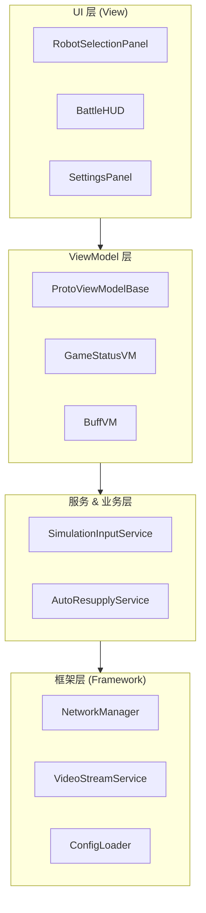
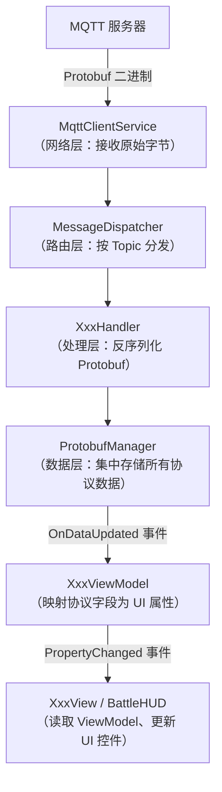
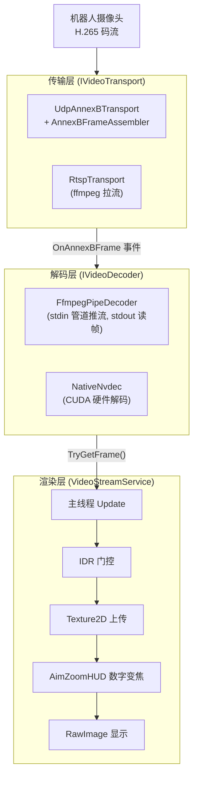
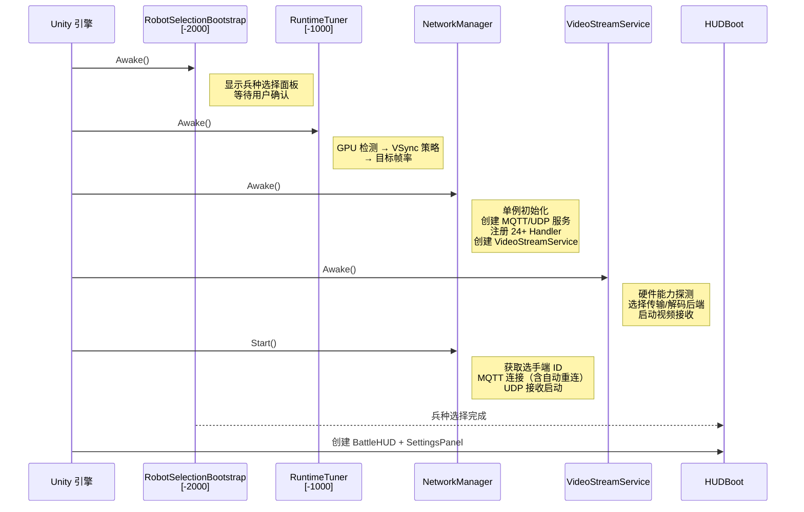
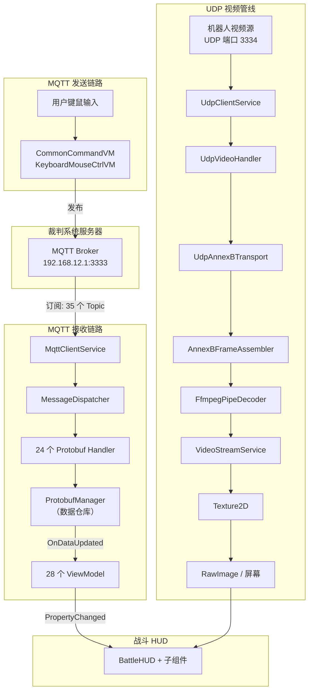

> **项目规模（截止2026_0213）**：146 个手写 C# 源文件，约 18 800 行代码（不含自动生成的 Protobuf 代码）。

---

## 一、项目全貌

### 1.1 项目定位

本项目是 **RoboMaster 2026 机甲大师赛**的选手端客户端，运行于操作手的电脑上，核心职责：

1. 通过 **MQTT** 接收裁判系统下发的比赛数据（血量、弹药、BUFF、赛程等）
2. 通过 **UDP** 接收机器人摄像头的实时视频流
3. 将操作手的键鼠输入通过 **MQTT** 发送给机器人
4. 将所有信息整合为一个 **战斗 HUD 界面**呈现给操作手

### 1.2 技术栈

| 技术                   | 用途                        |
| ---------------------- | --------------------------- |
| Unity 6000.3.5f1 + URP | 游戏引擎 + 渲染管线         |
| C# (.NET Standard 2.1) | 主要开发语言                |
| M2Mqtt v4.3.0          | MQTT 客户端库               |
| Google.Protobuf v3     | 消息序列化                  |
| ffmpeg（外部进程）     | 视频解码（软解 / 硬件加速） |
| C++ / CUDA（原生插件） | NVDEC 硬件解码（可选）      |

### 1.3 目录结构总览

```text
Assets/
├── Editor/                  # Unity 编辑器扩展工具（3 个文件）
├── Generated/               # Protobuf 自动生成代码（勿手动修改）
├── Plugins/                 # 第三方 DLL + 原生视频插件（C++/CUDA）
├── Proto/                   # Protobuf 协议定义源文件
├── Resources/               # 字体、图标等运行时资源
├── Scripts/                 # 核心源代码（136 个文件）
│   ├── Framework/           #   基础框架层
│   │   ├── Boot/            #     启动 & 硬件检测
│   │   ├── Network/         #     网络通信（MQTT / UDP / 消息分发）
│   │   └── Video/           #     视频流管线（传输 / 解码 / 渲染）
│   ├── Modules/             #   业务模块（暂空，预留扩展）
│   ├── Plugins/             #   原生插件 C# 桥接层
│   ├── Services/            #   业务服务（射击仿真、弹药购买、自动补给）
│   └── UI/                  #   用户界面
│       ├── Core/            #     UI 基础设施（工厂、颜色、布局、形状）
│       ├── HUD/             #     战斗 HUD 组件（15 个文件）
│       ├── RobotSelection/  #     赛前兵种选择流程
│       ├── ViewModels/      #     MVVM ViewModel 层（28 个文件）
│       └── Views/           #     MVVM View 层（28 个文件）
├── Settings/                # URP 渲染管线配置
├── StreamingAssets/Config/  # 运行时 JSON 配置文件
└── Utils/                   # 工具库（配置加载、日志系统）
```

---

## 二、架构设计

### 2.1 分层架构

项目采用 **四层架构**，自底向上依赖：



**依赖规则**：上层可以依赖下层，下层不得依赖上层。框架层通过**事件**向上通知。

### 2.2 核心设计模式速查

| 模式                     | 在项目中的应用                                                       | 推荐阅读文件            |
| ------------------------ | -------------------------------------------------------------------- | ----------------------- |
| **单例** (Singleton)     | NetworkManager、UIManager、VideoStreamService、ProtobufManager       | `NetworkManager.cs`     |
| **观察者** (Observer)    | MQTT 消息事件、ProtobufManager.OnDataUpdated、INotifyPropertyChanged | `ProtobufManager.cs`    |
| **策略** (Strategy)      | IVideoDecoder / IVideoTransport 可替换实现                           | `IVideoDecoder.cs`      |
| **工厂方法** (Factory)   | UIFactory 纯代码创建所有 UI 元素                                     | `UIFactory.cs`          |
| **模板方法** (Template)  | ProtoViewModelBase.UpdateFrom / ProtoViewBase.RenderAll              | `ProtoViewModelBase.cs` |
| **中介者** (Mediator)    | NetworkManager 协调 MQTT/UDP/Dispatcher                              | `NetworkManager.cs`     |
| **生产者-消费者**        | UDP 后台线程 → ConcurrentQueue → 主线程协程                          | `UdpClientService.cs`   |
| **对象池** (Object Pool) | ArrayPool 减少 GC、AnnexBFrameAssembler 帧缓冲复用                   | `UdpVideoHandler.cs`    |
| **空对象** (Null Object) | ImageDecoder 作为 IVideoDecoder 的空实现                             | `ImageDecoder.cs`       |
| **MVVM**                 | ViewModel 持有数据 + PropertyChanged，View 订阅并渲染                | 见 §2.3                 |

### 2.3 MVVM 架构详解

本项目在 Unity 中实现了一套 **无第三方框架的 MVVM**，数据流如下：



#### 两条开发路径

项目提供了两种 ViewModel/View 的实现方式：

|               | 手写路径                                                 | 自动路径                                                 |
| ------------- | -------------------------------------------------------- | -------------------------------------------------------- |
| **ViewModel** | 继承 `ProtoViewModelBase<T>`，手写字段映射               | 继承 `ProtoAutoViewModel<T>`，**零代码**（反射自动提取） |
| **View**      | 继承 `ProtoViewBase<TVM>`，手写 `RenderAll()`            | 使用 `ProtoAutoView<T>`，自动文本列表渲染                |
| **代表文件**  | `RobotDynamicStatusViewModel` + `RobotDynamicStatusView` | `EventViewModel`（仅 7 行）+ `EventView`（仅 2 行）      |
| **适用场景**  | 正式 HUD、需要精细布局                                   | 调试面板、快速原型                                       |


### 2.4 视频管线架构



### 2.5 启动时序



---

## 四、全部文件索引

本节列出项目中**每一个**手写源文件的作用。结构相同的系列文件（如 Handler / ViewModel / View 三件套）合并说明。

### 4.1 Framework/Boot — 启动与硬件检测（2 个文件，615 行）

| 文件                            | 行数 | 作用                                                                                                                                                           |
| ------------------------------- | ---- | -------------------------------------------------------------------------------------------------------------------------------------------------------------- |
| `HardwareCapabilityDetector.cs` | 529  | 静态工具类。启动时探测 GPU/CPU/内存等硬件信息，自动判定能力等级（Low/Mid/High）和推荐的解码加速模式（NVDEC/VAAPI/DXVA/Software）。支持从 JSON 加载模拟低配环境 |
| `RuntimeTuner.cs`               | 86   | MonoBehaviour（ExecutionOrder = -1000）。确保后台刷新、根据 GPU 类型设置 VSync 策略、设置目标帧率、开发版本输出 FPS 诊断日志                                   |

### 4.2 Framework/Network — 网络通信核心（7 个文件，1018 行）

| 文件                   | 行数 | 作用                                                                                                                                            |
| ---------------------- | ---- | ----------------------------------------------------------------------------------------------------------------------------------------------- |
| `IMessageHandler.cs`   | 20   | 定义 `IMessageHandler`（接收 byte[]）和 `IZeroCopyMessageHandler`（接收 ArraySegment）两个消息处理接口                                          |
| `GameEventTypes.cs`    | 83   | `GameEventId` 枚举，定义 RoboMaster 比赛中约 60 个事件 ID（按功能分段编号：比赛状态、机器人、建筑、神符等）                                     |
| `MessageDispatcher.cs` | 121  | 基于 Topic 的消息路由器，将消息分发到已注册的 Handler。支持零拷贝分发和日志节流（每 topic 每秒限 10 条）                                        |
| `MqttClientService.cs` | 196  | MQTT 客户端封装。管理连接/断线重连/订阅/退订/消息发布。使用协程实现自动重连和异步发送队列                                                       |
| `UdpClientService.cs`  | 278  | UDP 接收服务。后台线程阻塞式接收 → ConcurrentQueue → 主线程协程分发。支持 IPv6 双栈、ArrayPool 零拷贝                                           |
| `ProtobufManager.cs`   | 96   | 线程安全懒加载单例。集中管理所有 35 个 Protobuf 数据对象，提供 `UpdateData<T>` 泛型更新接口，通过 `OnDataUpdated` 事件通知业务层                |
| `NetworkManager.cs`    | 307  | 全局网络管理器（MonoBehaviour 单例）。统一管理 MQTT/UDP 两个网络服务，注册全部 Handler，自动创建 VideoStreamService 和 EventNotificationService |

### 4.3 Framework/Network/Handlers — 消息处理器（27 个文件，654 行）

#### 通用 Protobuf Handler 系列（26 个文件，各约 21 行）

这 21 个文件结构完全相同：实现 `IMessageHandler` 接口，在 `HandleMessage` 中调用 `Protobuf.Parser.ParseFrom()` 反序列化消息，然后触发 `OnMessageReceived` 事件。以 `GameStatusHandler` 为代表即可理解全部。

| 文件                                      | 对应 Protobuf 消息                                 |
| ----------------------------------------- | -------------------------------------------------- |
| `GameStatusHandler.cs`                    | `GameStatus` — 比赛阶段、倒计时、比分              |
| `RobotDynamicStatusHandler.cs`            | `RobotDynamicStatus` — 血量、热量、弹药            |
| `RobotStaticStatusHandler.cs`             | `RobotStaticStatus` — 最大血量、最大热量、存活状态 |
| `RobotModuleStatusHandler.cs`             | `RobotModuleStatus` — 模块状态                     |
| `RobotInjuryStatHandler.cs`               | `RobotInjuryStat` — 受击统计                       |
| `RobotPositionHandler.cs`                 | `RobotPosition` — 机器人位置                       |
| `RobotPathPlanInfoHandler.cs`             | `RobotPathPlanInfo` — 路径规划                     |
| `RobotRespawnStatusHandler.cs`            | `RobotRespawnStatus` — 复活进度                    |
| `RobotPerformanceSelectionSyncHandler.cs` | `RobotPerformanceSelectionSync` — 体系选择同步     |
| `KeyboardMouseControlHandler.cs`          | `KeyboardMouseControl` — 键鼠控制数据              |
| `CustomControlHandler.cs`                 | `CustomControl` — 自定义控制                       |
| `CustomByteBlockHandler.cs`               | `CustomByteBlock` — 自定义字节块                   |
| `BuffHandler.cs`                          | `Buff` — BUFF 状态                                 |
| `EventHandler.cs`                         | `Event` — 比赛事件                                 |
| `PenaltyInfoHandler.cs`                   | `PenaltyInfo` — 犯规信息                           |
| `GlobalLogisticsStatusHandler.cs`         | `GlobalLogisticsStatus` — 全局经济                 |
| `GlobalUnitStatusHandler.cs`              | `GlobalUnitStatus` — 全局单位状态                  |
| `GlobalSpecialMechanismHandler.cs`        | `GlobalSpecialMechanism` — 特殊机制                |
| `RadarInfoToClientHandler.cs`             | `RadarInfoToClient` — 雷达信息                     |
| `AirSupportStatusSyncHandler.cs`          | `AirSupportStatusSync` — 空中支援                  |
| `DartSelectTargetStatusSyncHandler.cs`    | `DartSelectTargetStatusSync` — 飞镖选靶            |
| `DeployModeStatusSyncHandler.cs`          | `DeployModeStatusSync` — 部署模式                  |
| `RuneStatusSyncHandler.cs`                | `RuneStatusSync` — 神符状态                        |
| `SentryStatusSyncHandler.cs`              | `SentryStatusSync` — 哨兵状态                      |
| `SentryCtrlResultHandler.cs`              | `SentryCtrlResult` — 哨兵控制结果                  |
| `TechCoreMotionStateSyncHandler.cs`       | `TechCoreMotionStateSync` — 技术核心运动状态       |

#### 特殊 Handler

| 文件                 | 行数 | 作用                                                                                                                                           |
| -------------------- | ---- | ---------------------------------------------------------------------------------------------------------------------------------------------- |
| `UdpVideoHandler.cs` | 102  | 与通用 Handler 不同：解析 UDP 视频包的 8 字节二进制包头（frameId/sliceId/frameLen，小端手动解析），使用 `ArrayPool<byte>` 租借缓冲区实现零拷贝 |

### 4.4 Framework/Video — 视频管线（8 个文件，1790 行）

| 文件                      | 行数 | 作用                                                                                                                                                                  |
| ------------------------- | ---- | --------------------------------------------------------------------------------------------------------------------------------------------------------------------- |
| `IVideoTransport.cs`      | 17   | 传输层接口：`OnAnnexBFrame` 事件 + `Start()` / `Stop()` 生命周期                                                                                                      |
| `IVideoDecoder.cs`        | 36   | 解码层接口：`PushFrame()` 推入 AnnexB 码流 + `TryGetFrame()` 取出 RGB24 帧。含 `DecodedFrame` 数据结构（支持 ArrayPool 归还）                                         |
| `ImageDecoder.cs`         | 27   | IVideoDecoder 的空实现（Null Object 模式），用于调试                                                                                                                  |
| `UdpAnnexBTransport.cs`   | 59   | 基于 UDP 的传输实现。订阅 UdpVideoHandler 接收视频分片，通过 AnnexBFrameAssembler 组帧后触发 OnAnnexBFrame 事件                                                       |
| `AnnexBFrameAssembler.cs` | 266  | UDP 视频分片组装器。按帧号和分片号重组完整 AnnexB 字节流，处理丢包、超时、重复分片、帧回绕（ushort 65535→0），支持 ArrayPool 零拷贝                                   |
| `RtspTransport.cs`        | 205  | 基于 RTSP 的传输实现。通过 ffmpeg 子进程从 RTSP 源拉流，基于 AUD (NAL type 35) 分隔符进行流式组帧                                                                     |
| `FfmpegPipeDecoder.cs`    | 796  | 基于 ffmpeg 子进程的视频解码器。stdin 管道推入 AnnexB 码流，stdout 管道读取 rawvideo 像素帧。支持多种硬件加速自动选择与回退、codec 自动检测、看门狗进程监控           |
| `VideoStreamService.cs`   | 611  | 视频管线调度中心（MonoBehaviour 单例）。管理传输层和解码器的初始化与切换，主线程将解码帧应用到 Texture2D，含 IDR 门控、追帧丢帧、双缓冲、增量 GC 辅助、NVDEC 自动回退 |

### 4.5 Plugins — 原生插件桥接（3 个文件，176 行）

| 文件                     | 行数 | 作用                                                         |
| ------------------------ | ---- | ------------------------------------------------------------ |
| `NativeVideoBridge.cs`   | 176  | C++ NVDEC 原生插件的 C# P/Invoke 桥接层，封装 DllImport 调用 |
| `NativeVideoPlugin.cs`   | 0    | 预留文件（暂空）                                             |
| `VideoModeController.cs` | 0    | 预留文件（暂空）                                             |

### 4.6 Services — 业务服务（3 个文件，368 行）

| 文件                          | 行数 | 作用                                                                                                               |
| ----------------------------- | ---- | ------------------------------------------------------------------------------------------------------------------ |
| `SimulationInputService.cs`   | 99   | 编辑器仿真射击服务。仅在 `UNITY_EDITOR` 下激活，Enter 单按/长按触发射击，通过 MQTT 发送 CommonCommand 指令         |
| `AmmoPurchaseInputService.cs` | 144  | 弹药快捷购买服务。检测快捷键（数字 1-0），按兵种区分弹种和数量（英雄 42mm x1 / 其他 17mm x10），含客户端经济预检查 |
| `AutoResupplyService.cs`      | 125  | 激战自动补给服务。监控弹药余量，在射击状态且弹药低于阈值时自动购买，遵守经济规则                                   |

### 4.7 UI/Core — UI 基础设施（6 个文件，862 行）

| 文件                 | 行数 | 作用                                                                                                          |
| -------------------- | ---- | ------------------------------------------------------------------------------------------------------------- |
| `UIColors.cs`        | 42   | 静态颜色常量库：主题色（蓝系）、功能色（红蓝/绿/黄）、背景色（深色半透明）                                    |
| `UIFactory.cs`       | 292  | 静态 UI 工厂。运行时纯代码创建 Canvas/Image/TMP_Text/Button/Slider 等，含 SDF 中文字体预加载与动态 Atlas 预热 |
| `IconManager.cs`     | 74   | 静态图标管理器。从 Resources 加载 PNG 图标并缓存为 Sprite，支持运行时着色                                     |
| `UIShapeHelper.cs`   | 171  | 静态形状生成器。程序化生成圆角矩形和环形/弧形 Sprite（基于 SDF 算法），Flyweight 字典缓存避免重复创建         |
| `UISkew.cs`          | 51   | BaseMeshEffect 子类。对 UI Graphic 施加水平剪切（skew/shear），产生平行四边形效果                             |
| `UILayoutManager.cs` | 232  | HUD 布局与参数持久化。JSON 读写 ui_layout.json，定义 HUDSettings / AimSettings / ResupplySettings 等数据结构  |

### 4.8 UI — 顶层管理（1 个文件，153 行）

| 文件           | 行数 | 作用                                                                                                            |
| -------------- | ---- | --------------------------------------------------------------------------------------------------------------- |
| `UIManager.cs` | 153  | 全局弹窗管理器（单例）。管理面板注册/注销、层级排序（sortingOrder 自增）、弹窗生命周期。含 `PanelBase` 抽象基类 |

### 4.9 UI/HUD — 战斗 HUD 组件（15 个文件，7128 行）

| 文件                          | 行数 | 作用                                                                                                                                            |
| ----------------------------- | ---- | ----------------------------------------------------------------------------------------------------------------------------------------------- |
| `HUDBoot.cs`                  | 61   | HUD 启动器。等待兵种选择完成后创建 BattleHUD 和 SettingsPanel                                                                                   |
| `BattleHUD.cs`                | 459  | HUD 主控中心（单例）。管理所有子 HUD 的生命周期和布局，每帧从 ViewModel 拉取数据驱动子组件更新                                                  |
| `HealthBarHUD.cs`             | 150  | 底部血条。外发光 + 粗边框 + 颜色渐变（绿→黄→红）+ 百分比文字 + 平滑过渡动画                                                                     |
| `CrosshairRingHUD.cs`         | 408  | 准星环。十字准星 + 热量内环（黄→红）+ 弹药外环（亮蓝）+ 数值面板 + 敌人血条面板 + 吊射后坐力动画                                                |
| `DamageVignetteHUD.cs`        | 151  | 受击/低血量视觉效果。运行时生成径向渐变晕影纹理，受击闪烁（红/紫），低血量持续红色脉动                                                          |
| `DeathOverlayHUD.cs`          | 368  | 死亡灰屏覆盖。3 态状态机（Alive → Dead → Reviving），显示复活进度条 + 金币买活按钮 + 复活白闪特效                                               |
| `MatchInfoHUD.cs`             | 536  | 顶部对局信息栏。动态布局（阶段/倒计时/比分/轮次/经济），用户可在设置中开关各项，面板自动伸缩                                                    |
| `AimZoomHUD.cs`               | 231  | 射击聚焦（数字变焦）。修改视频 RawImage 的 uvRect 实现画面中心放大，射击自动开镜 + 停火延迟关镜 + 暗角遮罩                                      |
| `LobShotHUD.cs`               | 661  | 吊射模式视觉。接收自定义二值化视频帧，解码 I/D/Trail 帧协议，1bit → RGBA 彩色渲染（靶标/噪声/轨迹/弹丸分色），含敌方基地血条                    |
| `LobShotService.cs`           | 204  | 吊射模式服务。双 Shift 手势检测、模式切换（Enter/Exit Deploy）、射击输入 + 冷却、视频流控制                                                     |
| `BuffStatusHUD.cs`            | 651  | BUFF/DEBUFF 状态栏。左侧固定双列布局，按剩余时间排序，超出可见数提示，Tab 展开全屏面板，新增 BUFF 弹出醒目通知                                  |
| `HexPopupHUD.cs`              | 309  | 六边形弹药购买提示弹窗。程序化生成六边形 Sprite（SDF），淡入/正常/淡出 3 段动画                                                                 |
| `NotificationHUD.cs`          | 185  | 通知消息队列。顶部居中显示，FIFO 自动淡出，支持普通通知和 BUFF 醒目弹窗两种样式                                                                 |
| `EventNotificationService.cs` | 1020 | 事件通知中枢（单例）。MQTT 后台线程入队、主线程出队处理。统一 ID 体系覆盖官方协议 + 仿真扩展（50+ 事件），含防刷冷却                            |
| `SettingsPanel.cs`            | 1675 | 系统设置面板（单例）。左侧多级侧边栏（10 个菜单项）+ 右侧滑块/开关参数配置 + UI 布局编辑器（缩略图拖拽）+ 快捷键绑定 + 实时预览（防抖重建 HUD） |

### 4.10 UI/RobotSelection — 兵种选择流程（7 个文件，1682 行）

| 文件                           | 行数 | 作用                                                                                                                            |
| ------------------------------ | ---- | ------------------------------------------------------------------------------------------------------------------------------- |
| `RobotSelectionData.cs`        | 88   | 数据定义：`TeamColor` / `RobotType` 枚举 + `RobotSelectionResult` 类（含裁判系统 RobotId 和 MQTT 选手端 PlayerTerminalId 计算） |
| `RobotCapabilities.cs`         | 196  | 兵种能力查表（静态）。根据 2026 规则定义各兵种是否可射击、支持哪种体系选择，提供全局查询接口                                    |
| `RobotSelectionViewModel.cs`   | 167  | MVVM ViewModel。管理阵营/兵种选择状态（实现 INotifyPropertyChanged），不依赖 Unity API                                          |
| `RobotSelectionPanel.cs`       | 377  | 兵种选择面板（View）。横排 9 个倾斜按钮 + 阵营切换 + 键盘快捷键（1-9/Tab/Enter），订阅 ViewModel.PropertyChanged 刷新视觉       |
| `PerformanceSelectionPanel.cs` | 523  | 体系选择面板。根据兵种能力动态显示射手体系/底盘体系/哨兵控制选项                                                                |
| `RobotSelectionBootstrap.cs`   | 192  | 启动引导器（ExecutionOrder = -2000）。协调整个选择流程：兵种确认 → 体系选择 → 写入 ConfigLoader → 确保 HUDBoot 存在             |
| `Editor/ChineseFontCreator.cs` | 139  | 编辑器工具。用于生成中文 SDF 字体资源                                                                                           |

### 4.11 UI/ViewModels — ViewModel 层（29 个文件，1059 行）

#### 框架基类（2 个文件）

| 文件                    | 行数 | 作用                                                                                                                      |
| ----------------------- | ---- | ------------------------------------------------------------------------------------------------------------------------- |
| `ProtoViewModelBase.cs` | 42   | 所有手写 ViewModel 的抽象泛型基类。管理 ProtobufManager 订阅/取消订阅，子类只需实现 `UpdateFrom(IMessage)` 模板方法       |
| `ProtoAutoViewModel.cs` | 136  | 通用自动 ViewModel。利用反射自动提取 Protobuf 消息的所有公开属性，生成 `PropertyEntry` 列表供 View 渲染，无需手写字段映射 |

#### 手写 ViewModel 系列（24 个文件）

以下 ViewModel 继承 `ProtoViewModelBase<T>`，在 `UpdateFrom` 中手写字段映射。结构相同，仅映射字段不同：

| 文件                                        | 行数 | 对应 Protobuf 消息              | 重要字段                                                             |
| ------------------------------------------- | ---- | ------------------------------- | -------------------------------------------------------------------- |
| `GameStatusViewModel.cs`                    | 120  | `GameStatus`                    | 比赛阶段、倒计时、红蓝比分、轮次、暂停状态。注：早期代码，未使用基类 |
| `RobotDynamicStatusViewModel.cs`            | 54   | `RobotDynamicStatus`            | 血量、热量、弹药、射击计数、脱战状态（13 字段）                      |
| `RobotStaticStatusViewModel.cs`             | 55   | `RobotStaticStatus`             | 最大血量、最大热量、存活状态                                         |
| `BuffViewModel.cs`                          | 53   | `Buff`                          | BUFF 类型、等级、剩余/最大时间                                       |
| `KeyboardMouseControlViewModel.cs`          | 37   | `KeyboardMouseControl`          | 鼠标 XYZ、左右中键、键盘值                                           |
| `CommonCommandViewModel.cs`                 | 22   | `CommonCommand`                 | 命令类型 + 命令值                                                    |
| `CustomControlViewModel.cs`                 | 19   | `CustomControl`                 | 自定义控制数据                                                       |
| `CustomByteBlockViewModel.cs`               | 16   | `CustomByteBlock`               | 自定义字节块                                                         |
| `GlobalLogisticsStatusViewModel.cs`         | 25   | `GlobalLogisticsStatus`         | 经济（金币）                                                         |
| `GlobalUnitStatusViewModel.cs`              | 58   | `GlobalUnitStatus`              | 敌方基地/前哨站血量                                                  |
| `RobotInjuryStatViewModel.cs`               | 43   | `RobotInjuryStat`               | 各装甲板受击统计                                                     |
| `RobotModuleStatusViewModel.cs`             | 46   | `RobotModuleStatus`             | 模块状态                                                             |
| `RobotPositionViewModel.cs`                 | 25   | `RobotPosition`                 | 机器人坐标                                                           |
| `RobotPathPlanInfoViewModel.cs`             | 32   | `RobotPathPlanInfo`             | 路径规划信息                                                         |
| `RobotRespawnStatusViewModel.cs`            | 31   | `RobotRespawnStatus`            | 复活进度、买活花费                                                   |
| `RobotPerformanceSelectionSyncViewModel.cs` | 22   | `RobotPerformanceSelectionSync` | 体系选择同步                                                         |
| `RadarInfoToClientViewModel.cs`             | 31   | `RadarInfoToClient`             | 雷达信息                                                             |
| `AirSupportStatusSyncViewModel.cs`          | 28   | `AirSupportStatusSync`          | 空中支援状态                                                         |
| `DartSelectTargetStatusSyncViewModel.cs`    | 19   | `DartSelectTargetStatusSync`    | 飞镖选靶                                                             |
| `PenaltyInfoViewModel.cs`                   | 22   | `PenaltyInfo`                   | 犯规信息                                                             |
| `RuneStatusSyncViewModel.cs`                | 22   | `RuneStatusSync`                | 神符状态                                                             |
| `SentryStatusSyncViewModel.cs`              | 22   | `SentryStatusSync`              | 哨兵状态                                                             |
| `SentryCtrlResultViewModel.cs`              | 22   | `SentryCtrlResult`              | 哨兵控制结果                                                         |
| `TechCoreMotionStateSyncViewModel.cs`       | 28   | `TechCoreMotionStateSync`       | 技术核心运动状态                                                     |

#### 零代码自动 ViewModel（3 个文件）

| 文件                                 | 行数 | 作用                                                                |
| ------------------------------------ | ---- | ------------------------------------------------------------------- |
| `EventViewModel.cs`                  | 7    | 仅一行类定义。继承 `ProtoAutoViewModel<Event>` 即自动反射出所有字段 |
| `GlobalSpecialMechanismViewModel.cs` | 7    | 同上，继承 `ProtoAutoViewModel<GlobalSpecialMechanism>`             |
| `DeployModeStatusSyncViewModel.cs`   | 15   | 同上，继承 `ProtoAutoViewModel<DeployModeStatusSync>`               |

### 4.12 UI/Views — View 层（28 个文件，870 行）

#### 框架基类（2 个文件）

| 文件               | 行数 | 作用                                                                                          |
| ------------------ | ---- | --------------------------------------------------------------------------------------------- |
| `ProtoViewBase.cs` | 60   | 所有手写 View 的抽象泛型基类。封装 ViewModel 创建、绑定、主线程脏标记刷新、销毁的完整生命周期 |
| `ProtoAutoView.cs` | 71   | 通用自动 View。配合 ProtoAutoViewModel 使用，将协议全部字段以纯文本列表渲染到一个 TMP_Text    |

#### 手写 View 系列（23 个文件）

以下 View 继承 `ProtoViewBase<TVM>`，在 `CreateViewModel` 中创建对应 ViewModel，在 `RenderAll` 中绑定 UI 控件。结构相同，仅绑定控件不同：

| 文件                                   | 行数 | 对应 ViewModel                                                                           |
| -------------------------------------- | ---- | ---------------------------------------------------------------------------------------- |
| `GameStatusView.cs`                    | 82   | GameStatusVM — 7 个 TMP_Text（回合、红蓝分数、阶段、倒计时等）。注：早期代码，未继承基类 |
| `VideoTextureView.cs`                  | 31   | 无 ViewModel — 将 VideoStreamService 的解码纹理挂载到 RawImage                           |
| `KeyboardMouseControlView.cs`          | 35   | KeyboardMouseControlVM — 7 个 TMP_Text                                                   |
| `RobotDynamicStatusView.cs`            | 43   | RobotDynamicStatusVM                                                                     |
| `RobotStaticStatusView.cs`             | 45   | RobotStaticStatusVM                                                                      |
| `BuffView.cs`                          | 27   | BuffVM                                                                                   |
| `RobotInjuryStatView.cs`               | 37   | RobotInjuryStatVM                                                                        |
| `RobotModuleStatusView.cs`             | 37   | RobotModuleStatusVM                                                                      |
| `RobotPositionView.cs`                 | 25   | RobotPositionVM                                                                          |
| `RobotPathPlanInfoView.cs`             | 29   | RobotPathPlanInfoVM                                                                      |
| `RobotRespawnStatusView.cs`            | 29   | RobotRespawnStatusVM                                                                     |
| `RadarInfoToClientView.cs`             | 27   | RadarInfoToClientVM                                                                      |
| `GlobalLogisticsStatusView.cs`         | 25   | GlobalLogisticsStatusVM                                                                  |
| `GlobalUnitStatusView.cs`              | 45   | GlobalUnitStatusVM                                                                       |
| `AirSupportStatusSyncView.cs`          | 23   | AirSupportStatusSyncVM                                                                   |
| `CustomByteBlockView.cs`               | 24   | CustomByteBlockVM                                                                        |
| `PenaltyInfoView.cs`                   | 23   | PenaltyInfoVM                                                                            |
| `RobotPerformanceSelectionSyncView.cs` | 21   | RobotPerformanceSelectionSyncVM                                                          |
| `RuneStatusSyncView.cs`                | 23   | RuneStatusSyncVM                                                                         |
| `SentryCtrlResultView.cs`              | 22   | SentryCtrlResultVM                                                                       |
| `SentryStatusSyncView.cs`              | 21   | SentryStatusSyncVM                                                                       |
| `TechCoreMotionStateSyncView.cs`       | 21   | TechCoreMotionStateSyncVM                                                                |
| `DartSelectTargetStatusSyncView.cs`    | 21   | DartSelectTargetStatusSyncVM                                                             |

#### 零代码自动 View（3 个文件）

| 文件                            | 行数 | 作用                             |
| ------------------------------- | ---- | -------------------------------- |
| `EventView.cs`                  | 2    | 仅一行类定义，继承 ProtoAutoView |
| `GlobalSpecialMechanismView.cs` | 2    | 同上                             |
| `DeployModeStatusSyncView.cs`   | 19   | 同上                             |

### 4.13 Utils — 工具库（7 个文件，1673 行）

| 文件                           | 行数 | 作用                                                                                                                      |
| ------------------------------ | ---- | ------------------------------------------------------------------------------------------------------------------------- |
| `ConfigData.cs`                | 39   | 配置数据模型（Serializable）。定义 JSON 配置对应的所有字段：服务器 IP/端口、机器人数/ID、视频分辨率、目标帧率、日志缓冲等 |
| `ConfigLoader.cs`              | 257  | 静态配置加载器。支持硬件能力探测自动选档（Low/Mid/High）、JSON 注释移除、BOM 处理、懒加载                                 |
| `Log.cs`                       | 615  | 统一日志框架核心。后台线程异步批量写入、编译期宏裁剪（5 级 x 6 分类）、节流去重、10MB 自动轮转、ConcurrentQueue 无锁入队  |
| `LogBridge.cs`                 | 279  | 编译期分类宏桥接层。为每个日志分类提供独立方法，实现"分类宏 x 级别宏"双重编译裁剪                                         |
| `DebugLog.cs`                  | 107  | 旧日志 API 兼容层（Adapter 模式）。将旧 API 调用转发到新 Log 框架                                                         |
| `DebugTools.cs`                | 132  | 另一个旧日志系统兼容层                                                                                                    |
| `Editor/DebugLogController.cs` | 244  | 编辑器工具。日志系统的编辑器控制面板                                                                                      |

### 4.14 Editor — 编辑器扩展工具（3 个文件，495 行）

| 文件                     | 行数 | 作用                                                                                    |
| ------------------------ | ---- | --------------------------------------------------------------------------------------- |
| `ParamsManagerWindow.cs` | 195  | Unity Editor 参数管理器窗口。可视化编辑 params.json，支持中文参数注释、自动类型推导保存 |
| `LogViewerWindows.cs`    | 195  | Unity Editor 日志查看器。左侧文件列表 + 右侧内容查看 + 按关键字批量删除                 |
| `FontSdfGenerator.cs`    | 105  | SDF 字体资源生成工具                                                                    |

### 4.15 Proto & Generated — 协议定义与生成代码

| 文件                                   | 行数  | 作用                                                               |
| -------------------------------------- | ----- | ------------------------------------------------------------------ |
| `Proto/RoboMasterClientMessage.proto`  | 313   | Protobuf v3 协议定义。35 个 message 类型，覆盖 V1.2.0 协议全部消息 |
| `Generated/RoboMasterClientMessage.cs` | 11589 | 由 `protoc` 编译器自动生成的 C# 代码。**勿手动修改**               |

### 4.16 配置文件

| 文件                                         | 作用                                                                    |
| -------------------------------------------- | ----------------------------------------------------------------------- |
| `StreamingAssets/Config/params.json`         | 默认运行时配置：服务器 127.0.0.1:3333/3334、解码 1920x1080、目标 120fps |
| `StreamingAssets/Config/params_lowspec.json` | 低配环境配置                                                            |
| `StreamingAssets/Config/params_midspec.json` | 中配环境配置                                                            |
| `StreamingAssets/Config/ui_layout.json`      | HUD 布局参数持久化                                                      |

### 4.17 统计总览

| 模块                       | 文件数  | 代码行数   |
| -------------------------- | ------- | ---------- |
| Framework/Boot             | 2       | 615        |
| Framework/Network          | 7       | 1 018      |
| Framework/Network/Handlers | 27      | 654        |
| Framework/Video            | 8       | 1 790      |
| Plugins                    | 3       | 176        |
| Services                   | 3       | 368        |
| UI/Core                    | 6       | 862        |
| UI (顶层)                  | 1       | 153        |
| UI/HUD                     | 15      | 7 128      |
| UI/RobotSelection          | 7       | 1 682      |
| UI/ViewModels              | 29      | 1 059      |
| UI/Views                   | 28      | 870        |
| Utils                      | 7       | 1 673      |
| Editor                     | 3       | 495        |
| **合计**                   | **146** | **18 794** |

> 注：上表统计 `Assets/Scripts/`（136）+ `Assets/Utils/`（7）+ `Assets/Editor/`（3）下的手写 C# 文件。Proto 定义（313 行）、自动生成代码（11 589 行）及原生插件 C++/CUDA 代码不计入。

---

## 五、核心数据流总览



---
